# 4. Software and Hardware Guide

## 4.1 micro:bit Board

### 4.1.1 Introduction

The micro:bit is a pocket-sized computer, half the size of a credit card, designed by the BBC in collaboration with Microsoft, Samsung, ARM, and other partners for youth programming education. Integrated onboard are Bluetooth, an accelerometer, a compass, three buttons, a 5x5 LED dot matrix, and a microphone.

Numerous open-source libraries and interesting projects for micro:bit are available on the website:

[Microsoft MakeCode for micro:bit](https://makecode.microbit.org/#)

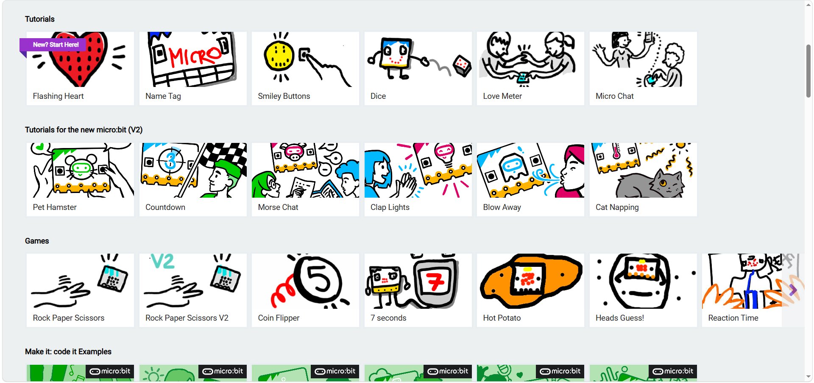

### 4.1.2 micro:bit Board Pinout


### 4.1.3 micro:bit Board Specifications

| Parameter | Value |
| :---: | :---: |
| Processor | Nordic nRF52833 |
| ARM | Cortex-M4 32bit+FPU 64MHz |
| Memory/Flash | 128KB RAM/512KB Flash |
| Wireless | 2.4GHz micro:bit Radio/BLE Bluetooth 5.0 |
| Power Supply | 5 V via Micro USB port, 3 V via edge connector or battery pack |
| Operating current | 300 mA |
| Dimensions | 52*43.2 mm |

### 4.1.4 micro:bit Board Function Layout

As shown in the figure below, the board mainly consists of onboard modules such as an accelerometer, programmable buttons, pins, an LED dot matrix, a USB port, Bluetooth, radio, and an electronic compass.


### 4.1.5 micro:bit Board Function Demos

<font size = "3.5">**1. Logo Control**</font>

Position of the logo on the micro:bit board:

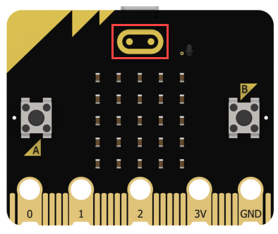

**(1) Learning Objectives**

Switch patterns by touching the logo on the micro:bit board.

**(2) Program Writing**

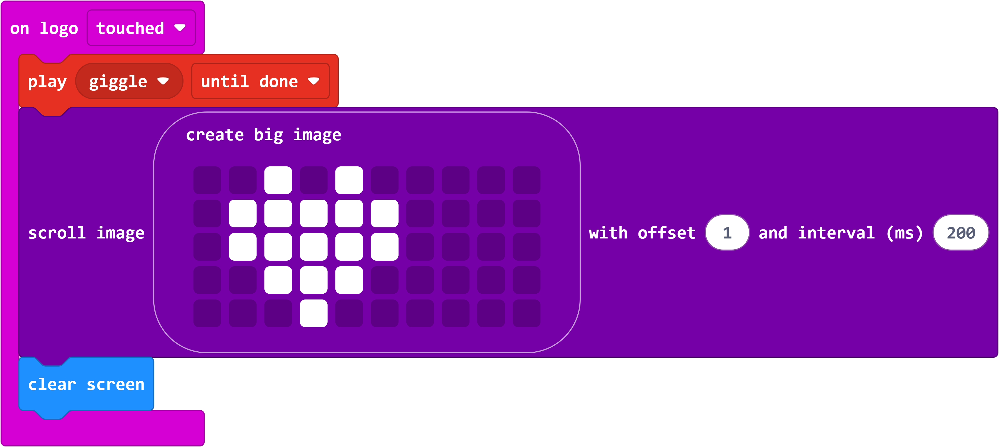

Program link: [https://makecode.microbit.org/_4g3TEs45p2bk](). Click **Edit** in the upper right corner of the link page to download the complete program.


**(3) Program Download**


**(4) Program Outcome**

When touching the logo with a hand, the micro:bit board emits the preset sound while the LED dot matrix scrolls to display a heart pattern.

<font size = "3.5">**2. Smart Thermometer**</font>

Position of the main chip on the micro:bit board:

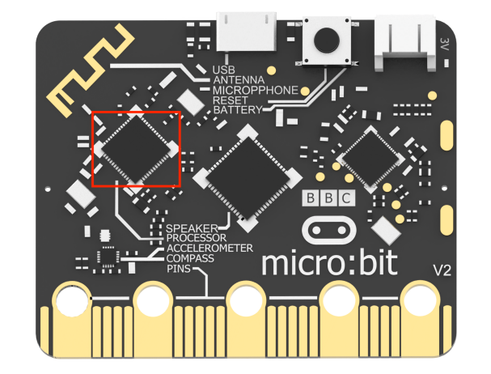

**(1) Learning Objectives**

Implement temperature detection using the micro:bit main chip.

**(2) Program Writing**

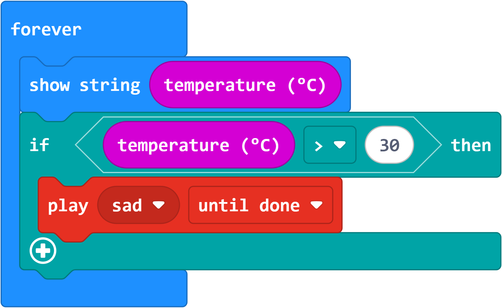

Program link: [https://makecode.microbit.org/_g7uRf4RWFcYU](). Click **Edit** in the upper right corner of the link page to download the complete program.


**(3) Program Download**


**(4) Program Outcome**

Gently press the micro:bit main chip with a finger. When the temperature exceeds 30 degrees Celsius, the speaker emits a sound prompt.

<font size = "3.5">**3. Timer**</font>

Position of the buttons on the micro:bit board:

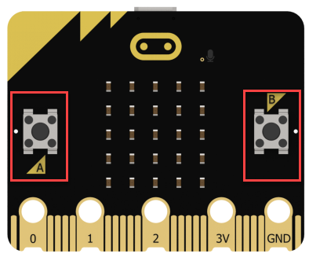

**(1) Learning Objectives**

Program the micro:bit buttons to function as a timer.

**(2) Program Writing**

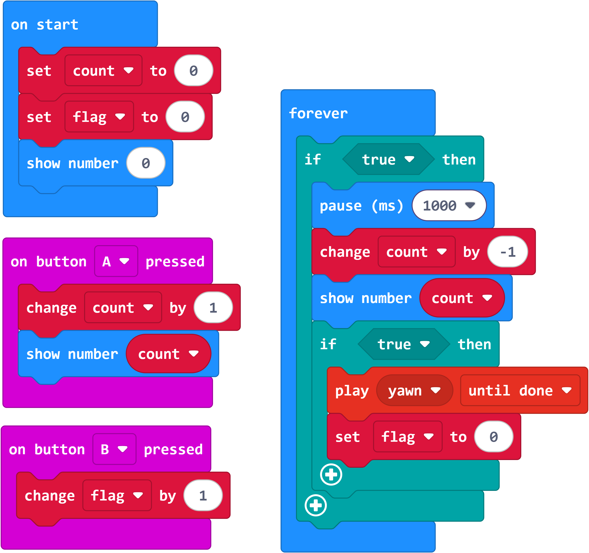

Program link: [https://makecode.microbit.org/_ip20k999cXu3](). Click **Edit** in the upper right corner of the link page to download the complete program.


**(3) Program Download**


**(4) Program Outcome**

The number 0 is displayed upon startup. Press **A** to increase the number. Press **B** to start a countdown that decrements every second. When the number reaches zero, a yawning sound effect is played and the countdown stops.

<font size = "3.5">**4. Music Player**</font>

Position of the buzzer on the micro:bit board:

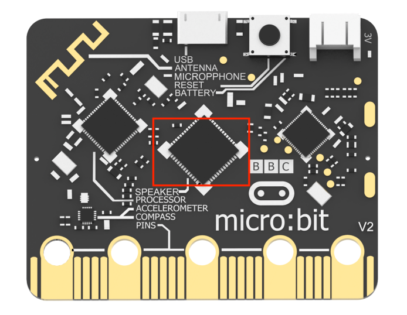

Position of the buttons on the micro:bit board:


**(1) Learning Objectives**

Program the micro:bit buttons to play music.

**(2) Program Writing**

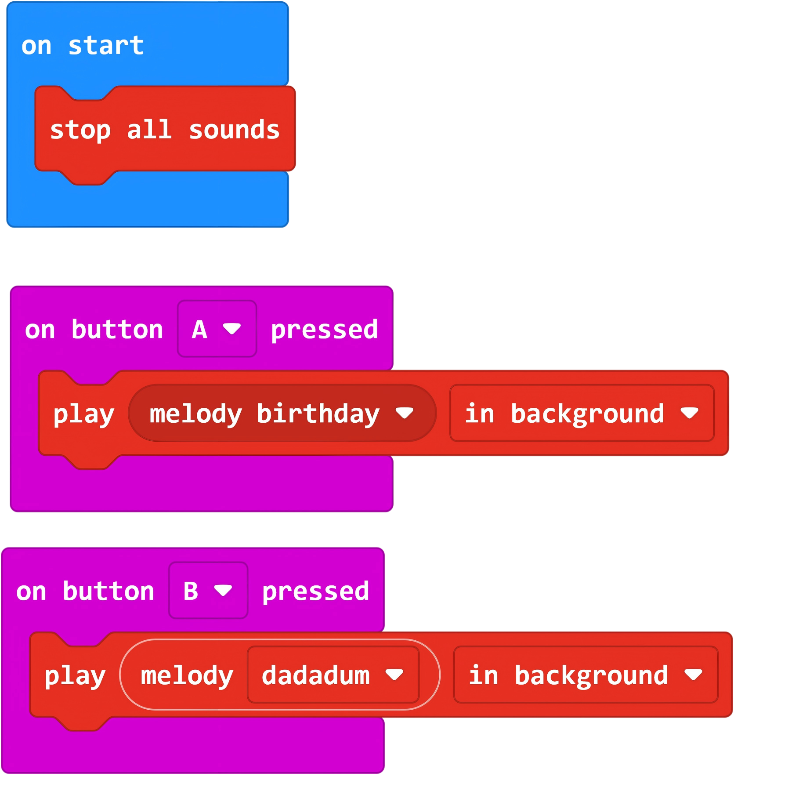

Program link: [https://makecode.microbit.org/_9vkfe8gjP0mL](). Click **Edit** in the upper right corner of the link page to download the complete program.


**(3) Program Download**


**(4) Program Outcome**

After downloading the program, press button **A** to play the song "Happy Birthday", or press button **B** to play the song "dadadum".

<font size = "3.5">**5. Noise Detector**</font>

Position of the buzzer on the micro:bit board:


Position of the microphone on the micro:bit board:

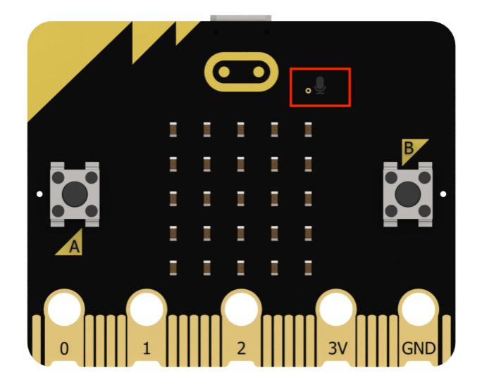

**(1) Learning Objectives**

Program sound detection and feedback functions.

**(2) Program Writing**

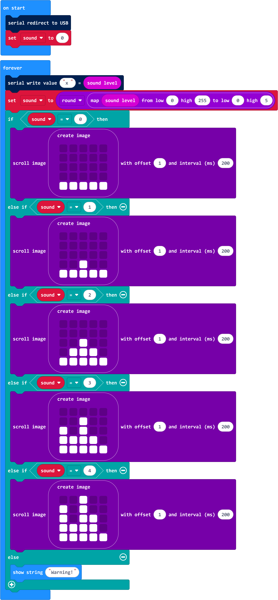

Program link: [https://makecode.microbit.org/_DcFWAKXYg3MK](). Click **Edit** in the upper right corner of the link page to download the complete program.


**(3) Program Download**


**(4) Program Outcome**

After downloading the program, speak toward the microphone on the micro:bit board. The LED dot matrix displays different heights of LED matrices based on the detected sound intensity.

<font size = "3.5">**6. Dark Alarm**</font>

Position of the LED dot matrix on the micro:bit board:

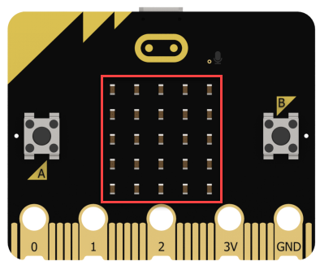

Position of the speaker on the micro:bit board:


**(1) Learning Objectives**

Program light detection and feedback functions.

**(2) Program Writing**


Program link: [https://makecode.microbit.org/_co9aifR4JTzo](). Click **Edit** in the upper right corner of the link page to download the complete program.


**(3) Program Download**


**(4) Program Outcome**

After downloading the program, move the micro:bit board to a dark place. The dot matrix screen displays a moon pattern while the speaker emits a prompt sound.

<font size = "3.5">**7. Compass**</font>

Position of the magnetometer on the micro:bit board:

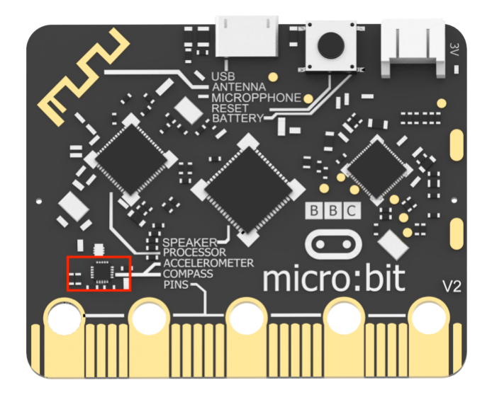

**(1) Learning Objectives**

Program direction detection and display arrow patterns.

**(2) Program Writing**


Program link: [https://makecode.microbit.org/_2FbKYdfY5E2u](). Click **Edit** in the upper right corner of the link page to download the complete program.


**(3) Program Download**


**(4) Program Outcome**

After calibration is completed, move the board in different directions while holding it, and the dot matrix displays the corresponding direction arrows.

> [!NOTE]
>
> **After downloading the program, the micro:bit board scrolls the prompt TILT TO FILL SCREEN, requiring calibration first. Move the micro:bit board front, back, left, and right while holding it until all LEDs on the matrix are lit.**

## 4.2 micro:bit Expansion Board

### 4.2.1 Introduction

This is a smart controller centered around the micro:bit, supporting graphical programming and Python programming. Enclosed in a PC plastic shell, it features onboard PWM servo ports, motor ports, programmable buttons, a buzzer, and other electronic modules. With multiple sensor ports reserved, it provides high expandability. Standardized anti-reverse 4-pin ports make it compatible with the complete range of Hiwonder sensors for convenient and safe use.

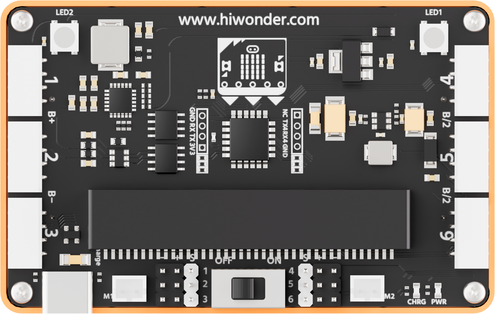

### 4.2.2 Specifications

| Parameter | Value |
| :---: | :---: |
| Product name | Micro:bit Expansion Board |
| Product Dimensions | 88.0 x 55.5 x 35.5 mm |
| Charging voltage | 5 V |
| Charging current | 1500 mA |
| Charging time | 1.5 h |
| Battery capacity | 2400 mAh |
| Maximum operating voltage | 8.4 V |
| Rated operating voltage | 7.4 V |

### 4.2.3 Port Overview

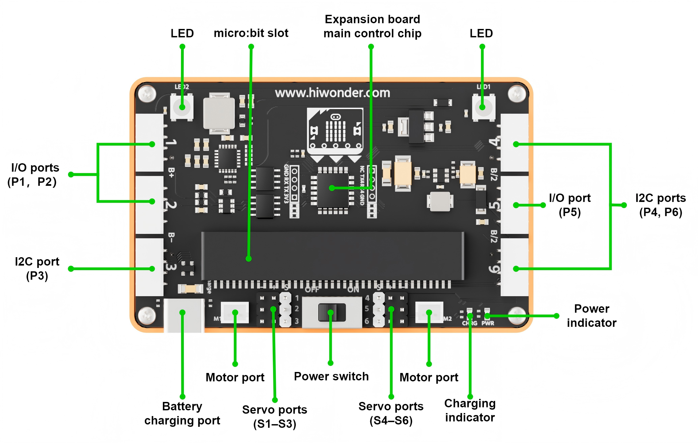

### 4.2.4 Demo: Voice Controlled Colored Lights

Position of the sound sensor on the micro:bit board:


Position of the RGB light on the micro:bit expansion board:

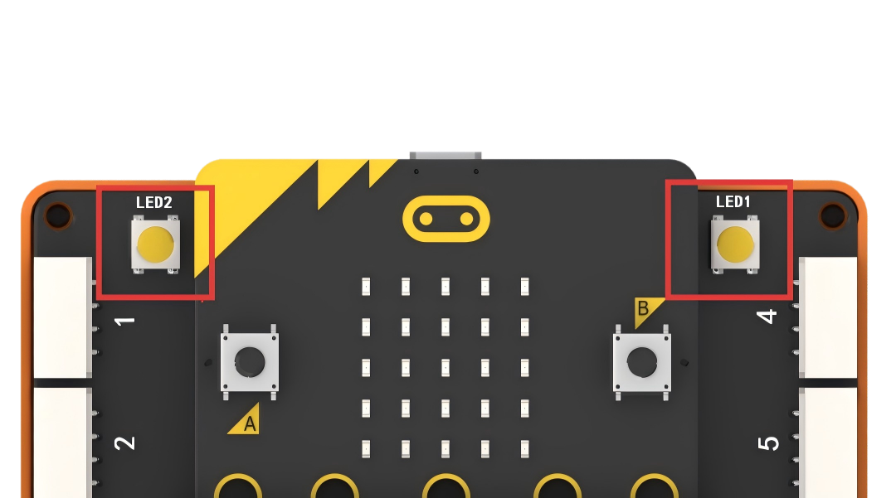

**(1) Learning Objectives**

Program a smart voice-controlled RGB light.

**(2) Program Writing**


Program link: [https://makecode.microbit.org/_4dU7zA7171i9](). Click **Edit** in the upper right corner of the link page to download the complete program.


**(3) Program Download**


**(4) Program Outcome**

Upon startup, initialize DaDaBit and display a grid icon. The ambient volume is continuously detected. When the volume is 50 or higher, the two RGB lights randomly switch to colors corresponding to numbers 0-9, refreshing every 100 milliseconds.

## 4.3 MakeCode Programming Environment

### 4.3.1 Platform Overview

The micro:bit is a product that does not require IDE installation. Simply open the [Microsoft MakeCode for micro:bit](https://makecode.microbit.org/#) website in a web browser to begin programming.

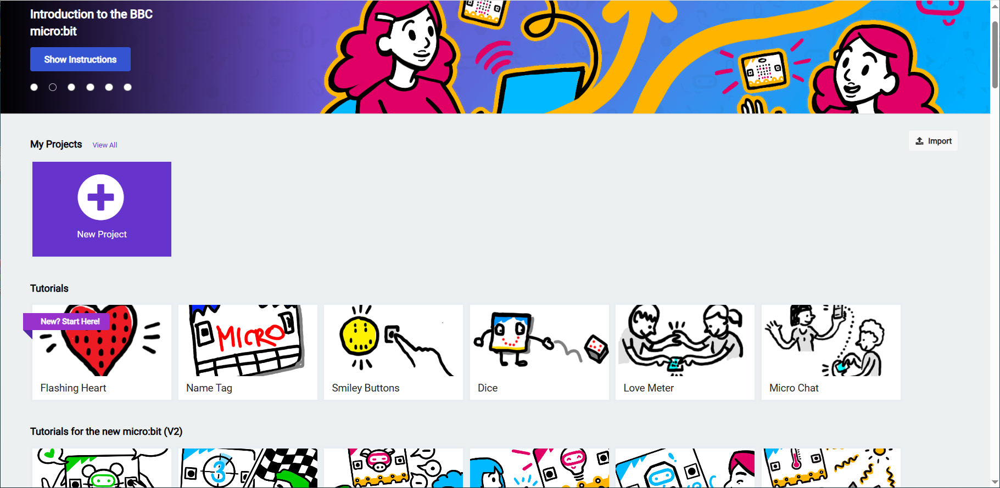

* **IDE Settings and Toolbar Overview**

To create a project, click **New Project**, then enter the project name.

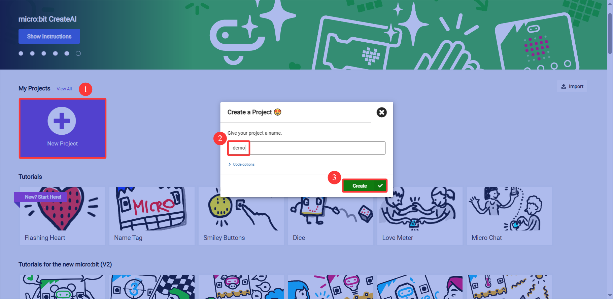

After entering the main interface, the interface can be divided into the following parts, as shown in the figure below:

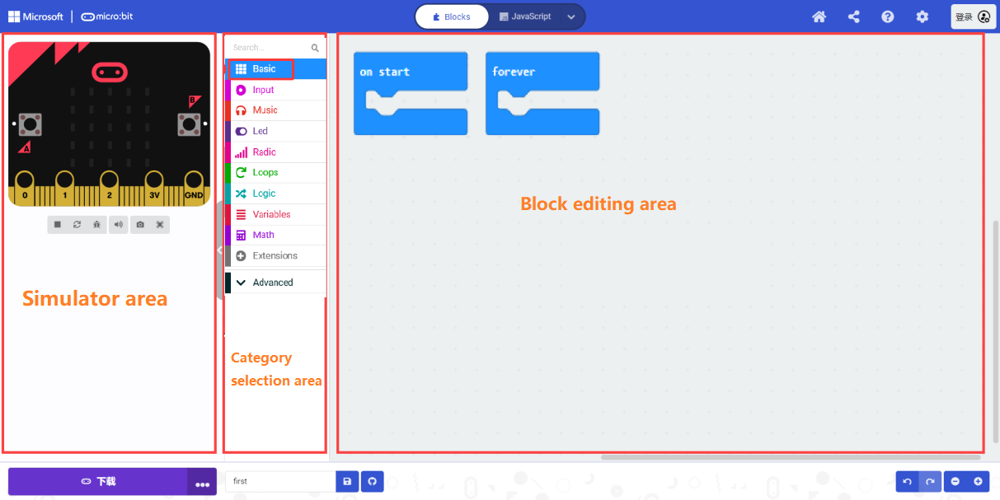

| Area | Function |
| :---: | :---: |
| Simulator Area | Used to simulate programming blocks |
| Category Selection Area | Allows using default blocks or adding blocks from extension packages |
| Block editing area | Block editing area, used for inserting, copying, pasting, deleting, and modifying blocks |

### 4.3.2 micro:bit Official Library Overview

| Block | Category | Description |
| :---: | :---: | :---: |
| 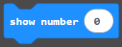 |  | Display the specified number on the micro:bit LED dot matrix screen. |
| 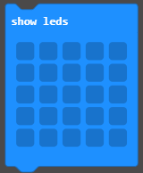 |  | Light up a custom pattern of LED beads on the micro:bit 5×5 dot matrix screen. |
|  |  | Display a preset icon on the micro:bit LED dot matrix screen. |
|  |  | Scroll text content on the micro:bit LED dot matrix screen. |
| 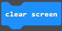 |  | Clear all display content on the micro:bit LED dot matrix screen. |
|  |  | Repeatedly run the enclosed program blocks continuously. |
| 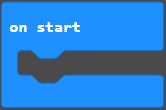 |  | The program entry point, executed once when the device powers on or restarts. |
| 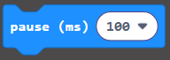 |  | Pause program execution for the specified number of milliseconds. |
| 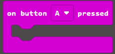 |  | Detect the button press state as an action trigger condition. |
|  |  | Get whether a button is currently pressed, returning a boolean result. |
| 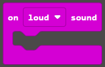 |  | Detect if the ambient sound intensity reaches the loud level. |
| 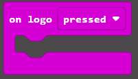 |  | Detect if the touch logo button on the front of the micro:bit is pressed. |
|  |  | Get the ambient sound level value. |
|  |  | Read data from the onboard temperature sensor of the micro:bit in degrees Celsius. |
|  |  | Play a note with a specified pitch and duration. |
|  |  | Stop all sounds currently being played by the device. |
|  |  | Play a preset sound effect such as giggle. |
| 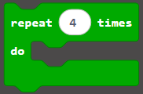 |  | Repeat the execution of internal program blocks for a specified number of times. |
| 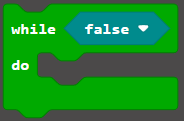 |  | Execute internal program blocks while the specified condition is false. |
| 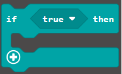 | 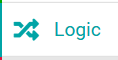 | Conditional statement block that executes the corresponding branch depending on whether the condition is met. |
| 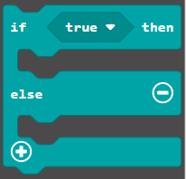 |  | Conditional statement block that executes different branches of program logic depending on whether the condition is met. |
| 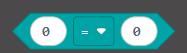 |  | Perform an equality comparison between two values to check if they are equal and return a boolean result. |
|  |  | Perform a logical AND operation on two boolean conditions, returning true only if both conditions are true. |
|  |  | Perform a logical OR operation on two boolean conditions, returning true if at least one condition is true. |
|  |  | Perform a logical NOT operation on the input condition, inverting its boolean value. |
|  |  | Assign an initial value to the specified variable. |
|  |  | Change the value of the specified variable by a specified increment. |
| 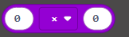 |  | Perform arithmetic operations on two values and return the result with support for addition, subtraction, multiplication, and division. |
|  |  | Randomly generate and return a value within the set upper and lower integer limits. |
|  | <br>->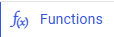 | Create a custom function to encapsulate reusable program logic. |
|  | <br>-> | Define custom array elements and assign them to the specified array variable `list`. |
|  | <br>-> | Create an empty array with no elements for future data storage. |
|  | <br>-> | Check if target text contains the specified character, returning a boolean result. |
| 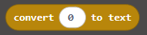 | <br>-> | Convert data formats such as numbers and booleans into standard text format. |

### 4.3.3 DaDabitv2 Library Overview

**1. Importing Library Files**

For the DaDa:bit V2.0 version, add **https://github.com/HiwonderK12/DaDabitV2**

* Click **Extensions**.

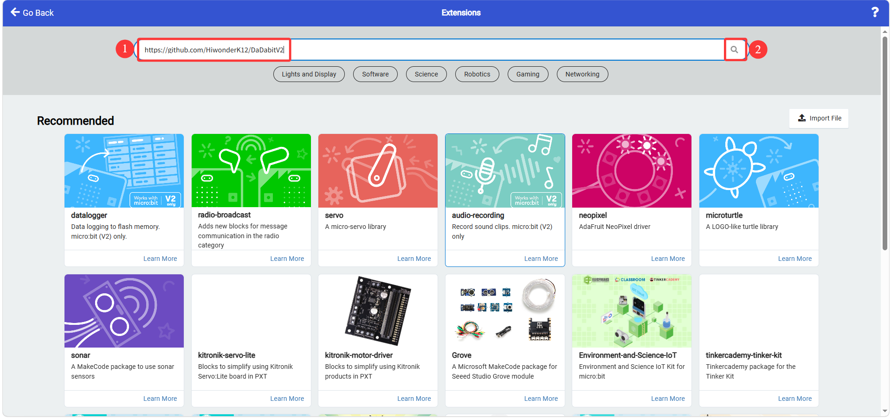

* Search for **https://github.com/HiwonderK12/DaDabitV2** in **Extensions** and click to add **dadabitV2**.

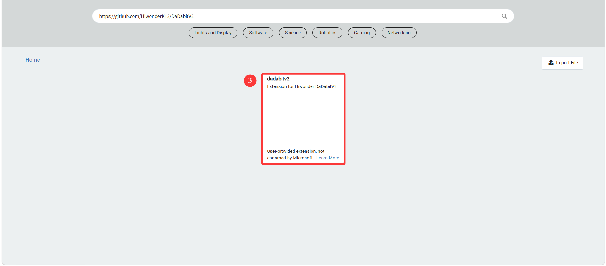

**2. Extension Library Overview**

| Block | Category | Description |
| :---: | :---: | :---: |
|  |  | Initialize hardware resources of the DaDaBit development board. |
| 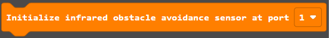 |  | Initialize the infrared obstacle avoidance sensor on the specified port to prepare for detection. |
|  |  | Initialize the light sensor on the specified port to prepare for reading data. |
|  |  | Initialize the 4-digit display on the specified port to prepare for display. |
| 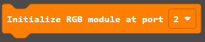 |  | Initialize the RGB light module on the specified port to prepare for control. |
|  |  | Initialize the 4-channel line follower sensor on the specified port to prepare for detection. |
| 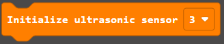 |  | Initialize the ultrasonic sensor on the specified port to prepare for distance measurement. |
|  |  | Initialize the fan hardware port to prepare for control. |
|  |  | Initialize the WonderLLM port to establish module communication connection. |
|  |  | Control the specified LEGO servo to rotate to the target angle within the set time. |
|  |  | Control the specified LEGO motor to run in the set direction and speed. |
|  |  | Set the fan speed with a value range from -100 to 100. |
| 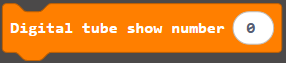 |  | Display specified numeric content on the 4-digit display. |
|  |  | Read light brightness data collected by the light sensor with a range of 0 to 100. |
|  |  | Get the detection state of the infrared obstacle avoidance sensor. |
|  |  | Get the detection state of the 4-channel line follower sensor. |
|  |  | Get the detection state of the specified line follower sensor, returning a boolean result. |
|  |  | Read distance data collected by the ultrasonic sensor in centimeters. |
| 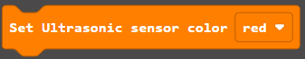 |  | Set the RGB light of the glowy ultrasonic sensor to the specified color. |
| 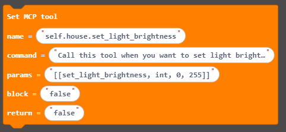 |  | Configure custom tool parameters callable by the AI module. |
|  |  | Synchronize MCP tool configuration information to the AI module. |
|  |  | Notify the AI module that a single tool call process has ended. |
|  |  | Read execution data returned after the AI module calls a tool. |
|  |  | Read numeric type data stored in the dictionary based on the specified key. |
|  |  | Send calculated data back to the AI module for processing. |
|  |  | Concatenate all data in the array and convert it to a text string. |
|  |  | Switch the working mode of WonderLLM, supporting three modes: voice interaction, color recognition, and face recognition. |
|  |  | Read the identified instruction result number from the voice interaction module. |
|  |  | Play preset voice broadcast content in the WonderEcho module. |
|  |  | Play the specified type and number of WonderEcho voice. |
|  |  | Detect whether a face is recognized, returning a boolean result. |
|  |  | Get the specified parameter of the face recognition result, such as center X coordinate. |
|  |  | Read the target color ID with the largest area recognized in the color recognition module. |
|  |  | Set the onboard RGB light of the development board to the specified color. |
|  |  | Set the onboard RGB light of the development board to the color corresponding to the specified value. |
| 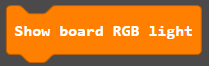 |  | Apply and display the set onboard RGB light effect. |
| 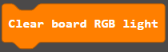 |  | Turn off all onboard RGB lights on the development board. |

## 4.4 Electronic Module Tutorials

### 4.4.1 360° Block Servo

#### 1. Introduction

This is a servo compatible with various LEGO building block components. Controlled using pulse width modulation, also known as PWM, it is a continuous rotation servo. Through PWM signals, rotation speed and direction can be controlled, but the specific rotation angle cannot be controlled.

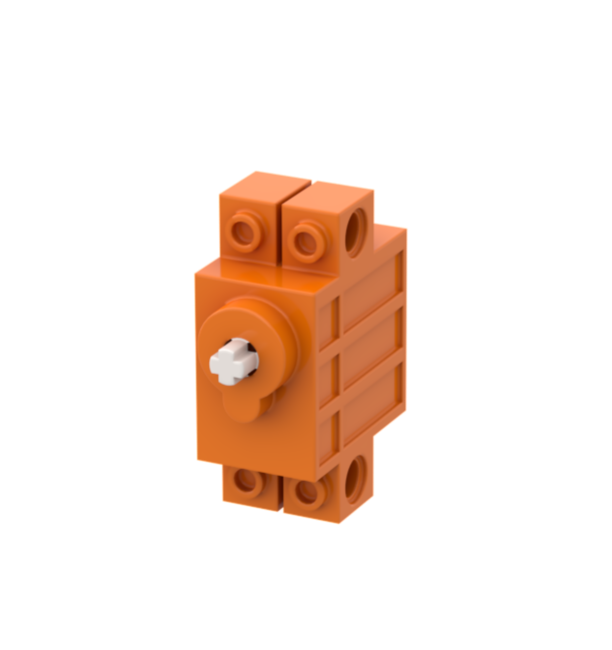

#### 2. Specifications

| Parameter | Value |
| :---: | :---: |
| Operating voltage | DC 4.8-6 V |
| Rated torque | 1N·m |
| Rotation range | 0°~360° |
| Cable length | 25 cm |
| Dimensions | 40 x 16 mm |

#### 3. Wiring Diagram

Connect the motor to controller port `S1`. Connect the yellow wire to `S`, the red wire to `5 V`, and the brown wire to `GND` as shown in the figure below:

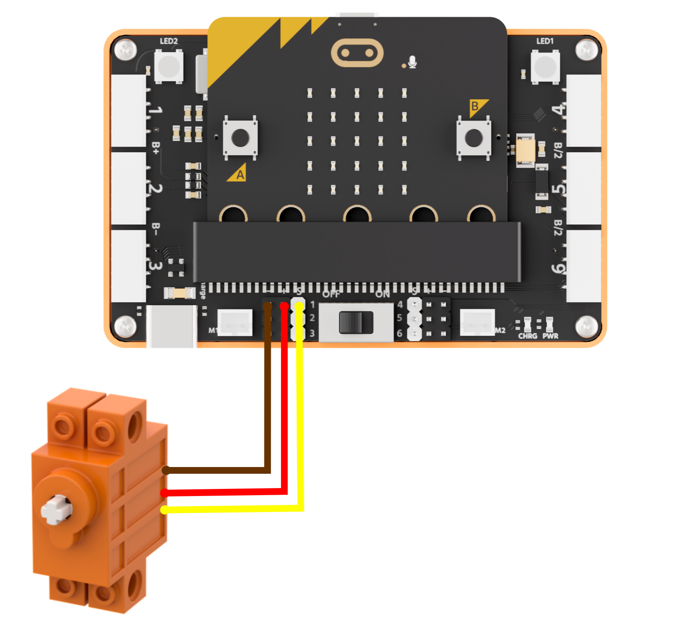

#### 4. Practical Demos

**Demo 1: Button-Controlled 360° Servo Rotation**

Program logic: Press button **A** to rotate the No. 1 LEGO 360° servo clockwise at a speed of 50. Press button **B** to rotate it counterclockwise at a speed of 50. Press buttons **A+B** simultaneously to stop servo rotation.


Program link: [https://makecode.microbit.org/_Wh4iykTojPp2](). Click **Edit** in the upper right corner of the link page to download the complete program.


Program Download Instructions:

Following the animated image, click **Download**, select the port, then click **Pair** to complete program download and test program execution result.


### 4.4.2 270° Block Servo

#### 1. Introduction

This is a servo compatible with various LEGO building block components. Controlled using pulse width modulation, also known as PWM, it is a limited rotation servo. Rotation angle can be controlled, but within a limited range from 0° to 270°.

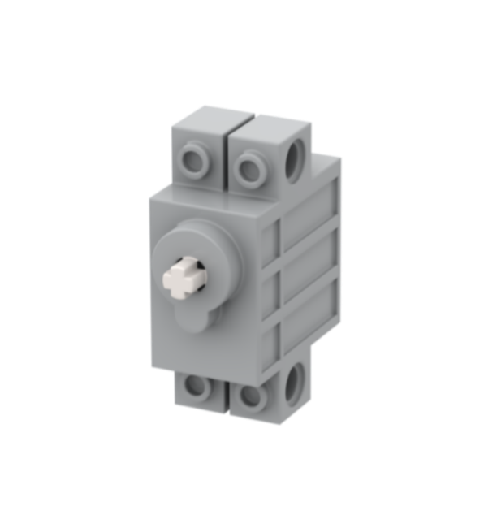

#### 2. Specifications

| Parameter | Value |
| :---: | :---: |
| Operating voltage | DC 4.8-6 V |
| Rated torque | 1N.m |
| Rotation range | 0°~270° |
| Cable length | 25 cm |
| Dimensions | 40 x 16 mm |

#### 3. Wiring Diagram

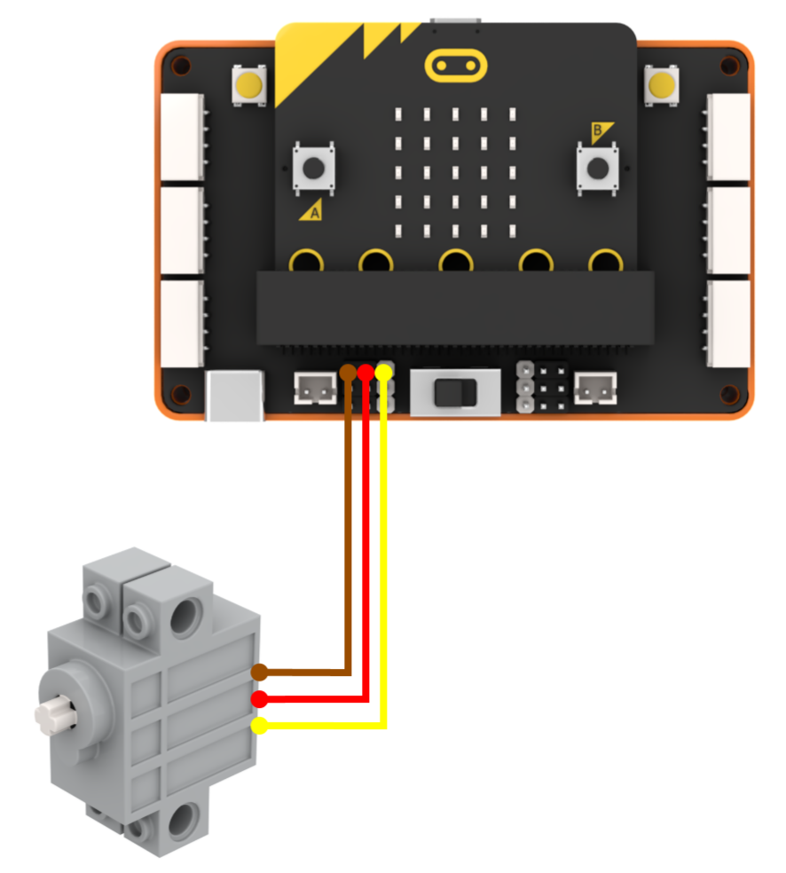

#### 4. Practical Demos

**Demo 1: 270° Servo Reciprocating Swing**

Program logic: Set the initial angle of the No. 1 270° servo to 0 degrees, and continuously swing the servo back and forth slowly between 0 degrees and 180 degrees.

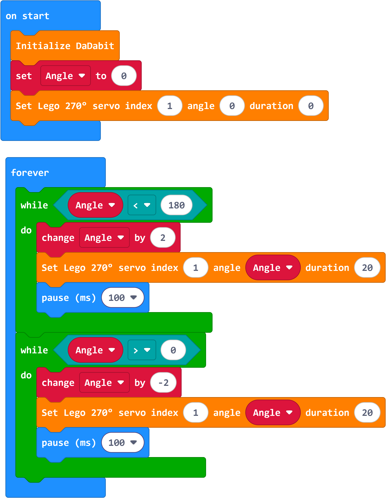

Program link: [https://makecode.microbit.org/_PDeW1W9q8RkX](). Click **Edit** in the upper right corner of the link page to download the complete program.


Program Download Instructions:

Following the animated image, click **Download**, select the port, then click **Pair** to complete program download and test program execution result.


### 4.4.3 Fan Module

#### 1. Introduction

This fan module does not require an additional motor driver board and features adjustable speed. It can be paired with a temperature sensor to create a smart fan device that automatically adjusts fan speed based on temperature changes. Additionally, the module features onboard LEGO-compatible holes for creative DIY designs.

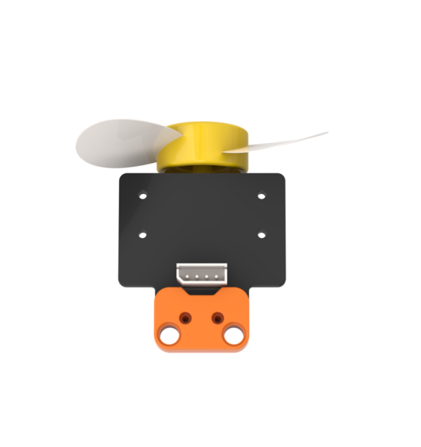

#### 2. Specifications

| Parameter | Value |
| :---: | :---: |
| Operating voltage | DC 5 V |
| Control method | PWM pulse control |
| Interface model | 5264-4AW |
| Dimensions | 64.0 x 41.8 x 25.0 mm |

#### 3. Wiring Diagram

* Supports connecting to ports `1` or `2` on the micro:bit expansion board.

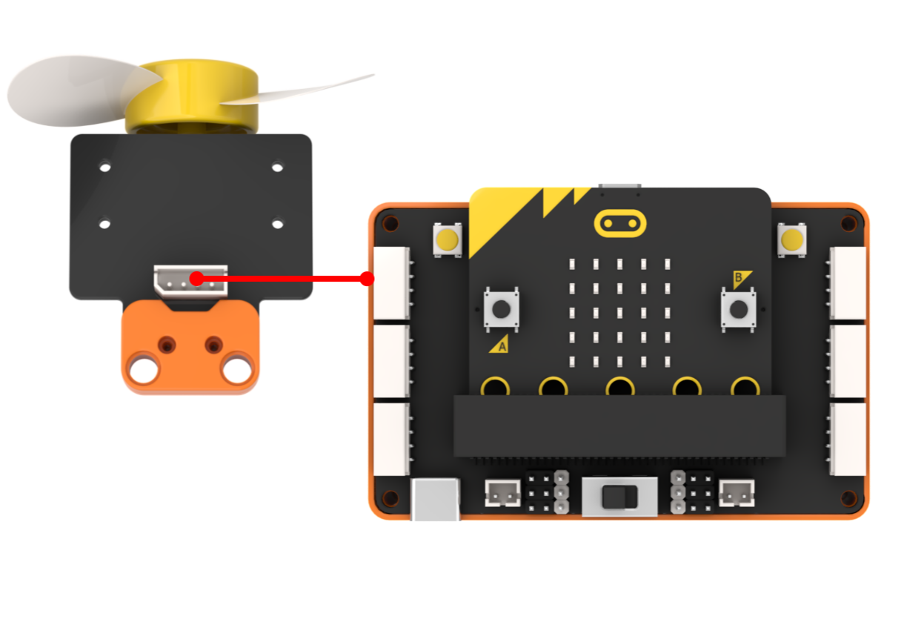

#### 4. Practical Demos

**Demo 1: Button-Controlled Fan Start and Stop**

Program logic: Press button **A** to run the fan at a speed of 80. Press button **B** to stop the fan.

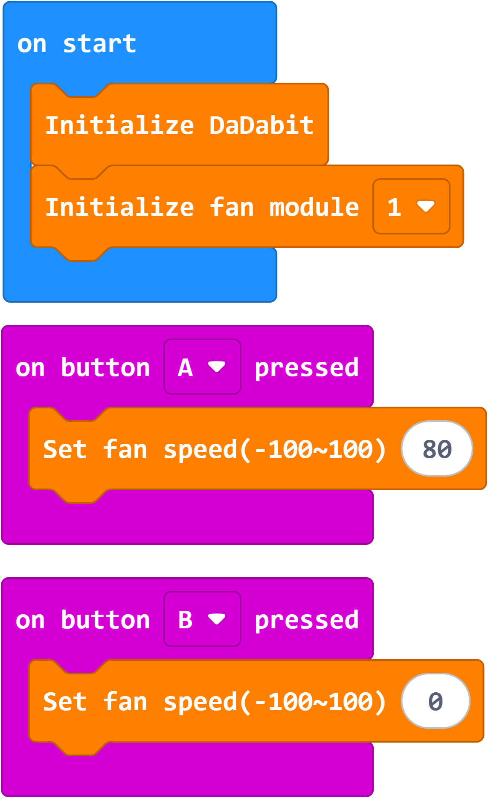

Program link: [https://makecode.microbit.org/_d2FJJCC5MbKs](). Click **Edit** in the upper right corner of the link page to download the complete program.


Program Download Instructions:

Following the animated image, click **Download**, select the port, then click **Pair** to complete program download and test program execution result.


<a id ="section-4-5"></a>

## 4.5 WonderLLM Module

### 4.5.1 Module Introduction

#### 1. Module Overview

WonderLLM is an AI Large Language Model module with an onboard ESP32-S3 high-performance chip. It integrates a 2-megapixel high-definition camera, microphone, high-definition display screen, speaker, and CI1302 voice recognition chip, deeply integrating multimodal models including text, voice, and vision.

Featuring easy operation, this module is frequently paired with robots to function as a super brain. It deeply understands instructions, granting robots outstanding perception, reasoning, and action capabilities to build a flexible and natural human-robot interaction experience.


#### 2. Operating Principle

- The module is woken up using a command word. Speak the wake-up word to activate WonderLLM. Human-robot interaction can proceed only after activation. To switch to English recognition, the English recognition firmware must be flashed. After switching to the English firmware, the English wake-up keyword is **Hello Hiwonder**.

- When recognizing the wake-up word, the buzzer beeps once, after which interaction begins. The module supports communication in English. If no voice is recognized within one minute, the module enters sleep mode, requiring reactivation for subsequent use.

#### 3. Hardware Port Overview


| No. | Description |
| :---: | :---: |
| 1 | Upper Type-C port, used for flashing program firmware to the ESP32-S3 chip |
| 2 | Lower Type-C port, used for flashing voice recognition firmware to the CI1302 chip |
| 3 | 4-PIN I2C communication port, available for secondary development |
| 4 | Capacitive touch screen, used for displaying interfaces and adjusting volume |
| 5 | Left button, used for switching expression or chat modes |
| 6 | High-definition camera, capable of capturing real-time images |
| 7 | Right button, used for module network configuration and interaction control |

#### 4. Precautions

1. Use a 5 V power supply, otherwise the module will be damaged.

2. The operating environment should be quiet, as noisy surroundings affect recognition accuracy.

3. Speak clearly at a moderate speed, maintaining a distance within 5 meters from the module.

### 4.5.2 Module Configuration

<a id ="section-4-5-2-1"></a>

#### 1. Device Startup

1. Powering the module is supported via the following ports: 1. **Upper Type-C port**, **2. Lower Type-C port**, **3. 4-PIN I2C communication port**. Connect an external power supply to any port, and the module powers on automatically.


2. After powering on, the screen displays the **device hotspot name** and **browser network configuration URL** accompanied by voice broadcast. Complete device network connection first by following [Module Network Connection](#section-4-5-2-2).


3. After network configuration, binding with the platform agent is required. The screen displays the **device ID** and **device binding platform URL** accompanied by a voice broadcast of the verification code. Complete device binding by following [Device Binding](#section-4-5-2-3).


4. If device binding is complete upon powering on, a white circular scroll bar appears on the screen while the module connects automatically based on stored Wi-Fi information. If network connection fails, the screen displays the **device hotspot name** and **browser network configuration URL** accompanied by voice broadcast. Reconfigure valid Wi-Fi connection information for the current environment by following [Module Network Connection](#section-4-5-2-2).


5. If device binding is complete upon powering on and configured Wi-Fi information is available in the current environment, the white circular scroll bar loads before network connection succeeds, jumping to the expression display interface. With all configurations normal, human-robot interaction begins after waking up the module.


<a id ="section-4-5-2-2"></a>

#### 2. Module Network Connection

- **Operation Description**

&emsp;&emsp;The module enters network configuration mode under three conditions: 1. Initial use or firmware re-flashing where no valid Wi-Fi information is saved in memory, 2. No matching hotspot exists in the current environment, 3. Manual operation long pressing button **B** to enter network configuration mode.

- **Operating Steps**

1. Network connection starts upon powering on the module. The screen displays the **device hotspot name** and **browser network configuration URL** accompanied by voice broadcast. The Large Language Model module opens its built-in hotspot for connection and configuration. Hotspot names vary across devices with a standard format **“Robot-xxxx”**, taken Robot-B7B9 as an example below.


2. Search for the corresponding hotspot using a computer or phone and connect, note that this hotspot has no password.


3. Click the hyperlink [Network Configuration](http://192.168.4.1/) to directly access the device configuration URL, or copy the URL below to open in any browser.

```py
http://192.168.4.1
```


4. Enter the desired hotspot name for automatic connection in field 1 shown below, and enter the password in field 2. Click **Connect** in field 3 to search for and connect to a matching hotspot in the current environment.


5. A list of available hotspots in the current environment scanned by the module appears on the interface. Click any item to automatically populate the hotspot name into field 1.


6. If the prompt below appears on the interface, the hotspot cannot be found in the current environment or the password is incorrect. Re-enter the information.


7. If the prompt below appears on the interface, the module found and connected to the hotspot successfully. The module restarts automatically and connects to the hotspot.


> [!NOTE]
>
> * **Do not enter hotspots that cannot be scanned, have weak signals, or do not support network connection.**
>
> * **If connection information for other hotspots was saved previously, new saved information coexists. Upon next startup, stored information is read sequentially to attempt hotspot connection.**
>
> * **If the message "Error: Failed to check for new version, retrying in xx seconds" appears after configuration, the hotspot may lack internet access or network quality is poor. Try switching hotspots.**
>

- **Manually Entering Network Configuration Mode**

1. The WonderLLM module supports manually entering network configuration mode to accommodate custom hotspot connection needs.

2. After powering on the module, long press the right button to send a restart command, turning off the screen upon receipt. Continue long pressing. After restarting, the module attempts to connect to a hotspot while displaying a white circular scroll bar. Detecting that the right button is long pressed, the module stops matching external hotspots and enters network configuration mode directly. Release the button at this point.

3. Stored hotspot configuration information is retained after entering network configuration mode. Access the network configuration page or short press the right button to exit network configuration mode.

4. After exiting network configuration mode, the module continues attempting connection based on saved hotspot information. If connection to external hotspots fails, network configuration mode is re-entered.

- **Managing Saved Connection Configurations**

1. When the module is in network configuration mode, connect to the module hotspot to access the network configuration interface. The list of all saved hotspot connection configurations is displayed, as shown below:

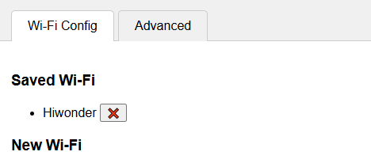

2. Click the  icon corresponding to any saved hotspot connection information to delete it, or click the  icon to raise its matching priority order during network configuration, where priority decreases from top to bottom.

<a id ="section-4-5-2-3"></a>

#### 3. Device Binding

- **Operation Description**

&emsp;&emsp;After network configuration upon startup, if used for the first time, the screen displays the **6-digit device ID** and **device binding platform URL** accompanied by voice broadcast. Complete device binding with the platform agent according to the tutorial below.


- **Operating Steps**

1. Click the hyperlink [XiaoZhi AI Chatbot](https://xiaozhi.me/) to directly access the device binding URL, or copy the URL below to open in any browser.

```py
https://xiaozhi.me
```

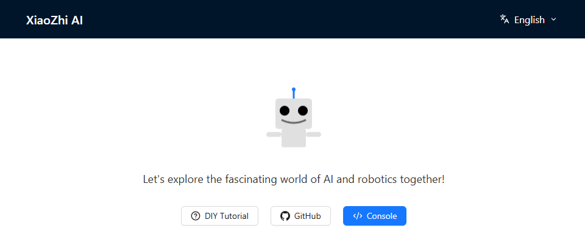

2. Click **Console** to enter the XiaoZhi AI agent management platform.

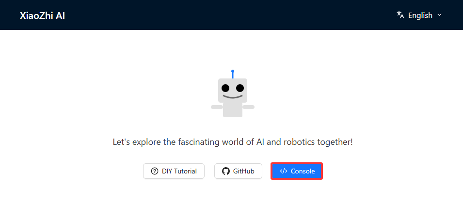

3. If logging in for the first time, register a platform account first.


4. After entering the corresponding information, click **Send code** to obtain the code required for account registration.


5. Check the box to agree to the service agreement and privacy policy, then click **Login**.


6. Fill in the required information, then click **Confirm** to complete registration and login.


7. After registration and login, the interface below appears.


8. Click the **∨** icon next to the Add Device button, then click **Create Agent**.

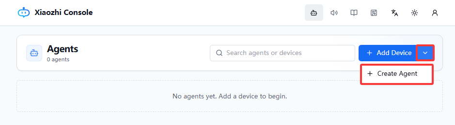

9. Enter the agent name, then click **Confirm** to complete agent creation.


10. Click **Configure** to adjust settings for various agent functions.


11. Click **Role** to configure role settings, selecting the conversation language in field 1, role voice tone in field 2, and voice parameters in field 3.

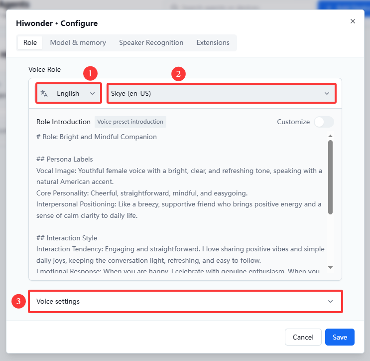

12. Click **Model & Memory**, select **Xiaozhi Lite** for the language model, disable the memory function, and keep default settings for other options.

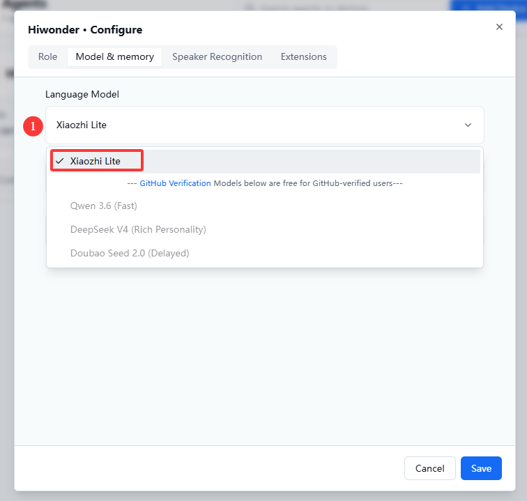


> [!NOTE]
>
> **If the account has not completed developer certification on the XiaoZhi AI platform, only basic models such as Xiaozhi Lite can be selected by default. To use advanced models such as Qwen 3.6 or DeepSeek V4, complete certification on the XiaoZhi AI platform by following [Platform Developer Certification](#section-4-5-2-5), then reselect here.**

13. Click **Extensions** to enable or disable official service functions, which are enabled by default for new agents, then click **Save**.

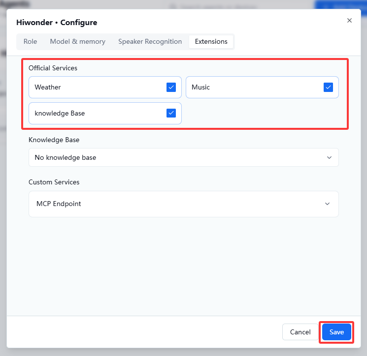

14. Click **Devices** to enter the device management function.


15. Click **Link new device**, enter the **6-digit device ID** in the pop-up window, then click **Link**.


16. Upon successful binding, the prompt **Device Added Successfully** appears on the page. Select **Open Source Version**, then click **Start Using**.


<a id ="section-4-5-2-4"></a>

#### 4. Device Unbinding

- **Operation Description**

&emsp;&emsp;To unbind a device, refer to the operations below.

- **Operating Steps**

1. Click the hyperlink [XiaoZhi AI Chatbot](https://xiaozhi.me/) to directly access the device binding URL, or copy the URL below to open in any browser.

```py
https://xiaozhi.me
```


2. Click **Console** to enter the XiaoZhi AI agent management platform.


3. Click **Devices** to enter the device management function.


4. Locate the target device, click the corresponding  icon, then click **Unbind** in the pop-up window.


5. Upon successful unbinding, the prompt **Device unbound successfully** appears on the page.

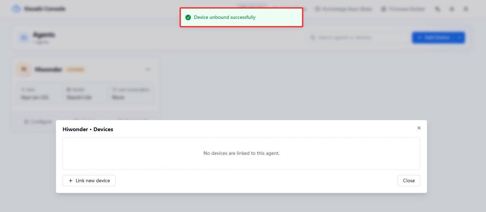

<a id ="section-4-5-2-5"></a>

#### 5. Platform Developer Certification

> [!NOTE]
>
> **If GitHub certification is incomplete, module usage is not affected, but available functions are limited. Differences between certified and uncertified status are listed below:**

|                           |        Unauthenticated         |                    Authenticated                     |
| :-----------------------: | :----------------------------: | :--------------------------------------------------: |
|      Model selection      |          Xiaozhi Lite          | Xiaozhi Lite, Qwen 3.6, DeepSeek V4, Doubao Seed 2.0 |
|  Number of bound devices  |               10               |                         100                          |
| Official service features | Weather, Music, Knowledge Base |      Weather, Joke, Music, News, Knowledge Base      |

- **Logging in to GitHub Platform**

1. On the XiaoZhi platform, click **GitHub Verification** under the  icon. After the page jumps to the authentication interface, click **Link GitHub**.


2. Wait for the page to jump to the GitHub login page.


3. If a GitHub account is registered, log in directly with username and password, jumping to [Binding XiaoZhi Platform with GitHub Platform](#section-4-5-2-5-3). If no GitHub account exists, click **Create an account**.


4. In the pop-up window, enter the email address, password, username, and location information in sequence, then click **Create account** to submit registration details.

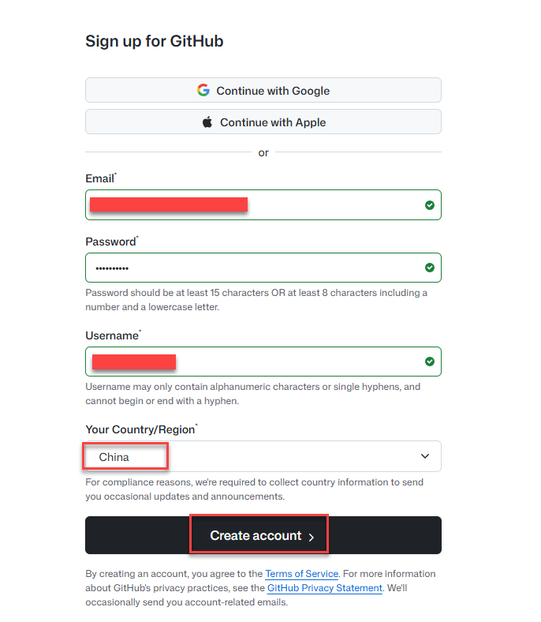

5. Click **Visual puzzle** on the page to start image verification.


6. After completing image verification, the GitHub platform sends a verification email to the registered email address. Open the email, copy the verification code, and enter it on the web page.


7. After registration, the web page jumps to the login page, displaying a registration success prompt window.


<a id ="section-4-5-2-5-3"></a>

- **Binding XiaoZhi Platform with GitHub Platform**

1. Click **Authorize tenclass** to complete binding between the XiaoZhi platform and GitHub platform.


2. After binding, authentication on the XiaoZhi platform is complete, returning automatically to the certification page with the prompt below.

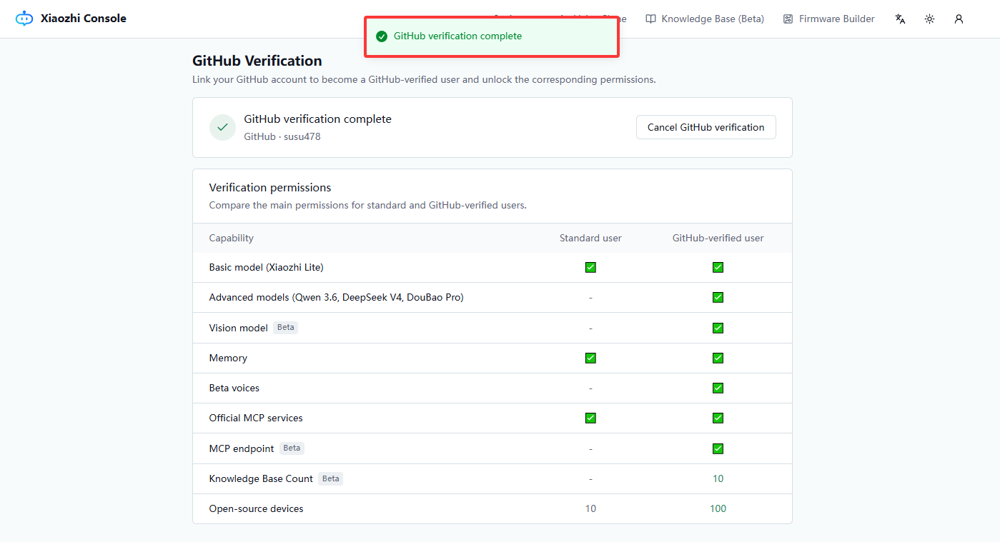

3. Click **Agent** to return to the XiaoZhi AI agent console. Create a new agent, and previously restricted configurations are fully unlocked.

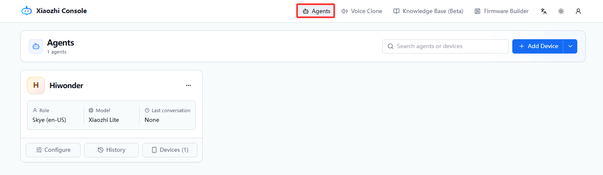


<a id ="section-4-5-2-6"></a>

#### 6. Device Restart

1. Manual restart after powering on is supported. Long press the left button **A** or long press the right button **B** to restart the module without disconnecting power.

2. When detecting a restart command sent by long pressing a button, the module shuts down and restarts automatically. The screen turns off directly. Release the button at this point, and the module turns on automatically afterwards.

3. If restarting by long pressing the right button **B**, keeping the button pressed after rebooting might trigger network configuration mode accidentally. To avoid this issue, restarting by long pressing the left button is recommended.

<a id ="section-4-5-3"></a>

### 4.5.3 Volume Control

> [!NOTE]
>
> **Changing the volume while WonderLLM is speaking takes effect in the next round of speaking.**

#### 1. Touch Screen Control

1. After powering on and connecting to an external hotspot, adjust the volume by touching the screen in two interfaces: 1. Expression interface, 2. Chat interface.

2. Operation method: Slide anywhere on the screen. Slide straight up to increase volume, or slide straight down to decrease volume. Adjustment range depends on sliding distance, supporting multiple slides to adjust volume.

3. The real-time volume value displays at the top of the screen when sliding. The figure below shows sliding up to increase volume in the expression interface as an example:

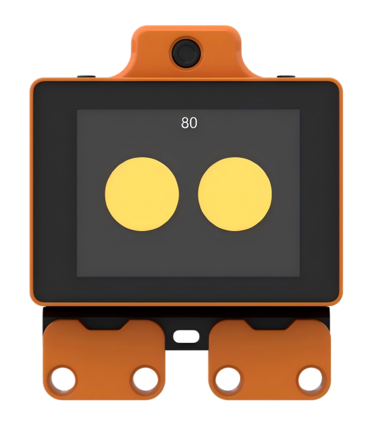

#### 2. Voice Interaction Control

1. During interaction with the WonderLLM Large Language Model module, the volume can be adjusted by giving voice commands.

2. Operation method: Speak the wake-up word or short press the right button to enter the **chat interface**. Once activated, use statements such as: 1. **Set the volume to...** (from 0 to 100, which can also be expressed as a percentage), 2. **Increase volume**, and the module adjust volume automatically.

3. After recognition, the conversation box returns the volume adjustment function, which requires no attention. The conversation box then displays and broadcasts the Large Language Model response, which is randomly generated with appropriate meaning.

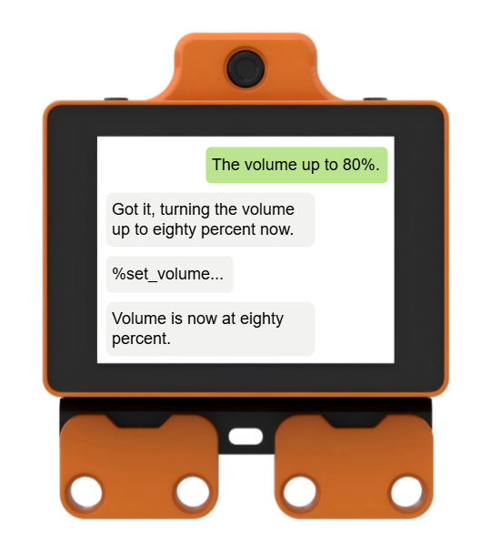

<a id ="section-4-5-4"></a>

### 4.5.4 Chat Mode

#### 1. Mode Overview

1. In this mode, the module listens to and understands spoken statements to make appropriate replies.

2. The relationship for switching between various module modes is shown in the figure below. Operations to enter chat mode are summarized as follows: In any other mode, speak the wake-up word or short press the right button to enter chat mode.


#### 2. Operating Instructions

1. After completing network configuration, the module enters the expression interface first, as shown below:


2. Speak the wake-up word **Hello Hiwonder**, or short press right button **B** to enter chat mode. The buzzer emits a prompt tone, and the screen switches to the chat box interface. The module activates successfully and begins listening to spoken statements.

3. If entering chat mode by speaking the wake-up word, the module sends **Hello** as the opening statement upon recognition. The Large Language Model makes an appropriate reply, displays it in the chat box interface, and broadcasts it, which can be interrupted to skip quickly as detailed in [Free Chat](#section-4-5-8). Listening to spoken statements begins afterwards.

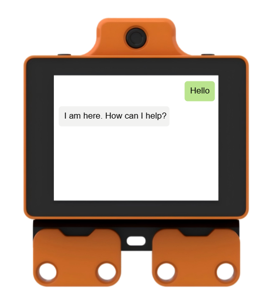

4. If entering chat mode by short pressing the right button, the module begins listening to spoken statements immediately.

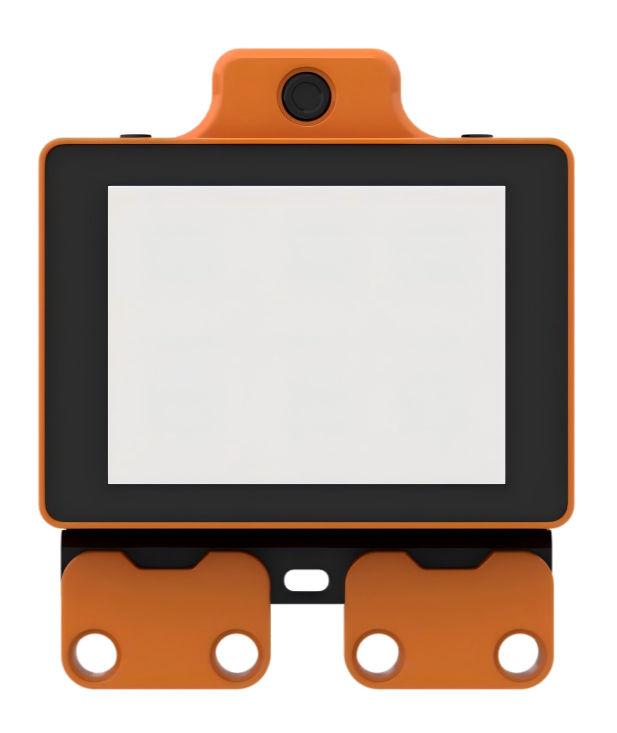

5. After entering chat mode and starting human-robot interaction, choose to keep the expression interface instead of displaying the chat box interface, as detailed in operating instructions of [Expression Mode](#section-4-5-5).

<a id ="section-4-5-5"></a>

### 4.5.5 Expression Mode

> [!NOTE]
>
> * **If the wake-up word is not spoken within 20 seconds in the expression interface, the module enters weather clock mode. Tap anywhere on the screen to return to expression mode.**
>
> * **Switching between these two modes changes the screen display content when entering chat mode.**
>
> * **During mode switching by short pressing the left button, the module operates in expression mode continuously. Short pressing the left button to switch to chat mode does not and cannot wake up the module to enter actual chat mode.**
>
> * **Specifically, if the display interface in chat mode is switched to the chat box interface by short pressing the left button, the module displays the chat box interface and Large Language Model response after activation by speaking the wake-up word or short pressing the right button.**
>
> * **If the display interface in chat mode is switched to expression interface by short pressing the left button, the module remains in expression interface after activation by speaking the wake-up word or short pressing the right button, making appropriate expressions based on replies.**
>

#### 1. Mode Overview

1. In this mode, the module mimics human facial expressions.

2. The relationship for switching between various module modes is shown in the figure below. Operations to enter expression mode are summarized as follows: 1. Tap the screen in weather clock mode to enter expression mode, 2. Double tap the screen in camera mode to enter expression mode, 3. Short press the right button in chat mode when the module is not speaking to enter expression mode.


#### 2. Operating Instructions

1. In expression mode, short press the left button to switch between **Chat Mode** and **Expression Mode**. The current mode name displays at the top of the screen.

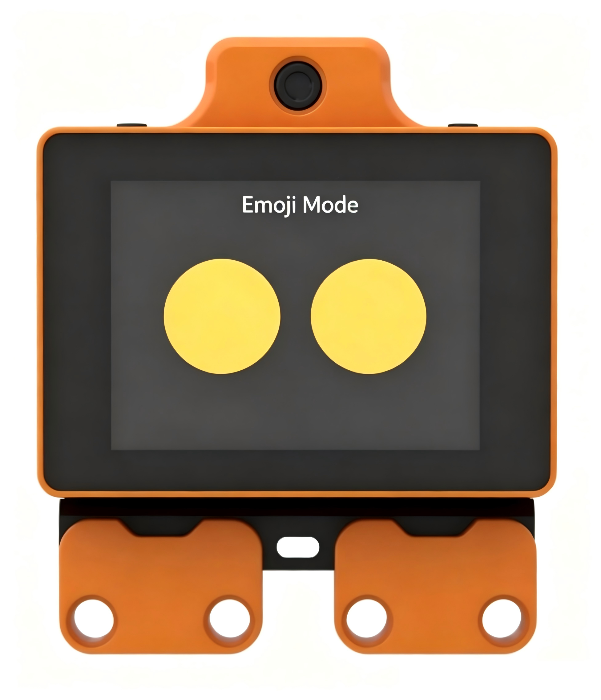

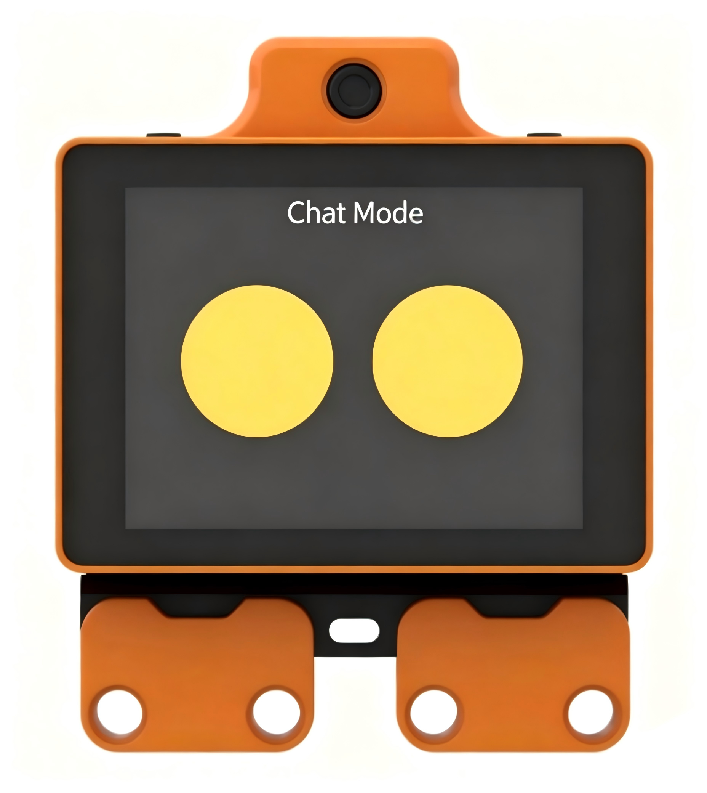

2. Short press the left button to switch to **Expression Mode**, where the display content for chat mode is the expression interface. Activate the module by speaking the wake-up word or short pressing the right button to enter **Chat Mode** and start interaction. The module makes facial expressions based on spoken statements, mainly through two methods: 1. Describe a specific event and the module makes a corresponding expression automatically when replying, 2. Ask the module to make a specific expression.

<a id ="section-4-5-6"></a>

### 4.5.6 Weather Clock Mode

> [!NOTE]
>
> **In weather clock mode, tap anywhere on the screen to return to expression mode. Alternatively, speak the wake-up word or short press the right button to enter chat mode.**

#### 1. Mode Overview

1. In this mode, the module obtains and displays real-time weather and time information based on the set city.

2. The relationship for switching between various module modes is shown in the figure below. Operations to enter weather clock mode are summarized as follows: Tap the screen or perform no operation for 20 seconds in expression mode to enter weather clock mode. Camera mode and chat mode do not support direct switching to weather clock mode.


#### 2. Operating Instructions

1. In expression mode, perform no operation for 20 seconds or tap anywhere on the screen to switch to weather clock mode.


2. After entering weather clock mode, the module remains in this mode if no other operations are performed.

3. In this mode, the screen displays the following content: 1. Real-time weather information for the current location and weather forecast for the next 2 days, 2. Current time and date, 3. Local city.

4. Modifying the local city is supported. Speak the wake-up word or short press the right button to enter the chat interface and activate the module. Give commands to the WonderLLM module using statements such as: 1. Modify city, which requires specifying the target city in subsequent conversation, 2. Switch local city to a specified city. After the module replies, the location for weather clock mode switches synchronously.


<a id ="section-4-5-7"></a>

### 4.5.7 Camera Mode

#### 1. Mode Overview

1. In this mode, the module calls the camera to continuously capture and display real-time images.

2. The relationship for switching between various module modes is shown in the figure below. Operations to enter camera mode are summarized as follows: Double tap the screen in expression mode to enter camera mode. Weather clock mode and chat mode do not support direct switching to camera mode.


#### 2. Operating Instructions

1. Double tap anywhere on the screen in expression mode to switch to camera mode.


2. In camera mode, the module calls the camera to continuously capture and display real-time images. The module remains in this mode if no other operations are performed.

3. In camera mode, tap anywhere on the screen to trigger the scene understanding function, as detailed in [Scene Understanding](#section-4-5-9).

<a id ="section-4-5-8"></a>

### 4.5.8 Free Chat

#### 1. General Operations

1. After powering on and completing network configuration, wake up the module by speaking the wake-up word or short pressing the right button to enter chat mode.

2. Speeches can be made freely. The module understands statements and makes text and voice replies through connection with the cloud Large Language Model. Featuring memory function, multi-round continuous conversations are supported.

3. After each round of conversation, including after waking up WonderLLM, the module continues listening. If no statement is recognized within one minute, the module stops listening automatically. The Large Language Model replies with an appropriate farewell phrase, displays it in the chat box interface, and broadcasts it. To continue interaction, wake up the module again by speaking the designated wake-up word or short pressing the right button.

4. The conversation can be ended actively during interaction. Give commands to the WonderLLM module using statements such as: 1. Goodbye, 2. Okay, let's stop here. Upon receipt, the module replies with a farewell phrase and stops listening.

5. The WonderLLM module supports a voice interruption function. While the module is speaking, which includes replying to statements, greeting, or saying goodbye, short press the right button. The module stops speaking immediately and starts listening to the next statement.

6. The WonderLLM module supports bilingual recognition and speech in Chinese and English. Switch the working language directly using statements such as: 1. Can Chinese be spoken?, 2. Can English be spoken?.

#### 2. Special Function Invocation

- **Function Overview**

&emsp;&emsp;Some special functions are built into the module, which can be invoked by spoken statements during interaction. Give commands to the WonderLLM module using statements such as: 1. What features are available?, 2. Introduce available functions. The table below lists the special functions currently supported by the module:

| No. | Function | No. | Function |
| :---: | :---: | :---: | :---: |
| 1 | Query Weather | 4 | Tell jokes |
| 2 | Broadcast news | 5 | Query Almanac |
| 3 | Outfit advice | 6 | Play music |

- **Invocation Examples**

&emsp;Give commands to the WonderLLM module using statements such as the following to invoke corresponding special functions:

1. Query weather function: **Query the weather condition in [Location]**.

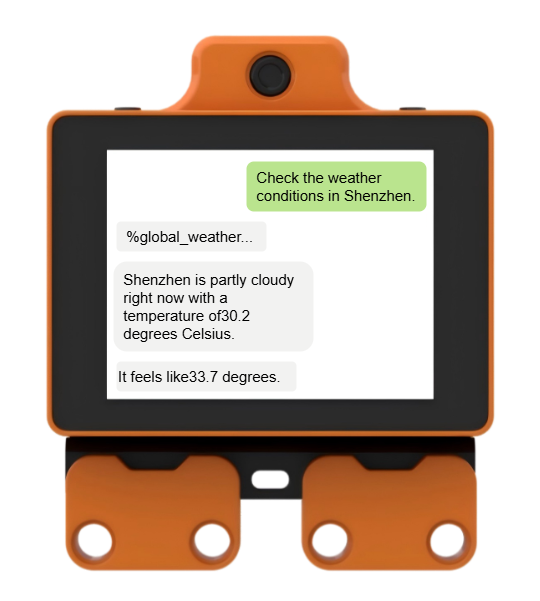

2. Broadcast news function: 1. **Broadcast today's news**, 2. **Introduce today's trending events**.


3. Outfit advice function: **What clothing combination is suitable for going out today**.


4. Tell jokes function: 1. **Tell a joke**, 2. **Tell a joke to make me laugh**.

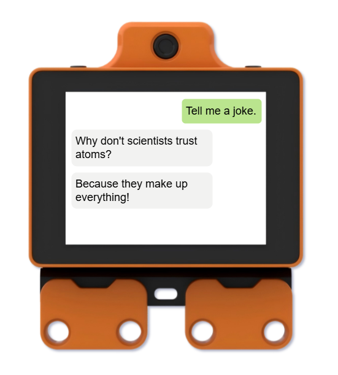

5. Query almanac function: **Query today's almanac items**.


6. Play music function: **Play a random music track**. 

   > [!NOTE]
   >
   > **When using the music playback function, reducing the module volume is recommended.**


<a id ="section-4-5-9"></a>

### 4.5.9 Scene Understanding

> [!NOTE]
>
> * **In the scene understanding function, the module does not support long-term observation. It only captures a real-time image and analyzes it after a command is given to enable this function.**
>
> * **In camera mode, double-tap the screen again to return to the expression interface.**
>
> * **Before clicking to trigger the function in camera mode, the module only captures real-time images through the camera and displays them on the screen, without calling the Large Language Model for analysis.**
>

#### 1. Voice Interaction Control

1. After powering on, the module enters the expression interface. Speak the wake-up word or short press the right button to enter the chat interface and activate the module.

2. Give commands to the WonderLLM module using statements such as: 1. **Describe what is seen in front**, 2. **Please take a photo**.

3. Upon understanding the command, the camera captures a real-time image and displays it on the screen briefly for confirmation. The conversation box returns the image capture function, which requires no attention. The conversation box then displays and broadcasts the Large Language Model analysis of the image, which is randomly generated with appropriate meaning.


#### 2. Touch Screen Trigger

1. In expression mode, double tap anywhere on the screen to enter camera mode, where the screen displays the real-time view captured by the camera in front.


2. In camera mode, tap anywhere on the screen to capture a real-time image. The image displays on the screen briefly for confirmation before returning to camera mode. The module broadcasts the image analysis automatically, which is randomly generated with appropriate meaning.

<a id ="section-4-5-10"></a>

### 4.5.10 Firmware Update

#### 1. ESP32-S3 Firmware Flashing

1. Connect the upper Type-C port of the WonderLLM module to the computer using a USB cable.


2. Open the file flash_download_tool_3.9.7.exe in the folder [Appendix\WonderLLM Flashing Tool\ESP32-S3 Firmware Flashing Tool\flash_download_tool_3.9.7](https://drive.google.com/drive/folders/1b-aoU7MKE3Y_4uExiBQByzBwePc7oKps?usp=sharing).

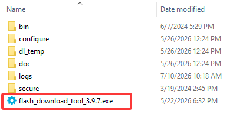

3. Select **ChipType** as **ESP32-S3**. Keep other settings as default, then click **OK**.


4. After opening the tool, click **...** to select the program bin file to be flashed. Open the file **WonderLLM_S3_V1.9.0-EN.bin** in the folder [Appendix\WonderLLM Firmware File\Online](https://drive.google.com/drive/folders/1YYIAVg12QUGiPGuGO3DVJx-ZvL7FNmBM?usp=sharing).


5. Check the box on the left. Configure the remaining settings as shown in the figure below. Select the COM port corresponding to the module. 

   > [!NOTE]
   >
   > **If SPI MODE is set to DIO according to the configuration below and the module fails to work after flashing, try setting SPI MODE to DOUT and flash again.**

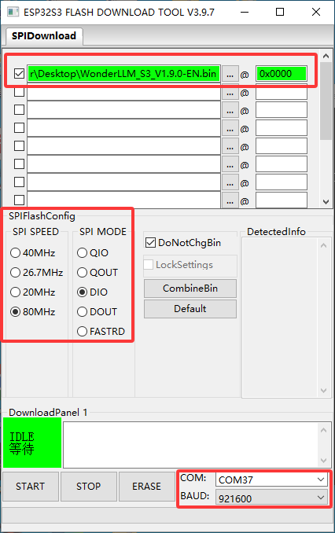

6. Click **ERASE** to clear the previously downloaded firmware, which is a required step, and wait until the status bar displays **FINISH**.


7. Click **START** to download the selected firmware, and wait for the progress bar to complete to finish firmware download.


#### 2. CI1302 Firmware Flashing

1. Connect the lower Type-C port of the WonderLLM module to the computer using a USB cable.


2. Open the file **PACK_UPDATE_TOOL.exe** in the folder [Appendix\WonderLLM Flashing Tool\CI1302 Firmware Flashing Tool](https://drive.google.com/drive/folders/1HbqVQO8ZhEwgTeZXTpBJER-n0p_pEQZm?usp=sharing).


3. Select the **CI1302** chip, then click **Update**.


4. Click **Select Firmware** to select the program bin file to be flashed. Open the file **CI1302_K12_EN.bin** in the folder [Appendix\WonderLLM Firmware File\Online](https://drive.google.com/drive/folders/1D2WloWPYkgp3ss7u4MCegzG4K0Etqa5U?usp=sharing).


5. Find the corresponding serial port and click to select it.


6. Long press the left and right buttons **A** and **B** on the WonderLLM module simultaneously to start flashing, then wait for flashing to complete successfully.


<a id ="section-4-6"></a>

## 4.6 WonderLLM Offline Version

<a id ="section-4-6-1"></a>

### 4.6.1 Firmware Update

#### 1. ESP32-S3 Firmware Flashing

1. Connect the upper Type-C port of the WonderLLM module to the computer using a USB cable.


2. Open the file **flash_download_tool_3.9.7.exe** in the folder [Appendix\WonderLLM Flashing Tool\ESP32-S3 Firmware Flashing Tool\flash_download_tool_3.9.7](https://drive.google.com/drive/folders/1b-aoU7MKE3Y_4uExiBQByzBwePc7oKps?usp=sharing).


3. Select Chip Type as **ESP32-S3**. Keep other settings as default, then click **OK**.


4. After opening the tool, click **...** to select the program bin file to be flashed. Open the file **WonderLLM_Echo_K12_EN.bin** in the folder [Appendix\WonderLLM Firmware File\Offline](https://drive.google.com/drive/folders/1D2WloWPYkgp3ss7u4MCegzG4K0Etqa5U?usp=sharing).


5. Check the box on the left. Configure the remaining settings as shown in the figure below. Select the COM port corresponding to the module. 

   > [!NOTE]
   >
   > **If SPI MODE is set to DIO according to the configuration below and the module fails to work after flashing, try setting SPI MODE to DOUT and flash again.**


6. Click **ERASE** to clear the previously downloaded firmware, which is a required step, and wait until the status bar displays **FINISH**.


7. Click **START** to download the selected firmware, and wait for the progress bar to complete to finish firmware download.


#### 2. CI1302 Firmware Flashing

1. Connect the lower Type-C port of the WonderLLM module to the computer using a USB cable.


2. Open the file **PACK_UPDATE_TOOL.exe** in the folder [Appendix\WonderLLM Flashing Tool\CI1302 Firmware Flashing Tool](https://drive.google.com/drive/folders/1HbqVQO8ZhEwgTeZXTpBJER-n0p_pEQZm?usp=sharing).


3. Select the **CI1302** chip, then click **Firmware Upgrade**.


4. Click **Select Firmware** to select the program bin file to be flashed. Open the file **CI1302_K12_EN.bin** in the folder [Appendix\WonderLLM Firmware File\Offline](https://drive.google.com/drive/folders/1D2WloWPYkgp3ss7u4MCegzG4K0Etqa5U?usp=sharing).


5. Find the corresponding serial port and click to select it.


6. Long press the left and right buttons **A** and **B** on the WonderLLM module simultaneously to start flashing, then wait for flashing to complete successfully.


### 4.6.2 Voice Interaction Mode

1. After updating both firmwares to the offline version, the module enters the **Standby** state first.


2. In any mode, long press right button **B** to enter voice interaction mode.


3. Activate the module by speaking the wake-up keyword **小幻小幻** to enter **Voice Interaction Mode**, and the module replies with **我在**.


4. After entering voice interaction mode, the module makes targeted message replies based on designated commands. The commonly used voice command entries are listed below, with more detailed command entries available in the Appendix.

| Voice ID | Command Word | Broadcast Statement |
| :---: | :---: | :---: |
| / | HELLO-HI-WONDER | I'm here |
| / | TURN-UP-VOLUME | Volume increase |
| / | TURN-DOWN-VOLUME | Volume decrease |
| / | MAXIMUM-VOLUME | Maximum volume |
| / | MEDIUM-VOLUME | Medium volume |
| / | MINIMUM-VOLUME | Minimum volume |
| 26 | HELLO | Hi |
| 27 | INTRODUCE-YOURSELF | Hello, i'm Hiwonder, and i can talk and dance. |
| 15 | WELCOME-YOU | Hello welcome |
| 1 | GO-STRAIGHT | Going straight |
| 2 | GO-BACKWARD | Going backward |
| 3 | TURN-LEFT | Turning left |
| 4 | TURN-RIGHT | Turning right |
| 9 | STOP | Copy that |
| 13 | SPEED-UP | Copy that |
| 14 | SLOW-DOWN | Copy that |
| 186 | Move left | Moving left |
| 187 | Move right | Moving right |
| 18 | TURN-ON-THE-LIGHT | Turn on the light |
| 19 | TURN-OFF-THE-LIGHT | Turn off the light |
| 39 | GIVE-A-RED-LIGHT | Copy that |
| 40 | GIVE-A-GREEN-LIGHT | Copy that |
| 41 | GIVE-A-BLUE-LIGHT | Copy that |
| 20 | OPEN-THE-DOOR | The door is open |
| 21 | CLOSE-THE-DOOR | The door is closed |
| 24 | UNFOLD-THE-AIRING-RACK | Copy that |
| 25 | FOLD-THE-ARING-RACK | Copy that |
| 36 | TURN-ON-THE-FAN | Copy that |
| 37 | TURN-OFF-THE-FAN | Copy that |
| 38 | ROTATING-STEERING-GEAR | Copy that |
| 181 | Show happy expression | Okay |
| 182 | Show sad expression | Okay |
| 183 | Show helpless expression | Okay |
| 184 | Show expectant expression | Okay |

5. After each round of interaction, including after waking up WonderLLM, the module continues listening. If no statement is recognized within one minute, the module stops listening automatically and switches to the sleep interface. To continue interaction, wake up the module again by speaking the designated wake-up word.


### 4.6.3 Face Recognition Mode

In any mode, short press right button **B** to enter face recognition mode.


### 4.6.4 Color Recognition Mode

In any mode, short press left button **A** to enter color recognition mode.

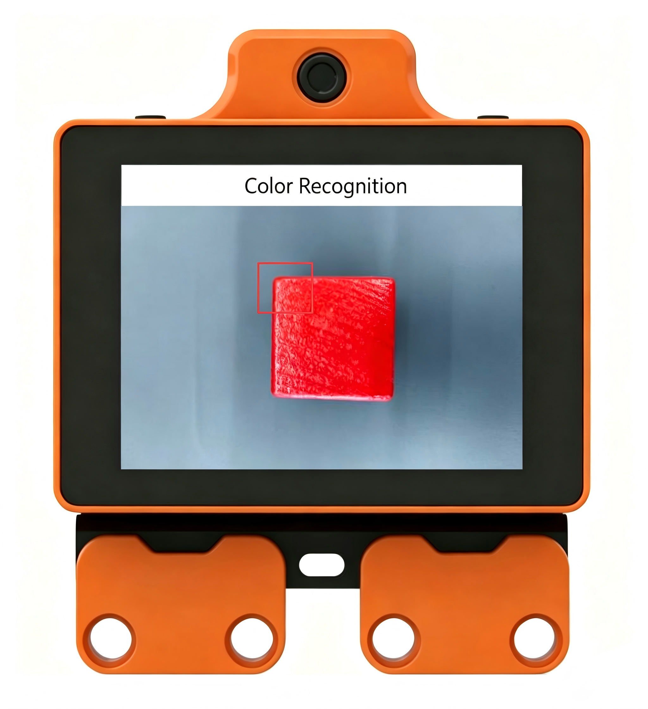

The color IDs corresponding to colors are listed below:

| Color ID | Color |
| :---: | :---: |
| 1 | Red |
| 2 | Orange |
| 3 | Green |
| 4 | Blue |
| 5 | Black |


