# 2. Quick Start

## 2.1 Large Model Interaction

> [!NOTE]
>
> **This section is designed to facilitate a quick start with the WonderLLM module. The module features diverse features. Refer to [4.5 WonderLLM Module](./4.Software%20and%20Hardware%20Guide.md#section-4-4) for detailed learning.**

### 2.1.1 Powering On the Device

1. The module supports power supply through the following interfaces, upper **Type-C Port 1**, lower **Type-C Port 2**, or **4-PIN I2C Communication Interface**. Connect an external power supply to any of these interfaces to automatically power on the module.


2. Upon powering on the module, the screen displays the **device hotspot name** and **browser network configuration URL** accompanied by a voice broadcast. Complete the module network configuration first according to [Module Network Configuration](#section-2-1-2).

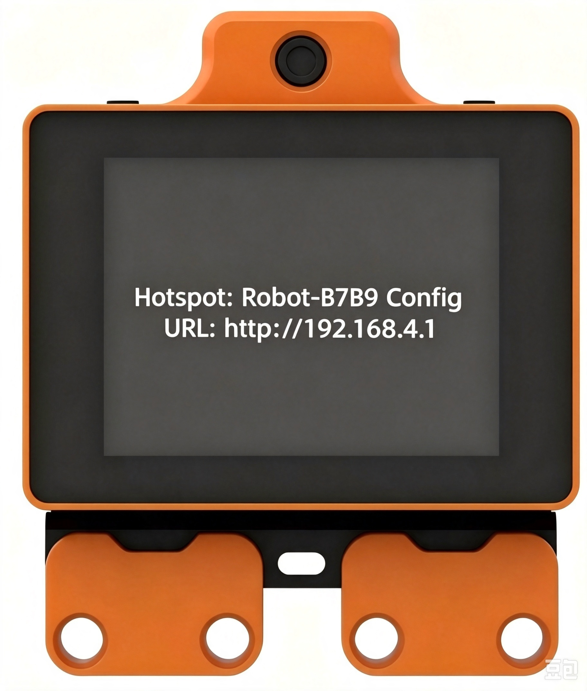

3. After network configuration, the module needs to be bound to the platform agent. The module screen displays the **device ID** and **device binding website** accompanied by a voice broadcast of the verification code. Complete the device binding according to [Device Binding](#section-2-1-4).


4. If device binding is completed after powering on the module, a white circular loading bar appears on the screen, indicating that the module is connecting to the network using the saved Wi-Fi information. If the network connection fails, the screen displays the **device hotspot name** and **browser network configuration URL** accompanied by a voice broadcast. Reconfigure the new Wi-Fi connection information available in the current environment according to [Module Network Configuration](#section-2-1-2).


5. If device binding is completed after powering on the module and the configured Wi-Fi connection information is available in the current environment, the white circular loading bar loads for a period of time until the network connection succeeds, then switches to the module expression display interface. At this point, all configurations of the module are normal, and human-computer interaction can begin after waking up the module.

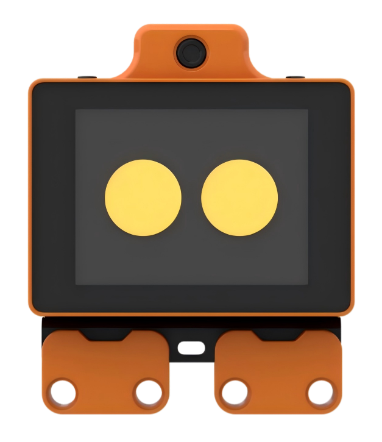

<a id ="section-2-1-2"></a>

### 2.1.2 Module Network Configuration

1. After powering on, the module starts the network connection process. The screen displays the **device hotspot name** and **browser network configuration URL** accompanied by a voice broadcast. The large model module enables its built-in hotspot for connection and configuration. Hotspot names vary by device, with a uniform format of **Robot-xxxx**. The hotspot **Robot-B7B9** is used below as an example for explanation.


2. Search for and connect to the corresponding hotspot using a computer or smartphone, noting that this hotspot requires no password.


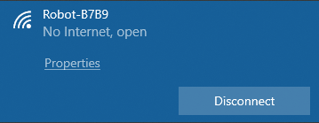

3. Click the [<u>Network Configuration</u>](http://192.168.4.1/) hyperlink for direct access to the device network configuration URL, or copy the following URL and open any browser to access the device network configuration URL.

```py
http://192.168.4.1
```

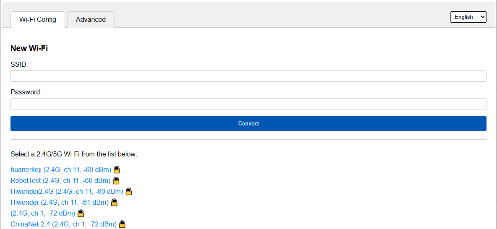

4. Enter the name of the desired hotspot for automatic connection upon powering on in box ① in the figure below, and enter the hotspot connection password in box ②. Finally click **Connect** in box ③, and the module attempts to search for and connect to the matching hotspot in the current environment based on the provided connection details.

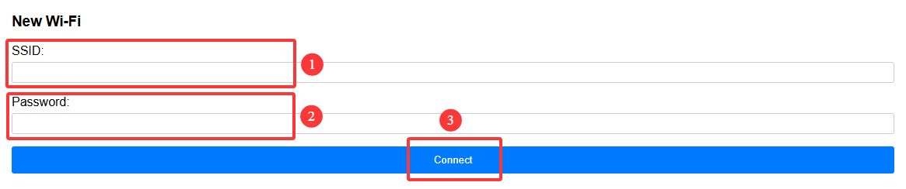

5. The list of available hotspots in the current environment scanned by the module is visible on the interface. Click an item, and the corresponding hotspot name automatically fills into box ①, saving time and offering convenience.

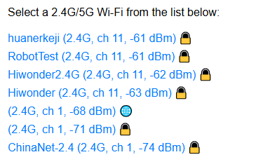

6. If the following prompt appears on the interface, the hotspot cannot be found in the current environment or the connection password is incorrect. Please re-enter.


7. If the following prompt appears on the interface, the module has successfully found and connected to the corresponding hotspot. The module will automatically restart and connect to the corresponding hotspot.

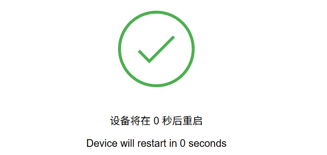

> [!NOTE]
>
> * **Do not enter hotspots that cannot be searched in the current environment, have excessively weak signals, or do not support network connection functions.**
>
> * **If the module has previously saved connection details for other hotspots, the newly saved hotspot connection details co-exist with them. Upon the next power-on operation, the module reads each connection entry sequentially in saved order to attempt matching and connecting to a hotspot.**
>
> * **If the prompt Error: Failed to check for new version, retrying in xx seconds appears on the screen after completing network configuration, the current hotspot may not be able to access the Internet or the network quality may be poor. Please try switching to another network.**
>

<a id ="section-2-1-3"></a>

### 2.1.3 XiaoZhi Platform Account Registration and Authentication

> [!NOTE]
>
> **If the account has not completed GitHub authentication, the use of the module is not affected, but available functions are limited. The differences between unauthenticated and authenticated accounts are shown in the table below:**

|                           |        Unauthenticated         |                    Authenticated                     |
| :-----------------------: | :----------------------------: | :--------------------------------------------------: |
|      Model selection      |          Xiaozhi Lite          | Xiaozhi Lite, Qwen 3.6, DeepSeek V4, Doubao Seed 2.0 |
|  Number of bound devices  |               10               |                         100                          |
| Official service features | Weather, Music, Knowledge Base |    Weather, Joke, Music, News, Knowledge **Base**    |

- **XiaoZhi Platform Account Registration**

1. Click the [<u>XiaoZhi AI Chatbot</u>](https://xiaozhi.me/) hyperlink for direct access to the device binding URL below, or copy the following URL and open any browser to access the device binding URL.

```py
https://xiaozhi.me
```


2. Click **Console** to enter the XiaoZhi AI Agent Management Platform.


3. If logging in for the first time, register a platform account first.


4. After filling in the required information, click **Send code** to obtain the verification code required for account registration.

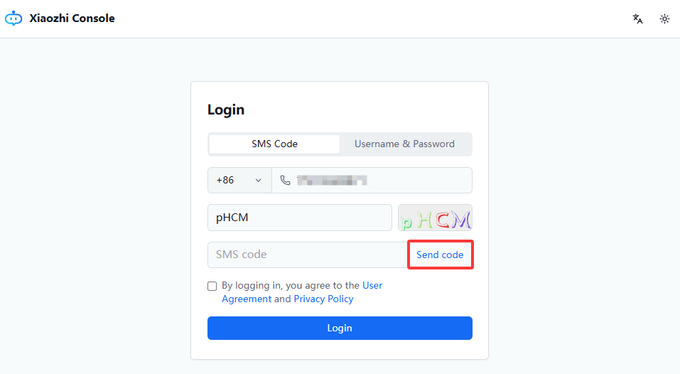

5. Check the box to agree to the terms of service and privacy policy, then click **Login**.


6. Select and fill in the required information, then click **Confirm** to complete registration and login.


- **Logging into GitHub Platform**

1. On the XiaoZhi platform, click **GitHub Verification** under the  icon, wait for the interface to jump to the authentication page, then click **Link GitHub**.


2. Wait for the page to jump to the GitHub account login page.


3. If a GitHub account has been registered, log in directly with the username and password, jumping to [Binding XiaoZhi Platform with GitHub Platform](#section-2-1-3-3). If no GitHub account has been registered, click **Create an account**.


4. In the pop-up interface, enter personal email, password, username, and location details in sequence, then click **Create account** to submit registration information.


5. Click **Visual puzzle** on the page to start image verification.

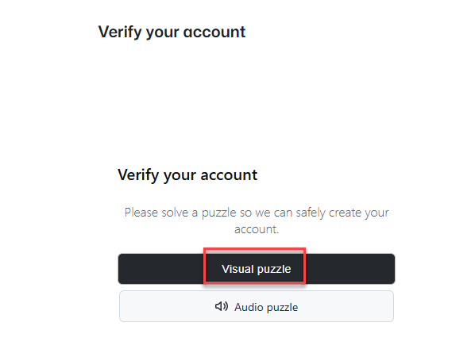

6. After completing image verification, GitHub sends a verification email to the previously entered registration email address. Open the email, copy the verification code, and enter it into the webpage.


7. After completing registration, the webpage jumps to the login page, displaying a pop-up message indicating successful registration.

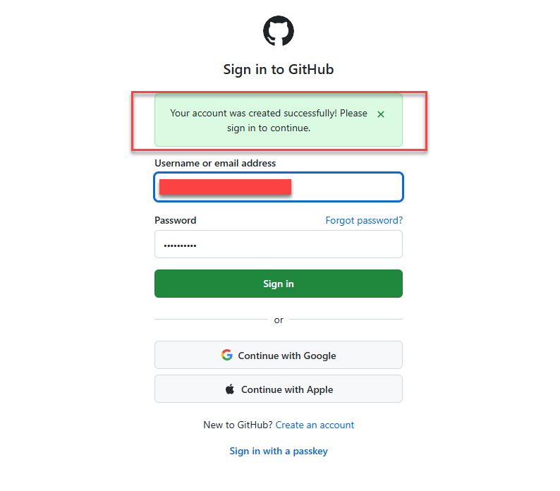

<a id ="section-2-1-3-3"></a>

- **Binding XiaoZhi Platform with GitHub Platform**

1. Click **Authorize tenclass** to complete the binding between the XiaoZhi platform and the GitHub platform.


2. Upon completing the binding, authentication on the XiaoZhi platform is fully completed, automatically returning to the previous authentication page where the following prompt appears.


<a id ="section-2-1-4"></a>

### 2.3.4 Device Binding

1. After completing registration, login, and authentication on the XiaoZhi platform, click **Agents** to enter the following interface.

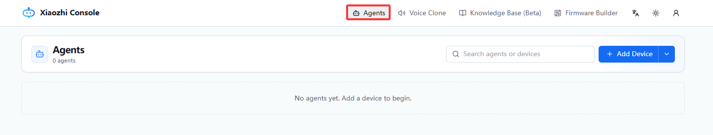

2. Click the **∨** button next to the add device button, then click **Create Agent**.


3. Fill in the agent name, then click **Confirm** to complete adding the agent.

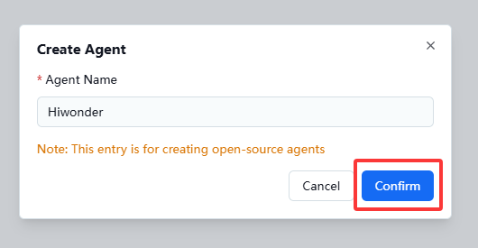

4. Click **Configure** to set up various function configurations for the agent.

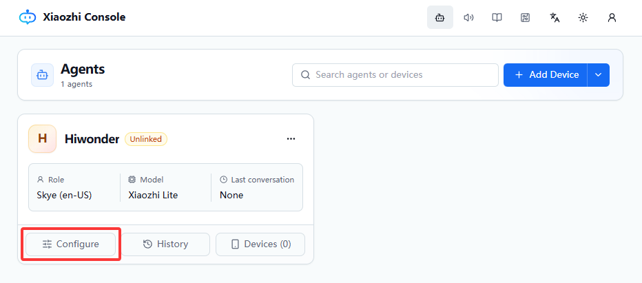

5. Click **Role** to configure the agent role, selecting the desired conversation language in box ①, selecting the desired role voice in box ②, and completing voice settings in box ③.


6. Click **Model & Memory**, select **DeepSeek V4 (Rich Personality)** for the language model option, disable the memory function, and keep the remaining settings at default values.

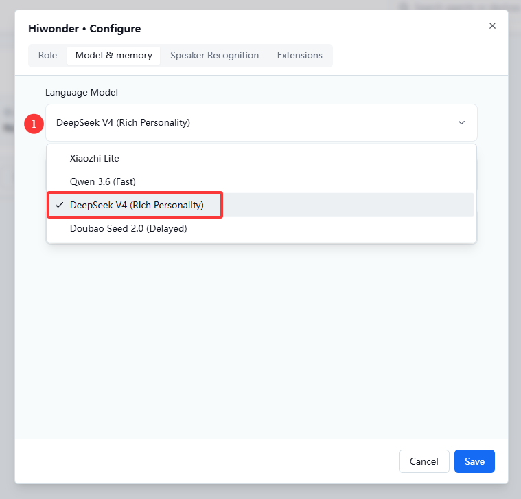

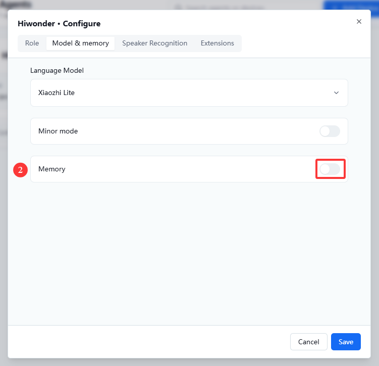

7. Click **Extensions**, check all official service functions, keep remaining options default, and click **Save**.

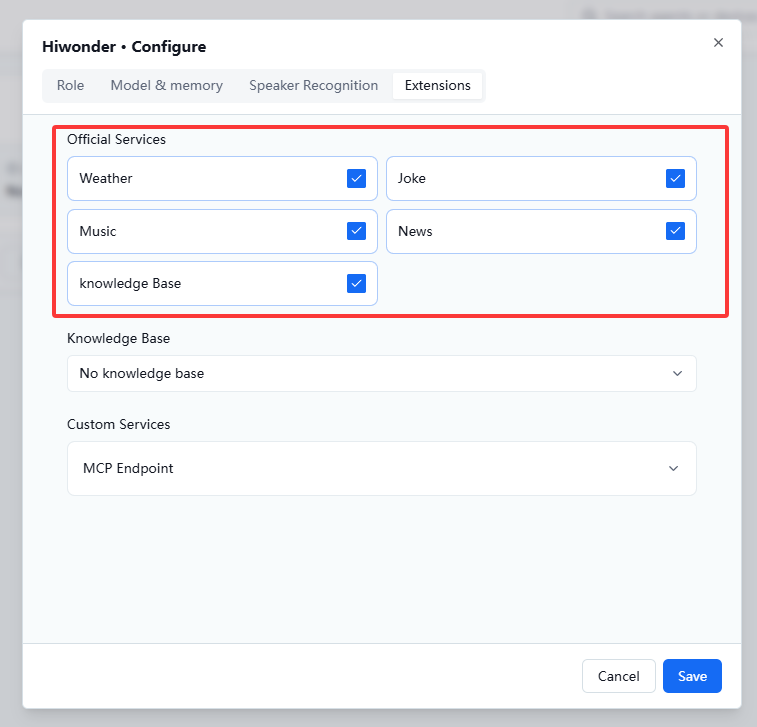

8. Click **Devices** to access the device management function.


9. Click **Link new device**, fill in the **6-digit Device ID** in the pop-up window, and click **Link**.


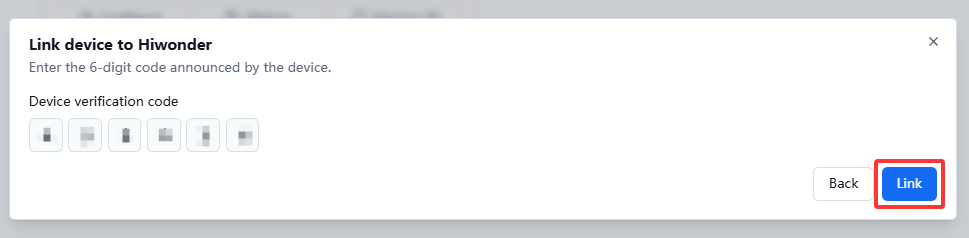

10. Upon successful binding, the **Device Added Successfully** prompt appears on the page, then select **Open Source Edition** and click **Start Using**.


### 2.1.4 Free Chat

- **Function Overview**

&emsp;The module features built-in special functions that can be invoked by spoken commands during human-computer dialogue. Refer to the following expressions to issue commands to the WonderLLM module and query all currently supported special functions, **① Show capabilities**, **② Introduce the functions**. The special functions currently supported by the module are listed below:

- **Invocation Examples**

&emsp;Refer to the following expressions to issue instructions to the `WonderLLM` module and invoke corresponding special functions:

1. Weather query function: **Check the weather in xx region**.


2. News broadcast function: **① Broadcast today's news**, **② Introduce today's trending events**.

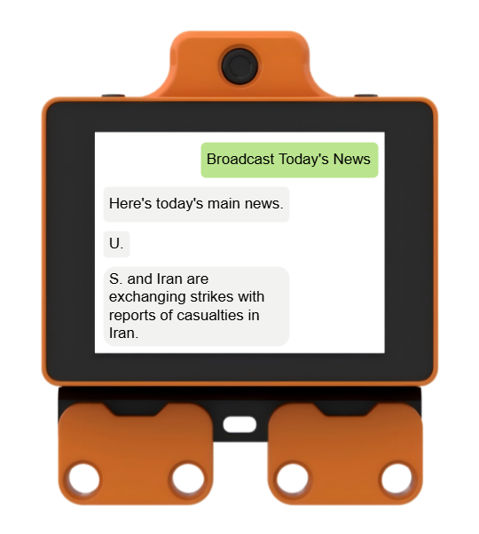

3. Outfit suggestion function: **What is a suitable outfit for going out today?**


4. Joke telling function: **① Tell a joke**, **② Share a funny story**.


5. Almanac query function: **Query today's almanac**.


6. Music playback function: **Play a random song**. 

   > [!NOTE]
   >
   > **When using the music playback function, lowering the volume of the module is recommended.**

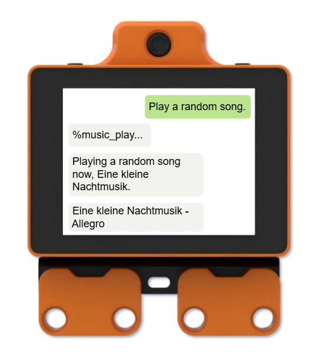

## 2.2 Hardware Preparation

### 2.2.1 Powering On

* Insert the battery into the battery slot at the bottom of the micro:bit expansion board. 

  > [!NOTE]
  >
  > **Do not reverse the positive and negative terminals.**


* Turn on the power switch. The red power indicator light on the expansion board lights up, indicating successful startup.

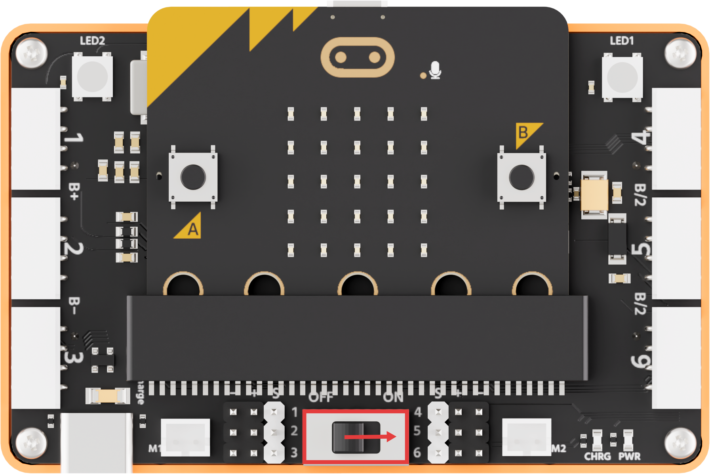

> [!NOTE]
>
> **For the first startup, refer to 2.2.2 Charging Instructions and charge the device via the charging port for about 5 seconds to activate the built-in battery protection chip. If the battery is not removed after activation, no further activation is needed later.**

### 2.2.2 Charging

#### 1. Charging Instructions

Use a 5 V 2A charger and connect it to the charging port of the micro:bit expansion board using the included Type-C data cable to charge:

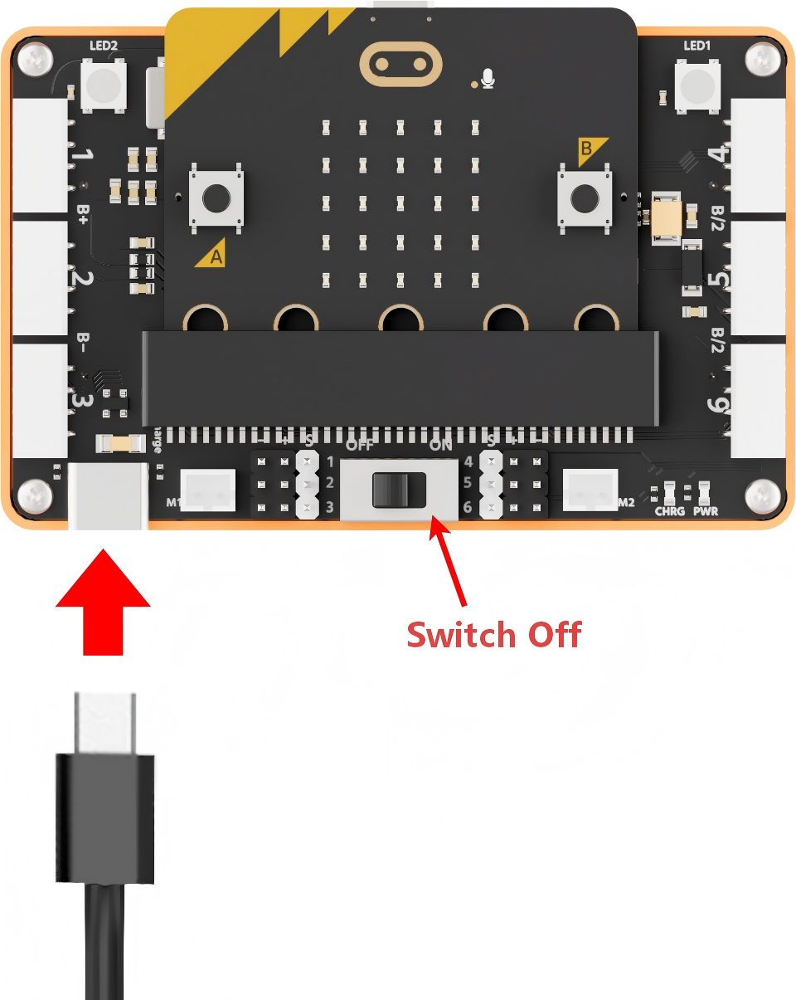

#### 2. Notes

   * During charging, the blue indicator light on the expansion board lights up, and the blue light turns off when fully charged. Unplug the charger and power supply promptly after charging is completed to avoid battery damage from overcharging. Attendance is required during charging.
   * The power switch must be turned off during charging, otherwise the battery cannot be fully charged.

## 2.3 Software Configuration

### 2.3.1 micro:bit Programming Environment

For the programming environment, BBC provides the online programming website [Microsoft MakeCode for micro:bit](https://makecode.microbit.org/), which features the easy-to-use graphical editor MakeCode.

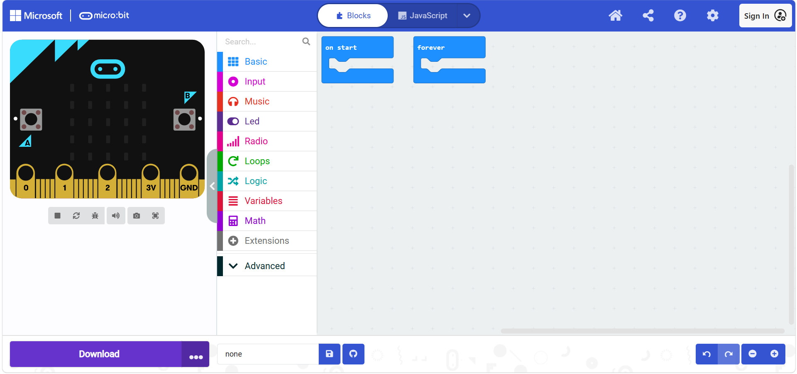

### 2.3.2 DaDabitv2 Extension Library

* Click to open **Extensions**.

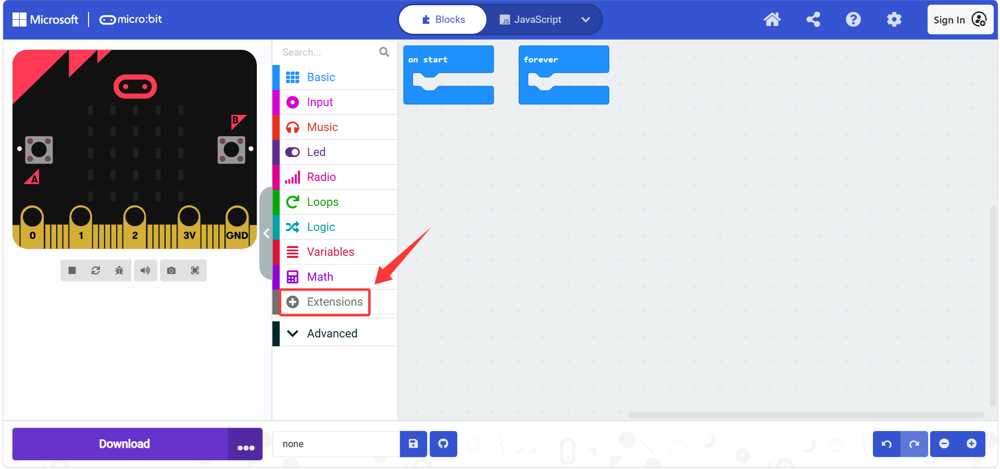

* Search for **https://github.com/HiwonderK12/DaDabitV2** in **Extensions** to add **dadabitV2**.

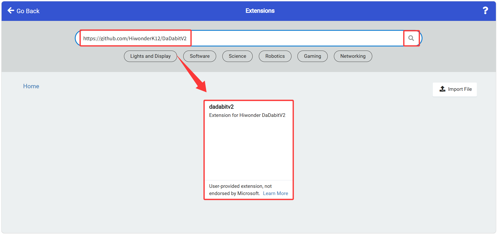

## 2.4 Starter Project 1: Button-Triggered Sound and Light Alarm

### 2.4.1 Programming

#### 1. Create a New File

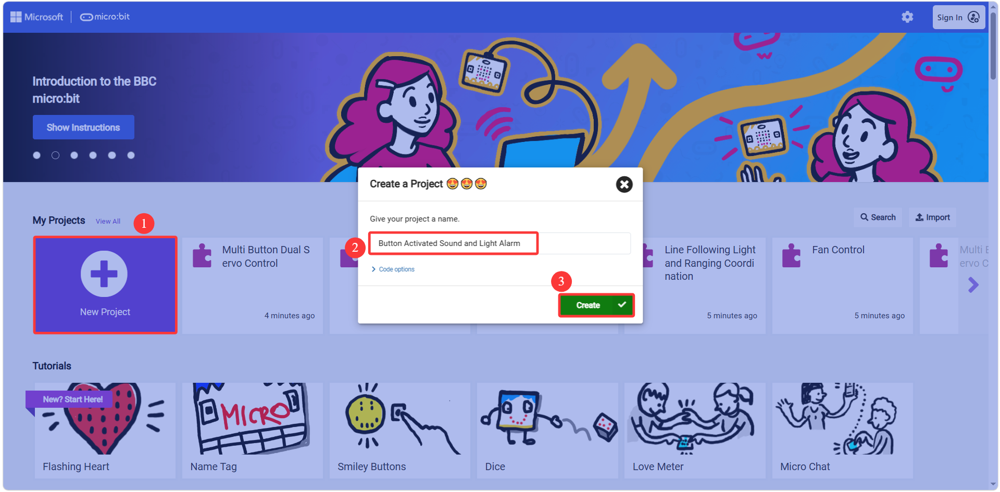

#### 2. Write the Program

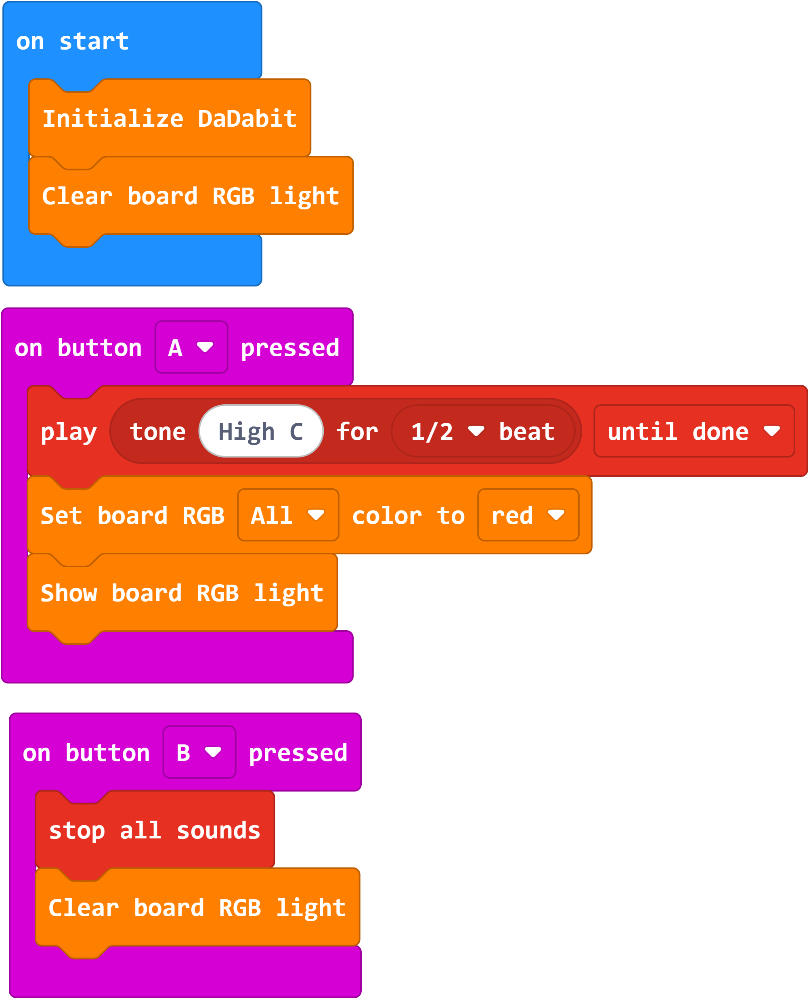

Program link: https://makecode.microbit.org/_RvsEdu4ao9MP. Click **Edit** in the top right corner of the link page to download the complete program.

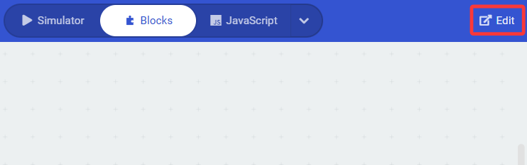

### 2.4.2 Program Downloading


### 2.4.3 Program Outcome

After powering on, the device initializes `DaDabit` and turns off the onboard RGB light. Press **A** to play a high-pitched tone and trigger the red light alarm. Press **B** to mute and turn off the RGB light.

## 2.5 Starter Project 2: Multi-Button Dual Servo Control

### 2.5.1 Wiring Guide

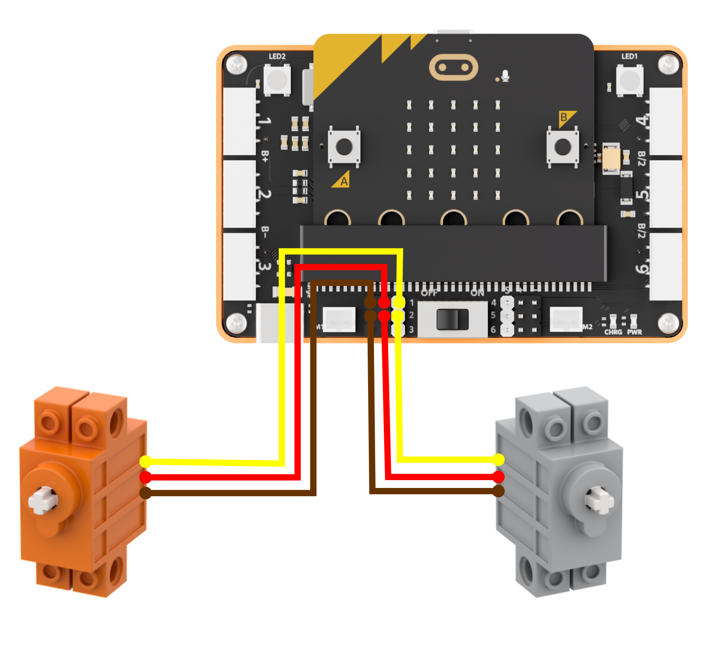

### 2.5.2 Programming

#### 1. Create a New File

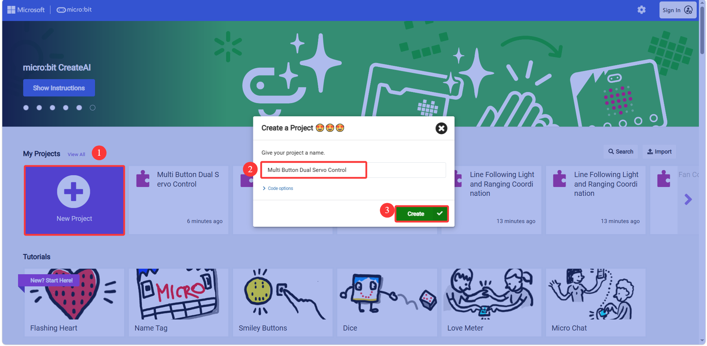

#### 2. Write the Program

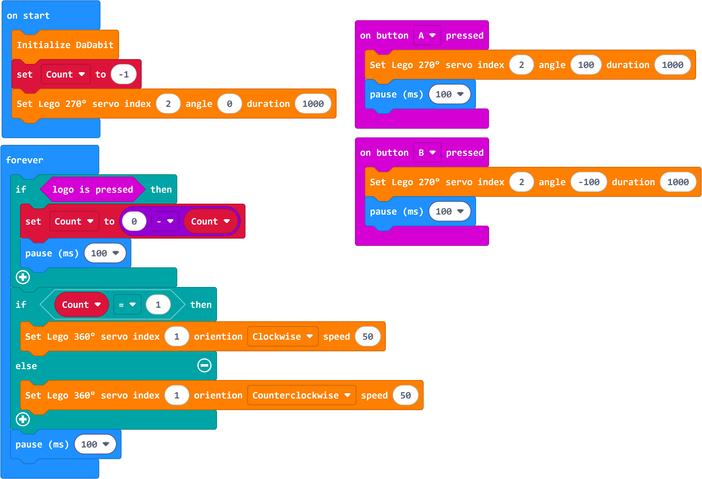

Program link: https://makecode.microbit.org/_F4tUxiFp15aX. Click **Edit** in the top right corner of the link page to download the complete program.


### 2.5.3 Program Downloading


### 2.5.4 Program Outcome

After powering on and initializing the device, the main loop continuously monitors the **Logo** button. Pressing the **Logo** button switches the value of the count variable, which alternates the rotation of Servo 1, the 360° servo, between clockwise and counterclockwise. Press **A** to rotate Servo 2 to `100°` and press **B** to rotate it to `-100°`, allowing independent control of the two servos.

