# 3. Creative Builds

## 3.1 Smart Beckoning Cat

### 3.1.1 Introduction
This is a smart beckoning cat capable of automated welcoming. Upon powering on, the device continuously captures the scene ahead. When the camera detects a face, the servo drives the beckoning cat to wave its hand, while the voice module broadcasts "Hello, welcome." Just like a warm receptionist in a store, it automatically completes the entire welcoming interaction.

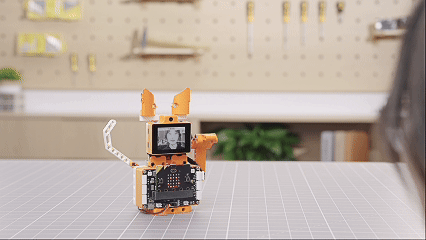

### 3.1.2 Learning Objectives

1. Understand the 270° block servo and the WonderLLM module, mastering coordinated control using the micro:bit expansion board.
2. Comprehend the logic of facial recognition and voice control, learning to implement face-triggered voice broadcasting and automated waving.

### 3.1.3 Assembly Guide

[Assembly Guide](https://drive.google.com/drive/folders/1AlF45z7gbs3xVetpQHt8FHB4hImLnFy4?usp=sharing)

### 3.1.4 Mode Switching

This model requires the offline vision function. If the offline vision function mode has been entered, skip this step and proceed directly to the wiring guide. Otherwise, refer to [4.6.1 Firmware Update](./4.Software%20and%20Hardware%20Guide.md#anther4.6.1) to re-flash the corresponding firmware.

### 3.1.4 Wiring Guide

- Insert the WonderLLM module cable into port 4 of the micro:bit expansion board.
- Insert the 270° block servo cable into port S1 of the micro:bit expansion board, ensuring the yellow wire of the servo is inserted into the white pin of S1.

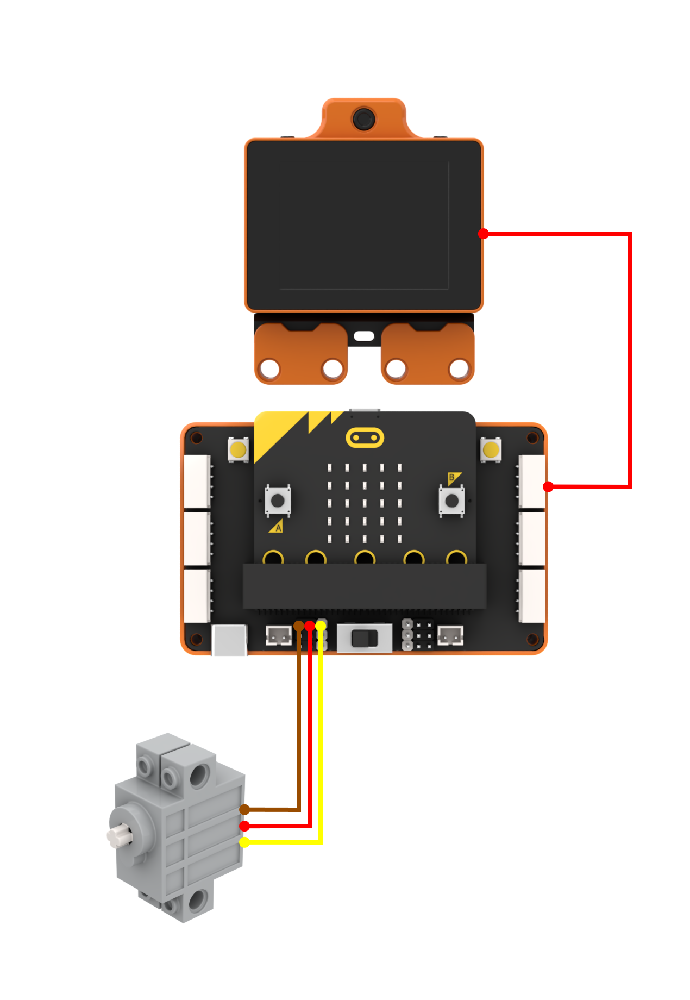

> [!NOTE]
>
> **For the first course involving the block servo, remove the building blocks from the servo first, and upload the program of this course to the micro:bit. Then, turn on the power switch of the micro:bit expansion board and wait for the block servo to rotate to its initial position of 0 degrees before reinstalling the building blocks. This step can be skipped if the servo reset program has been executed previously.**

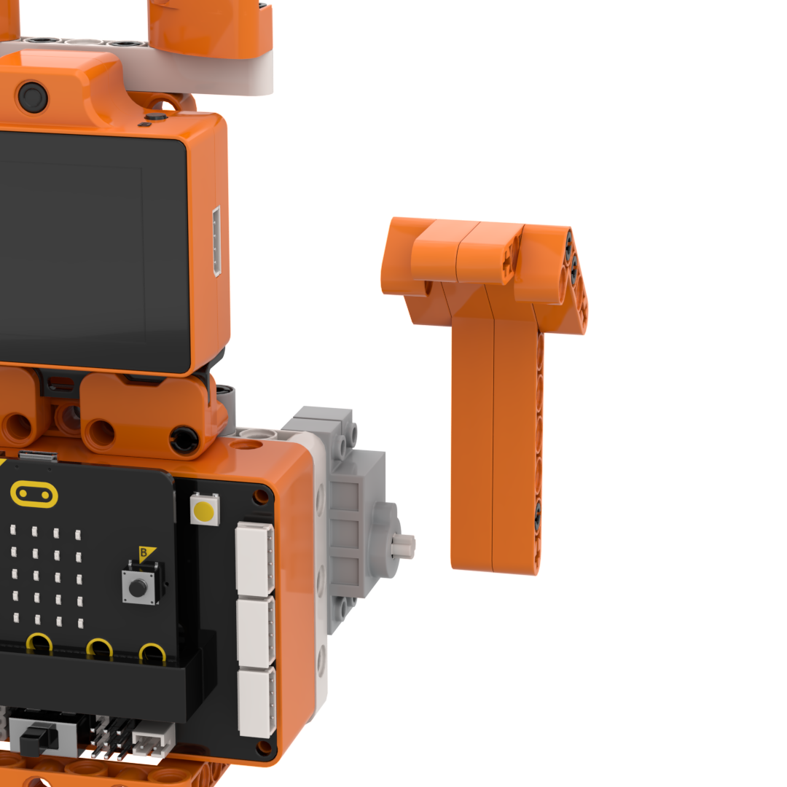

### 3.1.6 Programming

#### (1) Program Flowchart

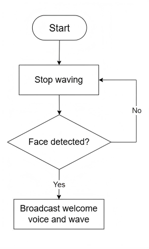

#### (3) Core Blocks Analysis

| Instruction Block | Category | Function Description |
| :---: | :---: | :---: |
|  |  | Define or get a variable used to store data |
|  |  | Assign a value to a custom variable |
|  |  | Initialize the DaDabit module to prepare for subsequent use |
|  |  | Initialize the WonderLLM interface to establish module communication |
|  |  | Switch the working mode of WonderLLM, supporting voice interaction, color recognition, and face recognition modes |
|  |  | Detect whether a face is recognized and return a boolean result |
|  |  | Control the angle and execution time of the 270° servo on the specified port |
|  |  | Play the preset voice broadcast content in the WonderEcho module |

#### (3) Complete Program

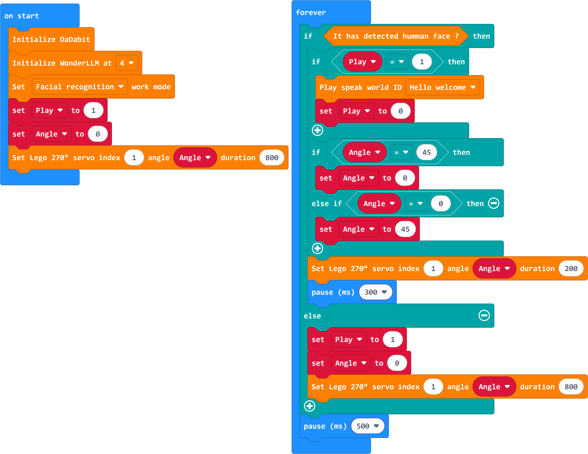

Program link: https://makecode.microbit.org/_HJPcTaJzALHt. Click **Edit Code** in the upper-right corner of the page to download the complete program.

### 3.1.7 Downloading the Program

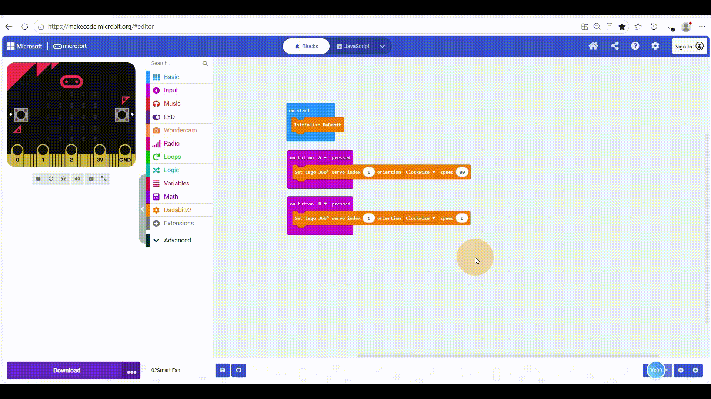

### 3.1.8 Project Extensions

When a face is recognized, the onboard RGB LED is set to yellow and the micro:bit dot matrix display shows **Hi,** synchronously triggering the light, pattern, sound, and waving action to enhance the welcoming atmosphere.

### 3.1.9 Technical Support and Discussion

Join the forum for sharing questions, ideas, or suggestions, and answers will be provided promptly. Click the hyperlink [Hiwonder Forum](http://forum.hiwonder.com) or enter the URL in a browser: http://forum.hiwonder.com

## 3.2 Color Scanner

### 3.2.1 Introduction
This is a color scanner capable of color recognition. Upon powering on, it continuously detects the color of objects in front of it. When the sensor identifies a specific color, the on-board RGB LED of the controller synchronously illuminates in the matching color. Working like a precise color detector, it provides direct visual feedback of the recognition results.

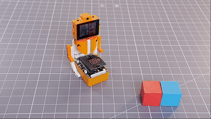

### 3.2.2 Learning Objectives

1. Master the micro:bit expansion board's onboard RGB LED and the WonderLLM offline color recognition feature, understanding multi-module coordinated control.
2. Comprehend the interaction logic between color recognition and visual feedback, learning to display identified colors synchronously.

### 3.2.3 Assembly Guide
### 3.2.4 Mode Switching

This model requires the offline vision function. If the offline vision function mode has been entered, skip this step and proceed directly to the wiring guide. Otherwise, refer to [4.6.1 Firmware Update](./4.Software%20and%20Hardware%20Guide.md#anther4.6.1) to re-flash the corresponding firmware.

### 3.2.4 Wiring Guide

* Insert the WonderLLM module cable into port 3 of the micro:bit expansion board, as shown below:

### 3.2.6 Programming

#### (1) Program Flowchart

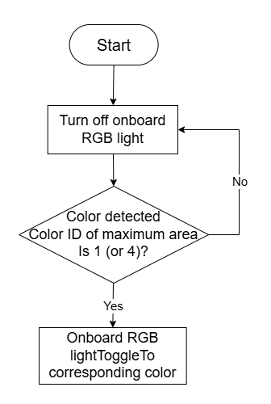

#### (3) Core Blocks Analysis

| Instruction Block | Category | Function Description |
| :---: | :---: | :---: |
|  |  | Initialize the DaDabit module to prepare for subsequent use |
|  |  | Initialize the WonderLLM interface to establish module communication |
|  |  | Switch the working mode of WonderLLM, supporting voice interaction, color recognition, and face recognition modes |
|  |  | Read the id of the target color with the largest area recognized in the color recognition module |
|  |  | Control the index and color of the onboard RGB light |
|  |  | Display the configured onboard RGB light effect |
|  |  | Turn off the onboard RGB light |

#### (3) Complete Program

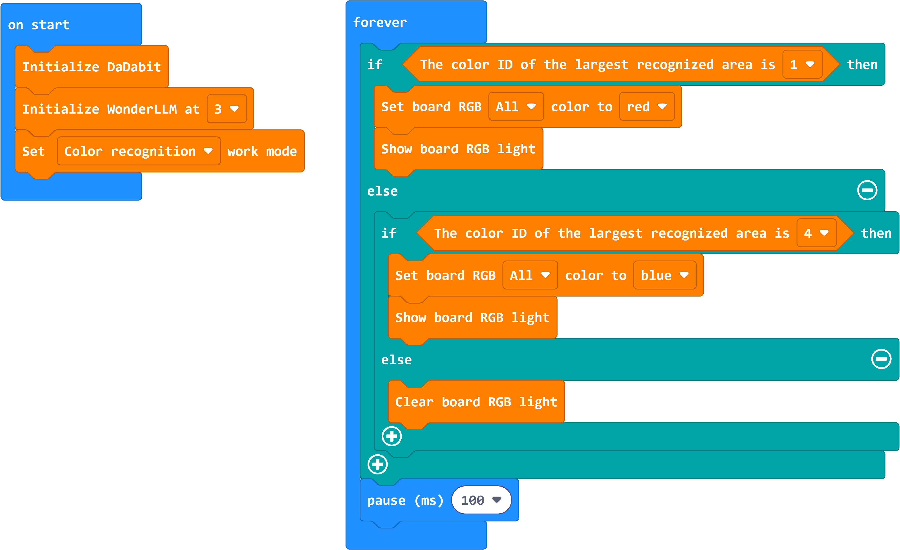

Program link: https://makecode.microbit.org/_KPq15ua43W28. Click **Edit Code** in the upper-right corner of the page to download the complete program.

### 3.2.7 Downloading the Program

### 3.2.8 Project Extensions

Upon color recognition, the corresponding RGB LED lights up and the micro:bit dot matrix display shows the first letter of the color's name, making the results more intuitive.

### 3.2.9 Technical Support and Discussion

Join the forum for sharing questions, ideas, or suggestions, and answers will be provided promptly. Click the hyperlink [Hiwonder Forum](http://forum.hiwonder.com) or enter the URL in a browser: http://forum.hiwonder.com

## 3.3 Adjustable Mixer

### 3.3.1 Introduction
This is an adjustable mixer featuring voice-controlled speed regulation. It remains in a standby stationary state after powering on. Upon receiving a voice command, the servo starts the mixing mechanism and switches between three speed levels, acting as a smart kitchen assistant that adjusts the mixing speed on demand.

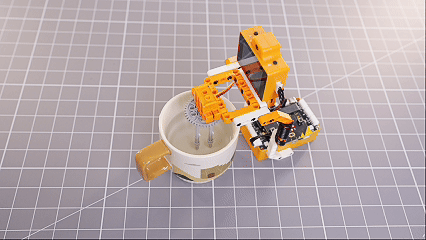

### 3.3.2 Learning Objectives

1. Recognize the 270° servo and the WonderLLM Online LLM module, and master the multi-device coordinated control method of the micro:bit expansion board.
2. Comprehend the semantic analysis of the large AI model and the principles of servo speed regulation, mastering voice-controlled three-level speed changes.

### 3.3.3 Assembly Guide
### 3.3.4 Mode Switching

This model requires the Online LLM. If the Online LLM mode has been entered, skip this step and proceed directly to the wiring guide. Otherwise, refer to [4.5.10 Firmware Update](./4.Software%20and%20Hardware%20Guide.md#anther4.5.10) to re-flash the corresponding firmware.

### 3.3.4 Wiring Guide

- Insert the WonderLLM module cable into port 4 of the micro:bit expansion board.
- Insert the 360° block servo cable into port S1 of the micro:bit expansion board, ensuring the yellow wire of the servo is inserted into the white pin of S1.

  As shown below:

### 3.3.6 Programming

#### (1) Program Flowchart

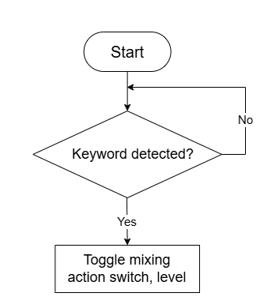

#### (3) Core Blocks Analysis

| Instruction Block | Category | Function Description |
| :---: | :---: | :---: |
|  |  | Loop execution of the internal program at set millisecond intervals |
|  |  | Compare whether the preceding and succeeding values are equal and return a boolean result |
|  |  | Compare whether two strings are identical and return a boolean result |
|  |  | Define or get a variable used to store data |
|  |  | Assign a value to a custom variable |
|  |  | Initialize the DaDabit module to prepare for subsequent use |
|  |  | Initialize the WonderLLM interface to establish module communication |
|  |  | Configure custom tool parameters that can be called by the ai module |
|  |  | Synchronize mcp tool configuration information with the ai module |
|  |  | Read the running data sent back after the ai module calls the tool |
|  |  | Extract the corresponding numeric value from the target dictionary based on the specified key and return it |
|  |  | Inform the ai module that a single tool call process has ended |
|  |  | Control the angle and execution time of the 270° block servo on the specified port |
|  |  | Determine whether the target text contains the specified character and return a boolean result |

#### MCP Parameter Configuration

* Tool Name: `self.robot.setMode`

1. Tool Description: You are a blender with three modes to choose from. Parameter description: Gear range: 0 to 3, returns 0 when stopping, returns 1 for first gear, returns 2 for second gear, and returns 3 for third gear.

2. AI Module Return Parameters: `[["mode", "int", "0", "0", "3"]]`

> [!NOTE]
> 
> **The field name is `mode`, integer type, the first 0 is the default value, the second 0 is the minimum value, and 3 is the maximum value.**

3. Block until call is completed: `true`

4. Return data to AI Module: `false`

5. Function: This MCP configuration defines the hardware speed regulation tool for the AI module. It allows the AI to issue gear commands from 0 to 3 to control the start, stop, and speed changes of the blender. The program will wait for the gear execution to complete during the call, and there is no need to send running data back to the AI.

#### (4) Complete Program

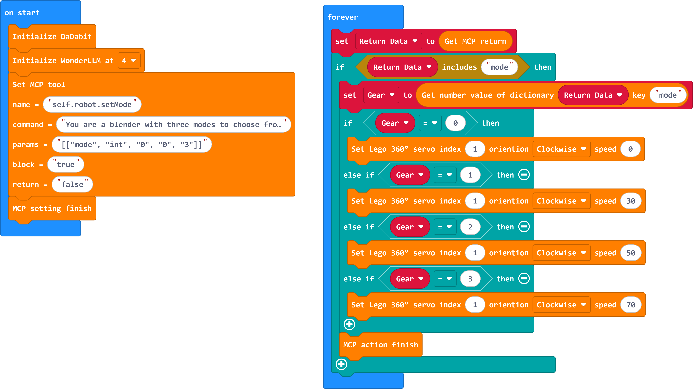

Program link: https://makecode.microbit.org/_Jar64WW2Xipj. Click **Edit Code** in the upper-right corner of the page to download the complete program.

### 3.3.7 Downloading the Program

### 3.3.8 Project Extensions

Without modifying the original three-level speed regulation logic, add green, yellow, and red RGB LED indications corresponding to speed levels 1, 2, and 3, respectively, to provide visual gear prompts.

### 3.3.9 Technical Support and Discussion

Join the forum for sharing questions, ideas, or suggestions, and answers will be provided promptly. Click the hyperlink [Hiwonder Forum](http://forum.hiwonder.com) or enter the URL in a browser: http://forum.hiwonder.com

## 3.4 Pumpjack Bot

### 3.4.1 Introduction
This is a pumpjack bot featuring voice-controlled start and stop. Upon powering on, the servo remains in a standby state. When a voice command is received, the servo drives a reciprocating motion to simulate the oil pumping action. Like an intelligent oil field device, its extraction operations can be started and stopped entirely by voice.

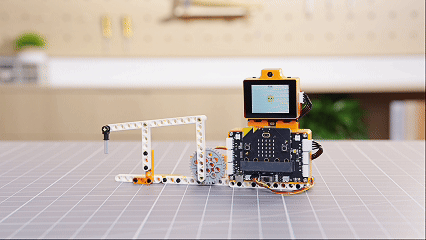

### 3.4.2 Learning Objectives

1. Understand the 360° block motor and the WonderLLM offline voice interaction module, mastering multi-module coordinated control using the micro:bit expansion board.
2. Comprehend the coordination logic between voice command analysis and motor control, mastering voice-controlled mechanical rotation.

### 3.4.3 Assembly Guide
### 3.4.4 Mode Switching

This model requires offline voice interaction. If the offline voice interaction mode has been entered, skip this step and proceed directly to the wiring guide. Otherwise, refer to [4.6.1 Firmware Update](./4.Software%20and%20Hardware%20Guide.md#anther4.6.1) to re-flash the corresponding firmware.

### 3.4.4 Wiring Guide

- Insert the WonderLLM module cable into port 4 of the micro:bit expansion board.
- Insert the 360° block servo cable into port S1 of the micro:bit expansion board, ensuring the yellow wire of the servo is inserted into the white pin of S1.

    As shown below:

### 3.4.6 Programming

#### (1) Program Flowchart

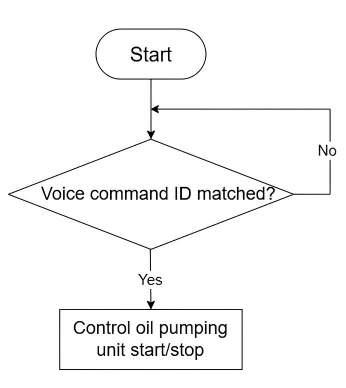

#### (3) Core Blocks Analysis

| Instruction Block | Category | Function Description |
| :---: | :---: | :---: |
|  |  | Define or get a variable used to store the command id |
|  |  | Assign a custom value to the custom command id variable |
|  |  | Initialize the DaDabit module to prepare for subsequent use |
|  |  | Initialize the WonderLLM interface to establish module communication |
|  |  | Switch the working mode of WonderLLM, supporting voice interaction, color recognition, and face recognition modes |
|  |  | Read the result id generated by the voice interaction module |
|  |  | Control the rotation direction and speed of the 360° block servo |

#### (3) Complete Program

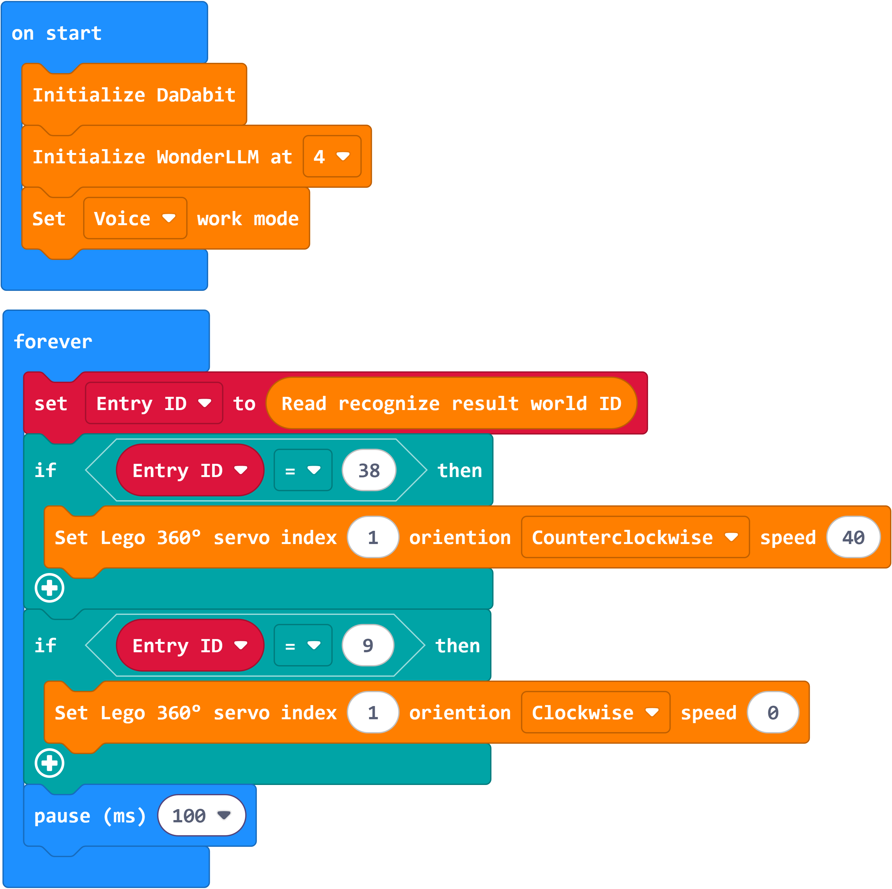

Program link: https://makecode.microbit.org/_Yzff8x3vp69x. Click **Edit Code** in the upper-right corner of the page to download the complete program.

### 3.4.7 Downloading the Program

### 3.4.8 Project Extensions

Set a running duration for the pumpjack. Once voice-activated, the pumpjack runs for 5 seconds and then pauses, while the onboard RGB LED turns yellow and the dot matrix display shows **OFF.**

### 3.4.9 Technical Support and Discussion

Join the forum for sharing questions, ideas, or suggestions, and answers will be provided promptly. Click the hyperlink [Hiwonder Forum](http://forum.hiwonder.com) or enter the URL in a browser: http://forum.hiwonder.com

## 3.5 Smart Cradle

### 3.5.1 Introduction
This is a smart cradle featuring voice-controlled sleep assistance. Upon powering on, the servo is locked in place. When a voice command is received, the servo rotates slowly to swing the cradle. Serving as an intelligent sleep assistant, the rocking motion is started and stopped by voice control.

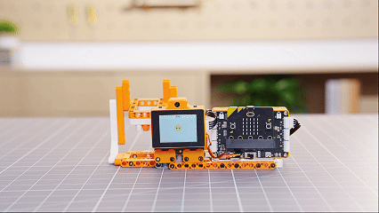

### 3.5.2 Learning Objectives

1. Understand the 360° block motor and the WonderLLM Online LLM module, mastering coordinated control using the micro:bit expansion board.
2. Comprehend the voice command and motor drive logic, learning to control the starting and stopping of the cradle rocking by voice.

### 3.5.3 Assembly Guide
### 3.5.4 Mode Switching

This model requires offline voice interaction. If the offline voice interaction mode has been entered, skip this step and proceed directly to the wiring guide. Otherwise, refer to [4.6.1 Firmware Update](./4.Software%20and%20Hardware%20Guide.md#anther4.6.1) to re-flash the corresponding firmware.

### 3.5.4 Wiring Guide

- Insert the WonderLLM module cable into port 4 of the micro:bit expansion board.
- Insert the 360° block servo cable into port S1 of the micro:bit expansion board, ensuring the yellow wire of the servo is inserted into the white pin of S1.

​	As shown below:

### 3.5.6 Programming

#### (1) Program Flowchart

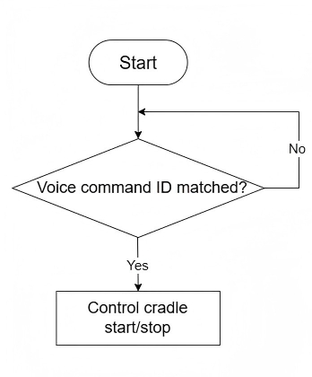

#### (3) Core Blocks Analysis

| Instruction Block | Category | Function Description |
| :---: | :---: | :---: |
|  |  | Define or get a variable used to store the command id |
|  |  | Assign a custom value to the custom command id variable |
|  |  | Initialize the DaDabit module to prepare for subsequent use |
|  |  | Initialize the WonderLLM interface to establish module communication |
|  |  | Switch the working mode of WonderLLM, supporting voice interaction, color recognition, and face recognition modes |
|  |  | Read the result id generated by the voice interaction module |
|  |  | Control the rotation direction and speed of the 360° block servo |

#### (3) Complete Program

Program link: https://makecode.microbit.org/_6gCRy7FWb8KY. Click **Edit Code** in the upper-right corner of the page to download the complete program.

### 3.5.7 Downloading the Program

### 3.5.8 Project Extensions

Upon receiving the startup voice command, the system plays random music while lighting up the yellow RGB LED. Pressing button **A** sets the cradle speed to 20 and displays **SLEEP** on the dot matrix display, triggering music, lights, text, and rocking actions synchronously.

### 3.5.9 Technical Support and Discussion

Join the forum for sharing questions, ideas, or suggestions, and answers will be provided promptly. Click the hyperlink [Hiwonder Forum](http://forum.hiwonder.com) or enter the URL in a browser: http://forum.hiwonder.com

## 3.6 Ferris Wheel

### 3.6.1 Introduction
This is a Ferris wheel featuring voice-controlled speed regulation. Upon powering on, the servo remains stationary. When a voice command is received, the servo rotates at a constant speed to spin the Ferris wheel, allowing starting and stopping the rotation entirely through voice control.

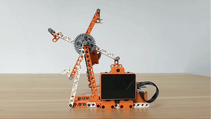

### 3.6.2 Learning Objectives

1. Understand the 360° block motor and the WonderLLM voice module, mastering coordinated control using the micro:bit expansion board.
2. Comprehend the logic of voice command analysis and motor control, implementing voice-activated start, stop, and constant-speed rotation.

### 3.6.3 Assembly Guide
### 3.6.4 Mode Switching

This model requires offline voice interaction. If the offline voice interaction mode has been entered, skip this step and proceed directly to the wiring guide. Otherwise, refer to [4.6.1 Firmware Update](./4.Software%20and%20Hardware%20Guide.md#anther4.6.1) to re-flash the corresponding firmware.

### 3.6.4 Wiring Guide

- Insert the WonderLLM module cable into port 4 of the micro:bit expansion board.
- Insert the 360° block servo cable into port S1 of the micro:bit expansion board, ensuring the yellow wire of the servo is inserted into the white pin of S1.

### 3.6.6 Programming

#### (1) Program Flowchart

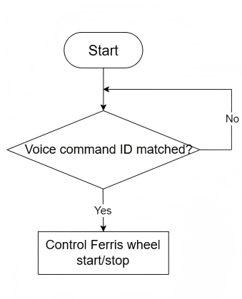

#### (3) Core Blocks Analysis

| Instruction Block | Category | Function Description |
| :---: | :---: | :---: |
|  |  | Define or get a variable used to store data |
|  |  | Assign a value to a custom variable |
|  |  | Initialize the DaDabit module to prepare for subsequent use |
|  |  | Initialize the WonderLLM interface to establish module communication |
|  |  | Switch the working mode of WonderLLM, supporting voice interaction, color recognition, and face recognition modes |
|  |  | Read the result id of the recognized command in the voice interaction module |
|  |  | Control the rotation direction and speed of the 360° block servo on the specified port |

#### (3) Complete Program

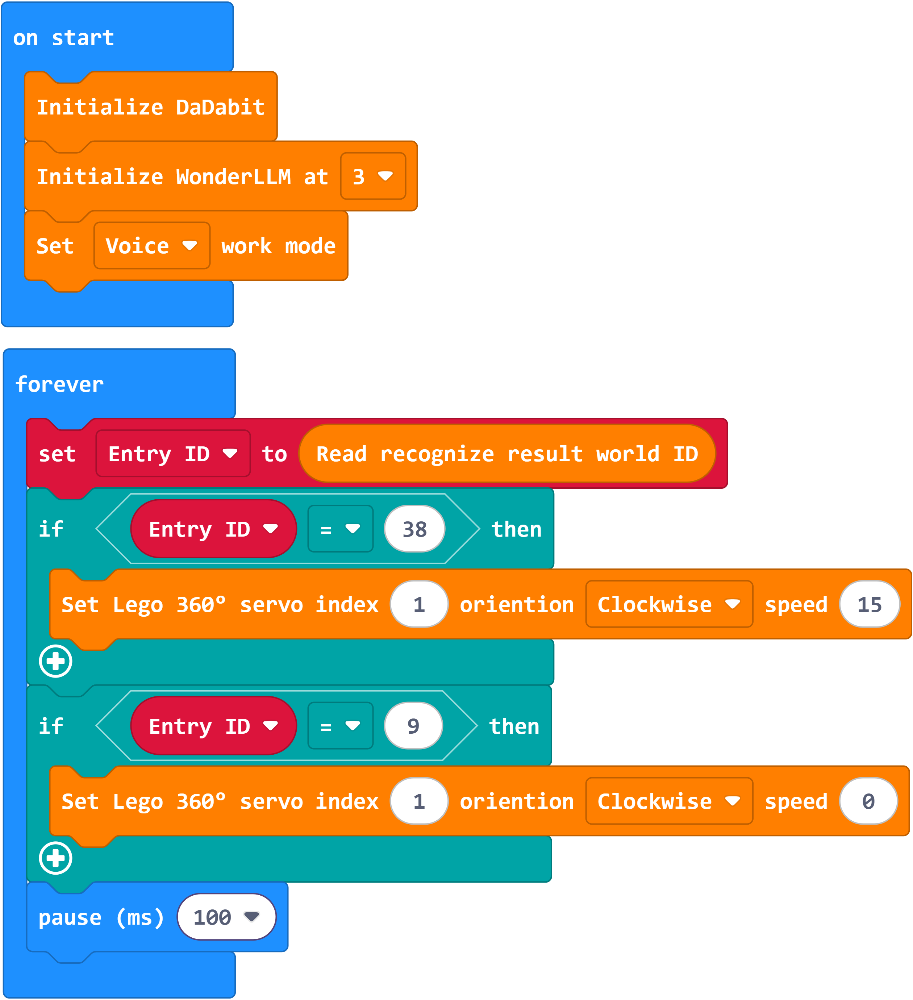

Program link: https://makecode.microbit.org/_YXxDVXd3K5Cv. Click **Edit Code** in the upper-right corner of the page to download the complete program.

### 3.6.7 Downloading the Program

### 3.6.8 Project Extensions

Upon voice activation, the RGB LED cycles through colors corresponding to numbers 0 to 9 every 100 milliseconds, while the dot matrix display shows **RUN** and the buzzer plays a melody named **wedding**, coordinating lights, patterns, and rotation.

### 3.6.9 Technical Support and Discussion

Join the forum for sharing questions, ideas, or suggestions, and answers will be provided promptly. Click the hyperlink [Hiwonder Forum](http://forum.hiwonder.com) or enter the URL in a browser: http://forum.hiwonder.com

## 3.7 Smart Desk Lamp

### 3.7.1 Introduction
This is a smart desk lamp featuring voice-controlled color adjustment. Upon powering on, the on-board RGB LED is turned off. When a voice command is received, the LED switches on and off or toggles between red, green, and blue light, acting as a smart desktop light fixture that allows free voice control of the lighting.

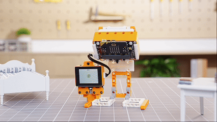

### 3.7.2 Learning Objectives

1. Recognize the onboard RGB light of the micro:bit expansion board and the WonderLLM module, and master the multi-module coordinated control method.
2. Comprehend the coordination logic of voice command analysis and light control, learning to implement voice-controlled light switches and colors.

### 3.7.3 Assembly Guide
### 3.7.4 Mode Switching

This model requires offline voice interaction. If the offline voice interaction mode has been entered, skip this step and proceed directly to the wiring guide. Otherwise, refer to [4.6.1 Firmware Update](./4.Software%20and%20Hardware%20Guide.md#anther4.6.1) to re-flash the corresponding firmware.

### 3.7.4 Wiring Guide

* Insert the WonderLLM module cable into port 3 of the micro:bit expansion board, as shown below:

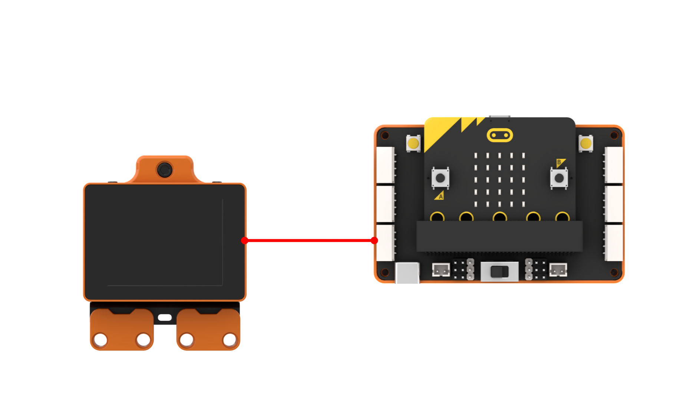

### 3.7.6 Programming

#### (1) Program Flowchart

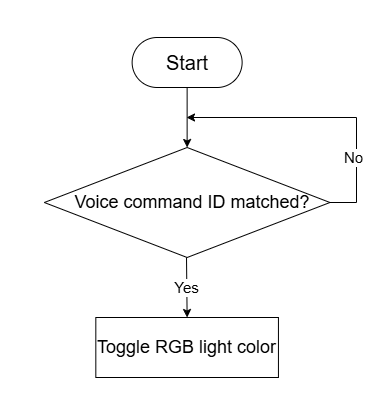

#### (3) Core Blocks Analysis

| Instruction Block | Category | Function Description |
| :---: | :---: | :---: |
|  |  | Initialize the DaDabit module to prepare for subsequent use |
|  |  | Initialize the WonderLLM interface to establish module communication |
|  |  | Switch the working mode of WonderLLM, supporting voice interaction, color recognition, and face recognition modes |
|  |  | Read the result id generated by the voice interaction module |
|  |  | Control the index and color of the onboard RGB light |
|  |  | Display the configured onboard RGB light effect |
|  |  | Turn off the onboard RGB light |

#### (3) Complete Program

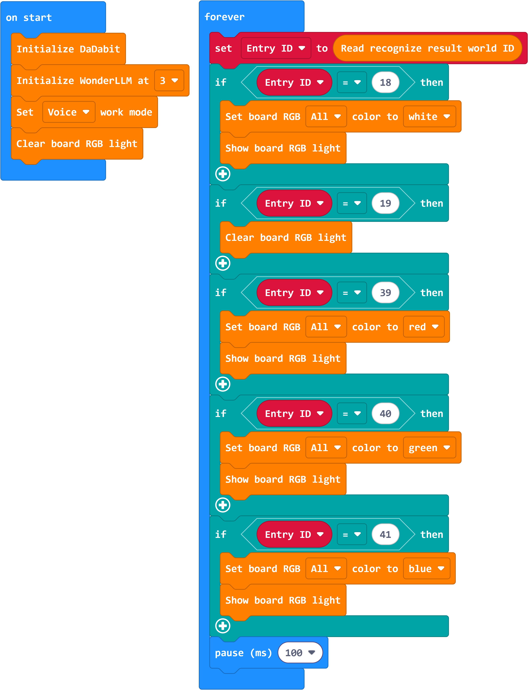

Program link: https://makecode.microbit.org/_5ucA0r3FkiwK. Click **Edit Code** in the upper-right corner of the page to download the complete program.

### 3.7.7 Downloading the Program

### 3.7.8 Project Extensions

Based on the original functions, add two levels of brightness adjustment for the desk lamp, and cycle between high and low brightness modes by pressing micro:bit button **A**.

### 3.7.9 Technical Support and Discussion

Join the forum for sharing questions, ideas, or suggestions, and answers will be provided promptly. Click the hyperlink [Hiwonder Forum](http://forum.hiwonder.com) or enter the URL in a browser: http://forum.hiwonder.com

## 3.8 Chef Bot

### 3.8.1 Introduction
This is a smart chef bot capable of cooking on command. Upon powering on, it enters a standby state. The WonderLLM large model supports controlling the cooking functions using any voice commands, such as "start cooking" or "start making food". The servo operates to simulate the stir-frying motion, acting as an indefatigable AI chef that uses voice control to precisely replicate the heat and flavor of each dish.

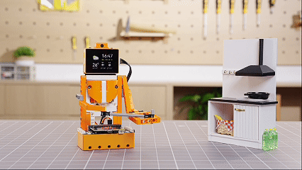

### 3.8.2 Learning Objectives

1. Understand the 360° block motor and the WonderLLM Online LLM module, mastering coordinated control using the micro:bit expansion board.
2. Comprehend the semantic recognition logic of the large AI model, learning to control the starting and stopping of the cooking arm by voice.

### 3.8.3 Assembly Guide
### 3.8.4 Mode Switching

This model requires the Online LLM. If the Online LLM mode has been entered, skip this step and proceed directly to the wiring guide. Otherwise, refer to [4.5.10 Mode Switching](./4.Software%20&%20Hardware%20Guide.md#anther4.5.10) to re-flash the corresponding firmware.

### 3.8.4 Device Wiring

- Insert the WonderLLM module cable into port 3 of the micro:bit expansion board.
- Insert the 360° block servo cable into port S1 of the micro:bit expansion board, ensuring the yellow wire of the servo is inserted into the white pin of S1.

​	As shown below:

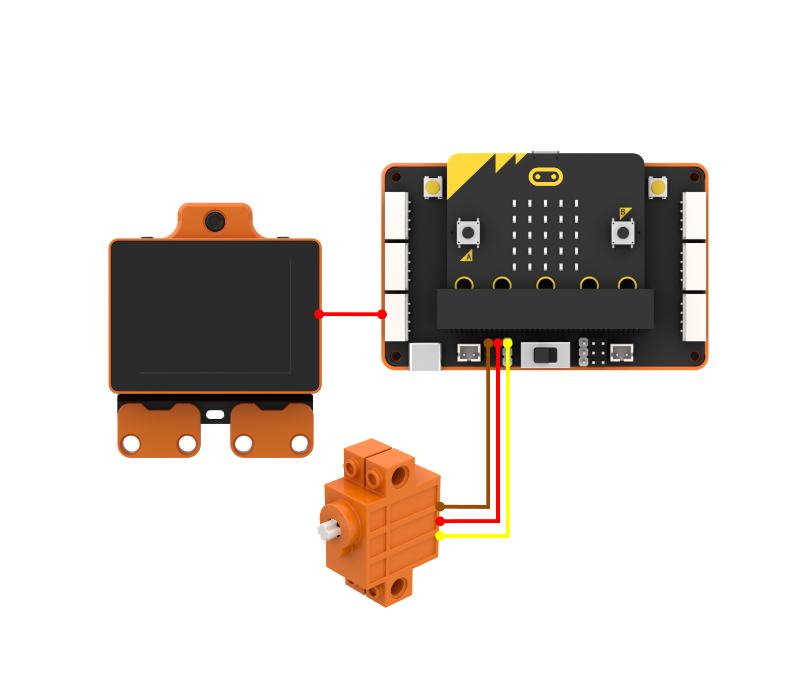

### 3.8.6 Programming

#### (1) Program Flowchart

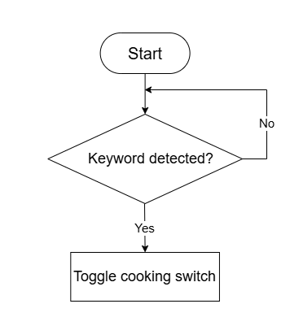

#### (3) Core Blocks Analysis

| Instruction Block | Category | Function Description |
| :---: | :---: | :---: |
|  |  | Define or get a variable used to store data |
|  |  | Assign a value to a custom variable |
|  |  | Initialize the DaDabit module to prepare for subsequent use |
|  |  | Initialize the WonderLLM interface to establish module communication |
|  |  | Configure custom tool parameters that can be called by the ai module |
|  |  | Synchronize mcp tool configuration information with the ai module |
|  |  | Read the running data sent back after the ai module calls the tool |
|  |  | Inform the ai module that a single tool call process has ended |
|  |  | Extract the corresponding numeric value from the target dictionary based on the specified key and return it |
|  |  | Control the running direction and speed of the 360° block servo on the specified port |
|  |  | Determine whether the target text contains the specified character |

#### MCP Parameter Configuration

* Tool Name: `self.robot.setCook`

1. Tool Description: You are a Chef Bot. The parameters are as follows: Switch: 0 or 1. When turned on, it returns 1; when turned off, it returns 0.

2. AI Module Return Parameters: `[["cook", "int", "0", "0", "1"]]`

> [!NOTE]
> 
> **The field name is `cook`, integer type, the first 0 is the default value, the second 0 is the minimum value, and 1 is the maximum value.**

3. Block until call is completed: `true`

4. Return data to AI Module: `false`

5. Function: This MCP configuration defines the switch control tool of the Chef Bot for the AI module. It allows the AI to send a command of 0 or 1 to control the start and stop of the Chef Bot, where turning it on returns 1 and turning it off returns 0. The program will wait for the operation to complete during the call, and there is no need to send extra running data back to the AI.

#### (4) Complete Program

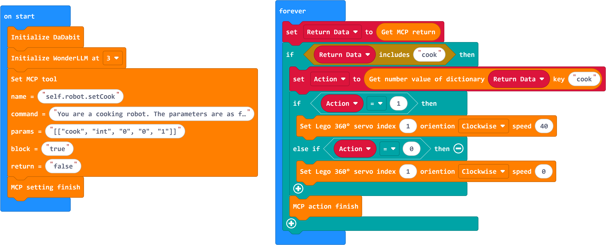

Program link: https://makecode.microbit.org/_L7xRHq7j22x6. Click **Edit Code** in the upper-right corner of the page to download the complete program.

### 3.8.7 Downloading the Program

### 3.8.8 Project Extensions

Add a timer mode for the Chef Bot. Set the cooking duration to 5 seconds by pressing button **A** or 10 seconds by pressing button **B**. Start the stir-frying action by voice. The cooking automatically stops and triggers a prompt when the set time is reached to prevent overcooking.

### 3.8.9 Technical Support and Discussion

Join the forum for sharing questions, ideas, or suggestions, and answers will be provided promptly. Click the hyperlink [Hiwonder Forum](http://forum.hiwonder.com) or enter the URL in a browser: http://forum.hiwonder.com

## 3.9 Pull-Up Bot

### 3.9.1 Introduction
This is an intelligent pull-up robot featuring workout on command. Through the voice interaction module, voice commands control the rotation of the servo, simulating the rising and falling actions of a figure doing pull-ups. Saying "Stop" halts the motion. Working like an energetic fitness coach, it uses voice commands to drive the motion rhythm, adding interactive fun.

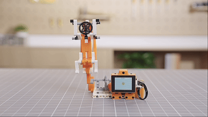

### 3.9.2 Learning Objectives

1. Understand the 360° block motor and the WonderLLM module, mastering coordinated control using the micro:bit expansion board.
2. Comprehend the coordination logic of voice command analysis and motor control, learning to control the starting and stopping of workout routines.

### 3.9.3 Assembly Guide
### 3.9.4 Mode Switching

This model requires offline voice interaction. If the offline voice interaction mode has been entered, skip this step and proceed directly to the wiring guide. Otherwise, refer to [4.6.1 Firmware Update](./4.Software%20and%20Hardware%20Guide.md#anther4.6.1) to re-flash the corresponding firmware.

### 3.9.4 Wiring Guide

- Insert the WonderLLM module cable into port 4 of the micro:bit expansion board.
- Insert the 360° block servo cable into port S1 of the micro:bit expansion board, ensuring the yellow wire of the servo is inserted into the white pin of S1.

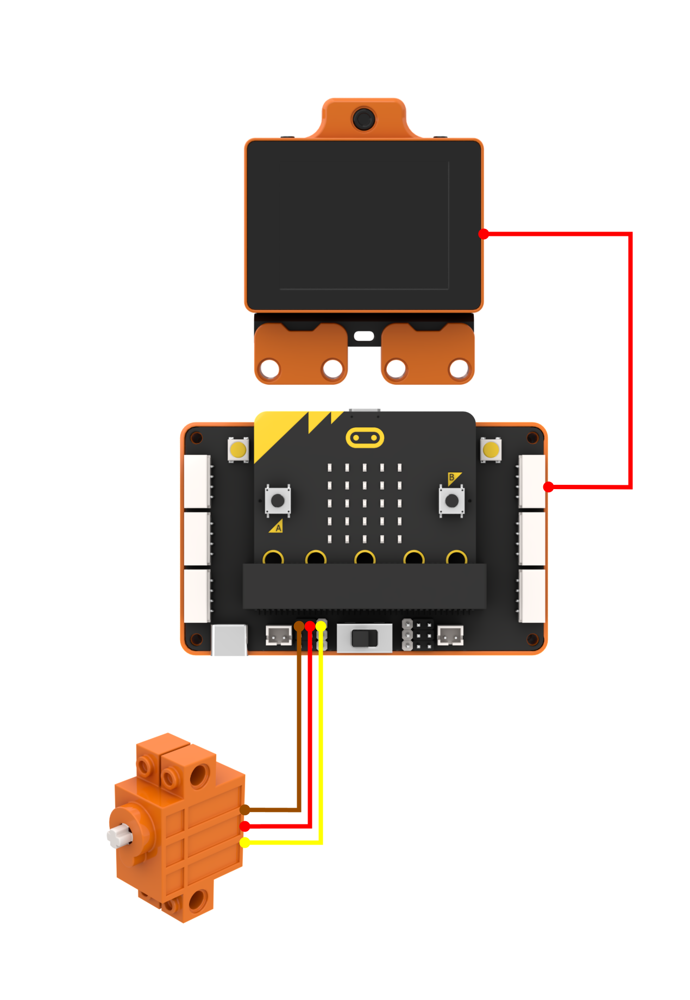

### 3.9.6 Programming

#### (1) Program Flowchart

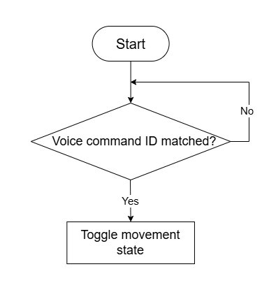

#### (3) Core Blocks Analysis

| Instruction Block | Category | Function Description |
| :---: | :---: | :---: |
|  |  | Define or get a variable used to store data |
|  |  | Assign a value to a custom variable |
|  |  | Initialize the DaDabit module to prepare for subsequent use |
|  |  | Initialize the WonderLLM interface to establish module communication |
|  |  | Switch the working mode of WonderLLM, supporting voice interaction, color recognition, and face recognition modes |
|  |  | Read the result id of the recognized command in the voice interaction module |
|  |  | Control the rotation direction and speed of the 360° block servo on the specified port |

#### (3) Complete Program

Program link: https://makecode.microbit.org/_E2f107Lw4WFA. Click **Edit Code** in the upper-right corner of the page to download the complete program.

### 3.9.7 Downloading the Program

### 3.9.8 Project Extensions

Display a tired expression on the dot matrix display when the workout duration exceeds 4 seconds. When the duration reaches 10 seconds, the robot stops, the buzzer plays a prompt tone, the red RGB LED flashes in celebration, and a happy expression is shown.

### 3.9.9 Technical Support and Discussion

Join the forum for sharing questions, ideas, or suggestions, and answers will be provided promptly. Click the hyperlink [Hiwonder Forum](http://forum.hiwonder.com) or enter the URL in a browser: http://forum.hiwonder.com

## 3.10 Smart Barrier Gate

### 3.10.1 Introduction
This is a smart barrier gate capable of proactive door opening. Upon powering on, it enters a standby state. When the WonderLLM module detects a face, the servo drives the barrier arm to raise automatically, while broadcasting the voice message "Hello, welcome." Just like a polite usher, it welcomes every guest with its automated gate opening and warm greeting.

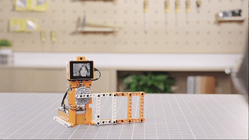

### 3.10.2 Learning Objectives

1. Understand the 270° block servo and the WonderLLM module, mastering multi-module coordinated control using the micro:bit expansion board.
2. Comprehend the programming logic of facial recognition and voice broadcasting, learning to implement face-triggered barrier actions and welcoming audio.

### 3.10.3 Assembly Guide
### 3.10.4 Mode Switching

This model requires the offline vision function. If the offline vision function mode has been entered, skip this step and proceed directly to the wiring guide. Otherwise, refer to [4.6.1 Firmware Update](./4.Software%20and%20Hardware%20Guide.md#anther4.6.1) to re-flash the corresponding firmware.

### 3.10.4 Wiring Guide

- Insert the WonderLLM module cable into port 3 of the micro:bit expansion board.
- Insert the 270° block servo cable into port S1 of the micro:bit expansion board, ensuring the yellow wire of the servo is inserted into the white pin of S1.

​	As shown below:

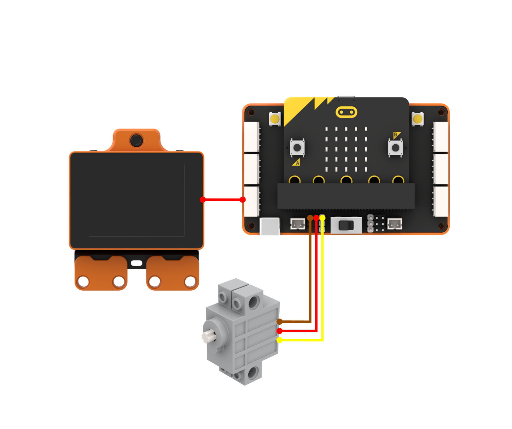

### 3.10.6 Programming

#### (1) Program Flowchart

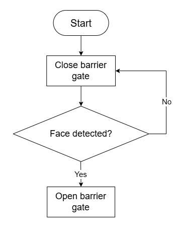

#### (3) Core Blocks Analysis

| Instruction Block | Category | Function Description |
| :---: | :---: | :---: |
|  |  | Initialize the DaDabit module to prepare for subsequent use |
|  |  | Initialize the WonderLLM interface to establish module communication |
|  |  | Switch the working mode of WonderLLM, supporting voice interaction, color recognition, and face recognition modes |
|  |  | Detect whether a face is recognized and return a boolean result |
|  |  | Control the angle and execution time of the 270° block servo on the specified port |
|  |  | Play the preset voice broadcast content in the WonderEcho module |

#### (3) Complete Program

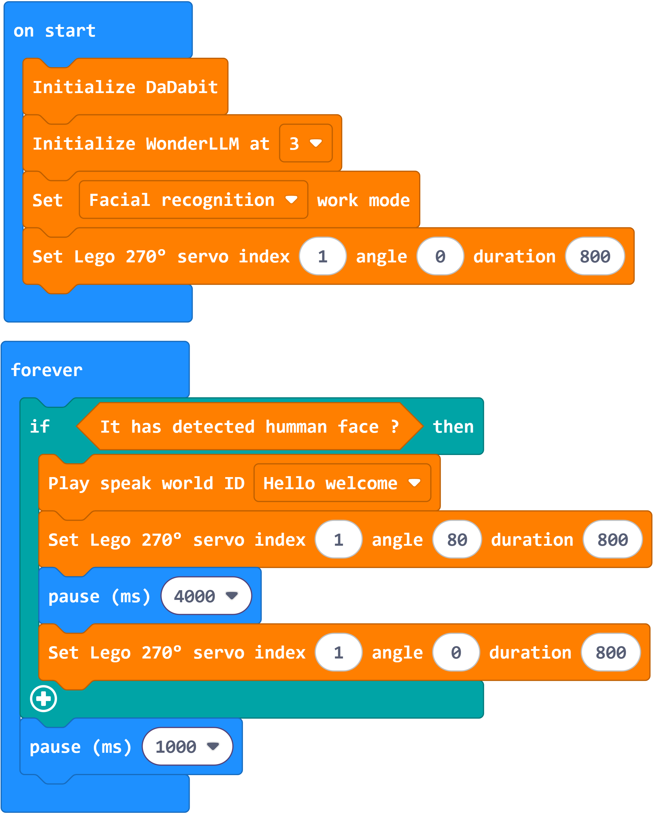

Program link: https://makecode.microbit.org/_KjYdsriJ4Tk8. Click **Edit Code** in the upper-right corner of the page to download the complete program.

### 3.10.7 Downloading the Program

### 3.10.8 Project Extensions

Add status lights: the LED is green-yellow when opening, solid green when fully open, flashes red when closing, and turns off when fully closed, making the gate status clear at a glance.

### 3.10.9 Technical Support and Discussion

Join the forum for sharing questions, ideas, or suggestions, and answers will be provided promptly. Click the hyperlink [Hiwonder Forum](http://forum.hiwonder.com) or enter the URL in a browser: http://forum.hiwonder.com

## 3.11 Pirate Ship

### 3.11.1 Introduction
This is a smart pirate ship featuring activation on command. Upon powering on, it enters a standby state. Through the WonderLLM voice interaction module, voice commands control the servo to rotate back and forth, driving the pirate ship model in a reciprocating swing. Like an amusement park operator, it uses voice commands to start this thrilling swinging ride.

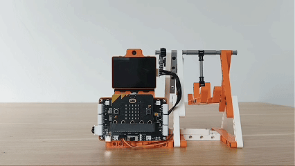

### 3.11.2 Learning Objectives

1. Understand the 270° block servo and the WonderLLM offline voice interaction module, mastering coordinated control using the micro:bit expansion board.
2. Comprehend the coordination logic of voice command analysis and servo rotation, learning to control the start, stop, and operation of mechanical structures via voice.

### 3.11.3 Assembly Guide
### 3.11.4 Mode Switching

This model requires offline voice interaction. If the offline voice interaction mode has been entered, skip this step and proceed directly to the wiring guide. Otherwise, refer to [4.6.1 Firmware Update](./4.Software%20and%20Hardware%20Guide.md#anther4.6.1) to re-flash the corresponding firmware.

### 3.11.4 Wiring Guide

- Insert the WonderLLM module cable into port 3 of the micro:bit expansion board.
- Insert the 270° block servo cable into port S1 of the micro:bit expansion board, ensuring the yellow wire of the servo is inserted into the white pin of S1.

​	As shown below:

> [!NOTE]
> 
> **For the first course involving the block servo, remove the gear from the servo first, and upload the program of this course to the micro:bit. Then, turn on the power switch of the micro:bit expansion board and wait for the block servo to rotate to its initial position of 0 degrees before reinstalling the gear. This step can be skipped if the servo reset program has been executed previously.**

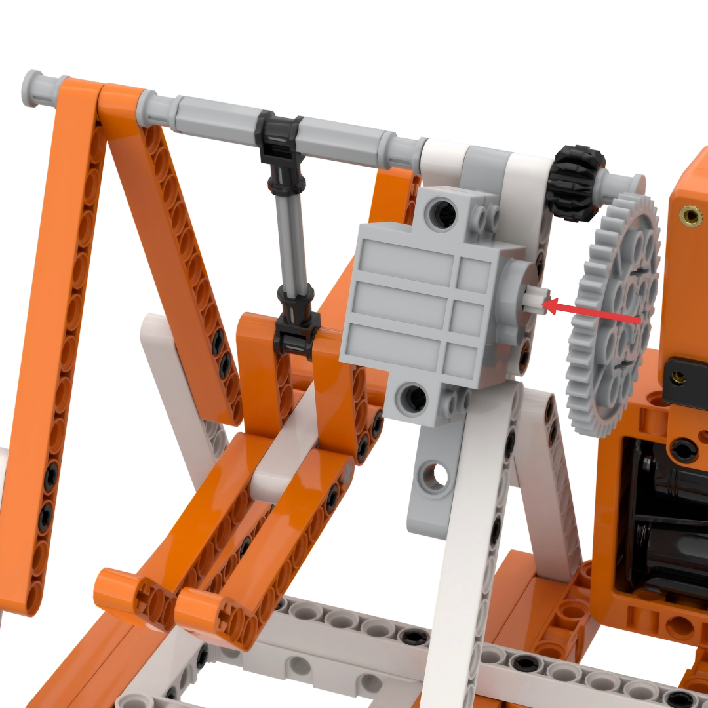

### 3.11.6 Programming

#### (1) Program Flowchart

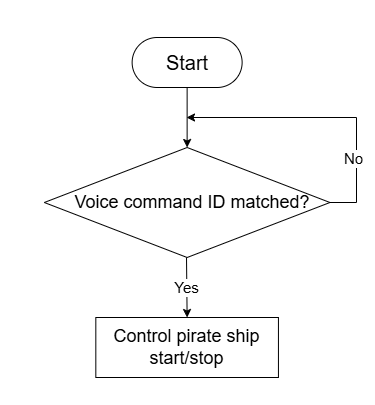

#### (3) Core Blocks Analysis

| Instruction Block | Category | Function Description |
| :---: | :---: | :---: |
|  |  | Define or get a variable used to store data |
|  |  | Assign a value to a custom variable |
|  |  | Increase or decrease the variable by a set step size |
|  |  | Initialize the DaDabit module to prepare for subsequent use |
|  |  | Initialize the WonderLLM interface to establish module communication |
|  |  | Switch the working mode of WonderLLM, supporting voice interaction, color recognition, and face recognition modes |
|  |  | Read the result id of the recognized command in the voice interaction module |
|  |  | Control the angle and execution time of the 270° block servo on the specified port |

#### (3) Complete Program

Program link: https://makecode.microbit.org/_Hksi5URYwHkJ. Click **Edit Code** in the upper-right corner of the page to download the complete program.

### 3.11.7 Downloading the Program

### 3.11.8 Project Extensions

Add a swinging amplitude switching function to the Pirate Ship. After voice activation, the Pirate Ship swings continuously with a small amplitude at a fixed speed to simulate the operation of amusement park equipment. Press button **A** to cycle the swinging amplitude among small, medium, and large levels.

### 3.11.9 Technical Support and Discussion

Join the forum for sharing questions, ideas, or suggestions, and answers will be provided promptly. Click the hyperlink [Hiwonder Forum](http://forum.hiwonder.com) or enter the URL in a browser: http://forum.hiwonder.com

## 3.12 Smart Swing

### 3.12.1 Introduction
This is a smart swing featuring swinging on command. Upon powering on, it enters a standby state. Through the WonderLLM voice interaction module, voice commands control the servo to rotate back and forth, driving the swing in a rhythmic front-and-back oscillation. Like a playground administrator, it uses voice commands to make the swing gently rock.

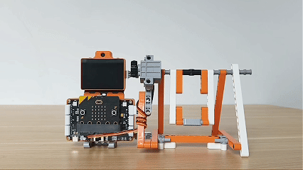

### 3.12.2 Learning Objectives

1. Understand the 270° block servo and the WonderLLM offline voice interaction module, mastering coordinated control using the micro:bit expansion board.
2. Comprehend the coordination logic of voice command analysis and servo operation, learning to control the swing's start, stop, and movement via voice.

### 3.12.3 Assembly Guide
### 3.12.4 Mode Switching

This model requires offline voice interaction. If the offline voice interaction mode has been entered, skip this step and proceed directly to the wiring guide. Otherwise, refer to [4.6.1 Firmware Update](./4.Software%20and%20Hardware%20Guide.md#anther4.6.1) to re-flash the corresponding firmware.

### 3.12.4 Wiring Guide

- Insert the WonderLLM module cable into port 6 of the micro:bit expansion board.
- Insert the 270° block servo cable into port S1 of the micro:bit expansion board, ensuring the yellow wire of the servo is inserted into the white pin of S1.

​	As shown below:

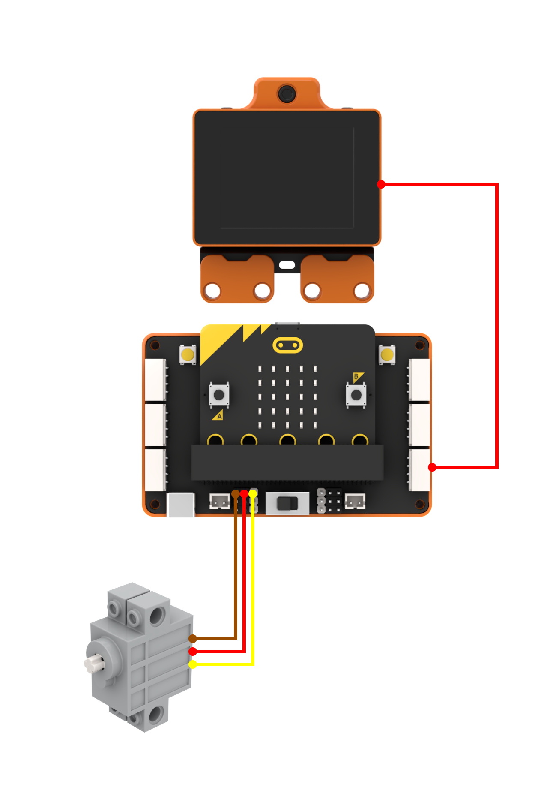

> [!NOTE]
> 
> **For the first course involving the block servo, remove the gear from the servo first, and upload the program of this course to the micro:bit. Then, turn on the power switch of the micro:bit expansion board and wait for the block servo to rotate to its initial position of 0 degrees before reinstalling the gear. This step can be skipped if the servo reset program has been executed previously.**

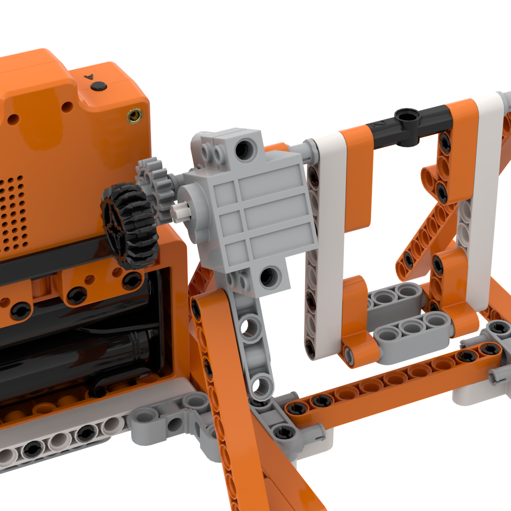

### 3.12.6 Programming

#### (1) Program Flowchart

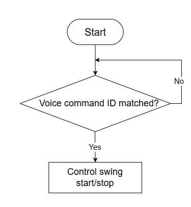

#### (3) Core Blocks Analysis

| Instruction Block | Category | Function Description |
| :---: | :---: | :---: |
|  |  | Define or get a variable used to store data |
|  |  | Assign a value to a custom variable |
|  |  | Increase or decrease the variable by a set step size |
|  |  | Initialize the DaDabit module to prepare for subsequent use |
|  |  | Initialize the WonderLLM interface to establish module communication |
|  |  | Switch the working mode of WonderLLM, supporting voice interaction, color recognition, and face recognition modes |
|  |  | Read the result id of the recognized command in the voice interaction module |
|  |  | Control the angle and execution time of the 270° block servo on the specified port |

#### (3) Complete Program

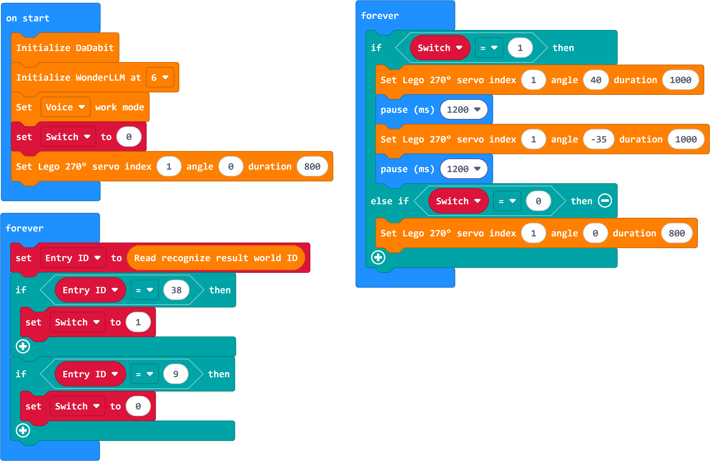

Program link: https://makecode.microbit.org/_Jrgfk3gKs0xj. Click **Edit Code** in the upper-right corner of the page to download the complete program.

### 3.12.7 Downloading the Program

### 3.12.8 Project Extensions

Add an automatic speed loop mode: after startup, the swing speed cycles through low, medium, and high speed levels, each for 5s, before pausing and repeating the cycle.

### 3.12.9 Technical Support and Discussion

Join the forum for sharing questions, ideas, or suggestions, and answers will be provided promptly. Click the hyperlink [Hiwonder Forum](http://forum.hiwonder.com) or enter the URL in a browser: http://forum.hiwonder.com

## 3.13 Sawing Bot

### 3.13.1 Introduction
This is a smart sawing bot featuring sawing on command. Upon powering on, it enters a standby state. Through the WonderLLM voice interaction module, voice commands control the servo to rotate back and forth, driving the figure's arms in a reciprocating sawing motion. Like a skilled carpenter, it uses mechanical transmission to simulate a realistic wood sawing scene.

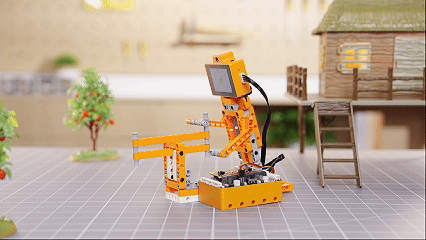

### 3.13.2 Learning Objectives

1. Understand the 270° block servo and the WonderLLM offline voice interaction module, mastering coordinated control using the micro:bit expansion board.
2. Comprehend the coordination logic of voice command analysis and servo operation, learning to control the starting, stopping, and operation of mechanical structures via voice.

### 3.13.3 Assembly Guide
### 3.13.4 Mode Switching

This model requires offline voice interaction. If the offline voice interaction mode has been entered, skip this step and proceed directly to the wiring guide. Otherwise, refer to [4.6.1 Firmware Update](./4.Software%20and%20Hardware%20Guide.md#anther4.6.1) to re-flash the corresponding firmware.

### 3.13.4 Wiring Guide

- Insert the WonderLLM module cable into port 3 of the micro:bit expansion board.
- Insert the 270° block servo cable into port S1 of the micro:bit expansion board, ensuring the yellow wire of the servo is inserted into the white pin of S1.

​	As shown below:

> [!NOTE]
> 
> **For the first course involving the block servo, remove the building blocks from the servo first, and upload the program of this course to the micro:bit. Then, turn on the power switch of the micro:bit expansion board and wait for the block servo to rotate to its initial position of 0 degrees before reinstalling the building blocks. At this point, the saw is in the middle position. This step can be skipped if the servo reset program has been executed previously.**

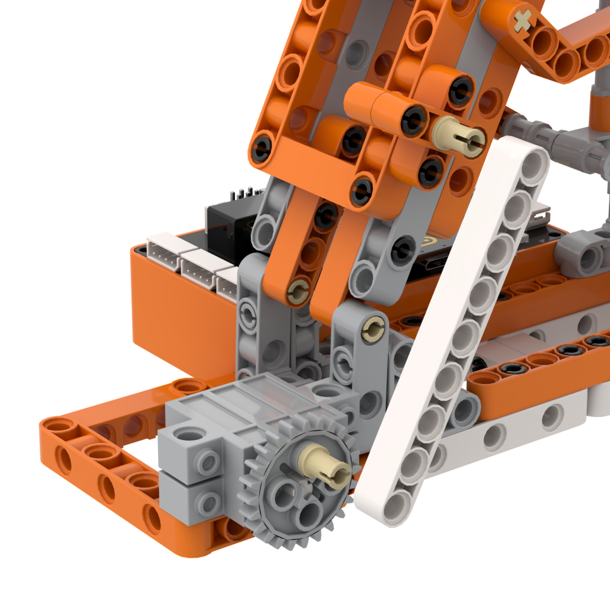

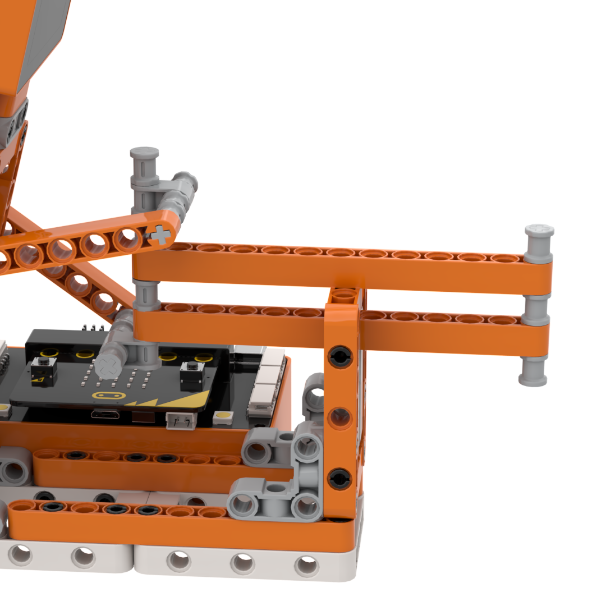

### 3.13.6 Programming

#### (1) Program Flowchart

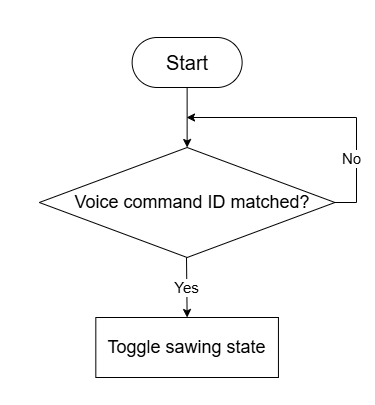

#### (3) Core Blocks Analysis

| Instruction Block | Category | Function Description |
| :---: | :---: | :---: |
|  |  | Define or get a variable used to store data |
|  |  | Assign a value to a custom variable |
|  |  | Increase or decrease the variable by a set step size |
|  |  | Initialize the DaDabit module to prepare for subsequent use |
|  |  | Initialize the WonderLLM interface to establish module communication |
|  |  | Switch the working mode of WonderLLM, supporting voice interaction, color recognition, and face recognition modes |
|  |  | Read the result id of the recognized command in the voice interaction module |
|  |  | Control the angle and execution time of the 270° block servo on the specified port |

#### (3) Complete Program

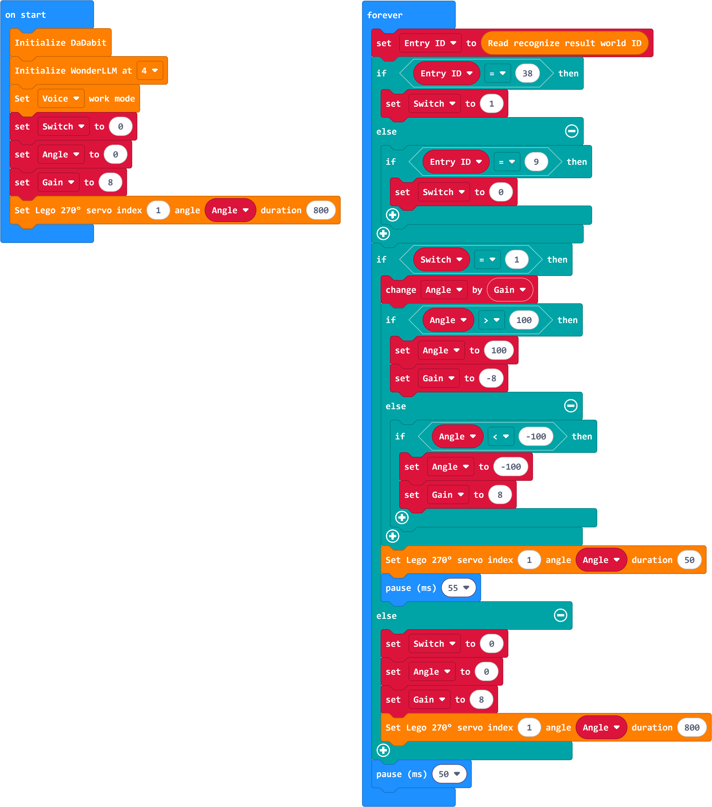

Program link: https://makecode.microbit.org/_Us38rz1Yhixm. Click **Edit Code** in the upper-right corner of the page to download the complete program.

### 3.13.7 Downloading the Program

### 3.13.8 Project Extensions

Add a work counter: the dot matrix display increments its count after each complete back-and-forth sawing motion. When the count exceeds 10, the RGB LED cycles through colors corresponding to numbers 0 to 9 every 100 milliseconds.

### 3.13.9 Technical Support and Discussion

Join the forum for sharing questions, ideas, or suggestions, and answers will be provided promptly. Click the hyperlink [Hiwonder Forum](http://forum.hiwonder.com) or enter the URL in a browser: http://forum.hiwonder.com

## 3.14 Face-Changing Bot

### 3.14.1 Introduction
This is a smart face-changing bot featuring expression changing on command. Upon powering on, it enters a standby state. Through the WonderLLM voice interaction module, voice commands switch and display corresponding facial expressions. Just like a dramatic actor full of emotions, it uses voice commands to transform into a variety of expressions.

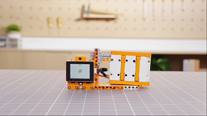

### 3.14.2 Learning Objectives

1. Understand the 270° block servo and the WonderLLM offline voice interaction module, mastering multi-module coordinated control using the micro:bit expansion board.
2. Comprehend the coordination logic of voice command analysis and servo actions, learning to control the mechanism to switch between different expressions.

### 3.14.3 Assembly Guide
### 3.14.4 Mode Switching

This model requires offline voice interaction. If the offline voice interaction mode has been entered, skip this step and proceed directly to the wiring guide. Otherwise, refer to [4.6.1 Firmware Update](./4.Software%20and%20Hardware%20Guide.md#anther4.6.1) to re-flash the corresponding firmware.

### 3.14.4 Wiring Guide

- Insert the WonderLLM module cable into port 3 of the micro:bit expansion board.
- Insert the 270° block servo cable into port S1 of the micro:bit expansion board, ensuring the yellow wire of the servo is inserted into the white pin of S1.

​	As shown below:

> [!NOTE]
> 
> For the first course involving the block servo, remove the barrier building block from the servo first, and upload the program of this course to the micro:bit. Then, turn on the power switch of the micro:bit expansion board and wait for the block servo to rotate to its initial position of 0 degrees before reinstalling the building block. This step can be skipped if the servo reset program has been executed previously.

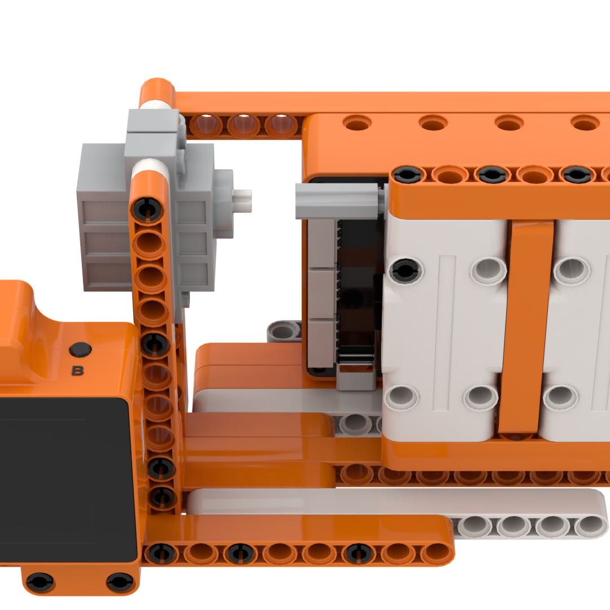

### 3.14.6 Programming

#### (1) Program Flowchart

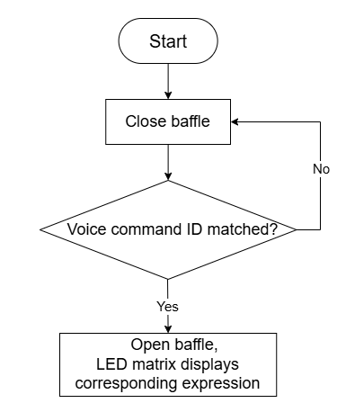

#### (3) Core Blocks Analysis

| Instruction Block | Category | Function Description |
| :---: | :---: | :---: |
| 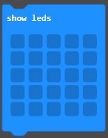 |  | Light up the LED screen to display a preset pattern |
|  |  | Clear all display content on the LED screen |
|  |  | Define or get a variable used to store data |
|  |  | Assign a value to a custom variable |
|  |  | Initialize the DaDabit module to prepare for subsequent use |
|  |  | Initialize the WonderLLM interface to establish module communication |
|  |  | Switch the working mode of WonderLLM, supporting voice interaction, color recognition, and face recognition modes |
|  |  | Read the result id of the recognized command in the voice interaction module |
|  |  | Control the angle and execution time of the 270° block servo on the specified port |

#### (3) Complete Program

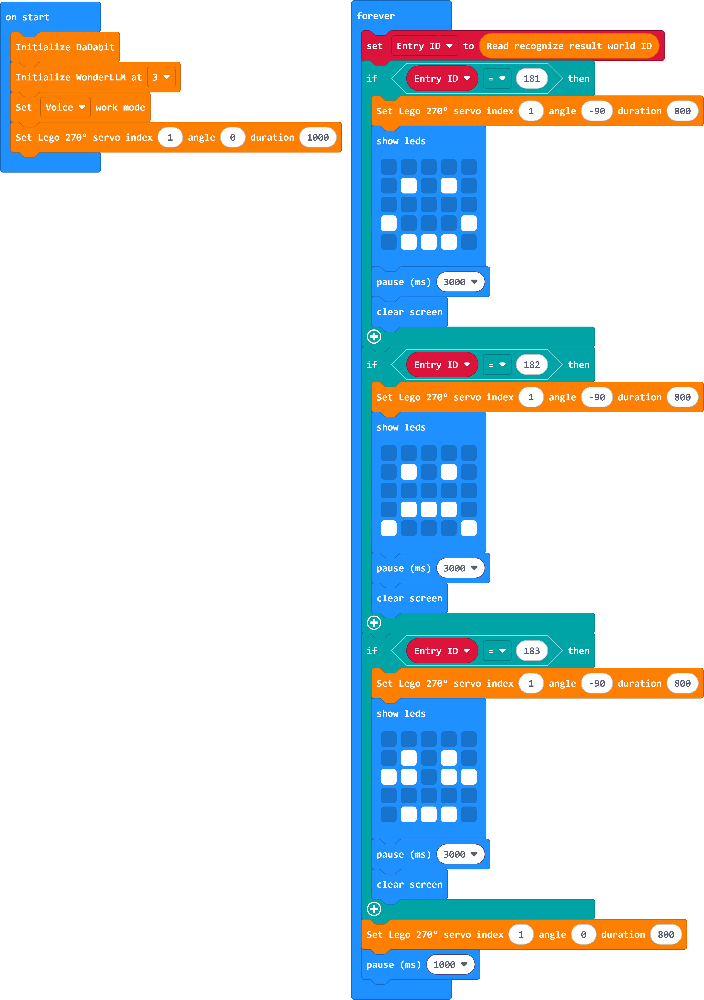

Program link: https://makecode.microbit.org/_isMg2oaDW5Wy. Click **Edit Code** in the upper-right corner of the page to download the complete program.

### 3.14.7 Downloading the Program

### 3.14.8 Project Extensions

Add RGB status lights: show green for happy, blue for sad, purple for helpless, and turn off the LED when no expression is displayed.

### 3.14.9 Technical Support and Discussion

Join the forum for sharing questions, ideas, or suggestions, and answers will be provided promptly. Click the hyperlink [Hiwonder Forum](http://forum.hiwonder.com) or enter the URL in a browser: http://forum.hiwonder.com

## 3.15 Ski Star

### 3.15.1 Introduction
This is a smart ski star featuring sliding on command. Upon powering on, it enters a standby state. Through the WonderLLM voice interaction module, voice commands control the figure to slide forward along the track or stop. Like a professional skier, it simulates the dynamics and fun of skiing with precise movements.

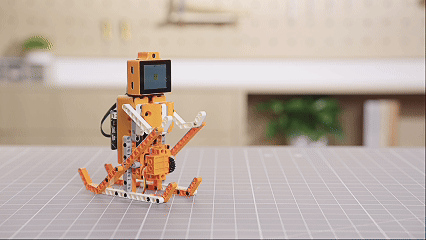

### 3.15.2 Learning Objectives

1. Understand the 360° block motor and the WonderLLM offline voice interaction module, mastering multi-module coordinated control using the micro:bit expansion board.
2. Comprehend the coordination logic of voice command analysis and motor control, learning to control the starting, stopping, and speed of mechanical structures via voice.

### 3.15.3 Assembly Guide
### 3.15.4 Mode Switching

This model requires offline voice interaction. If the offline voice interaction mode has been entered, skip this step and proceed directly to the wiring guide. Otherwise, refer to [4.6.1 Firmware Update](./4.Software%20and%20Hardware%20Guide.md#anther4.6.1) to re-flash the corresponding firmware.

### 3.15.4 Wiring Guide

- Insert the WonderLLM module cable into port 3 of the micro:bit expansion board.
- Insert the 360° block servo cable into port S1 of the micro:bit expansion board, ensuring the yellow wire of the servo is inserted into the white pin of S1.

​	As shown below:

### 3.15.6 Programming

#### (1) Program Flowchart

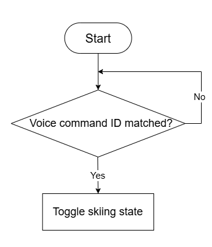

#### (3) Core Blocks Analysis

| Instruction Block | Category | Function Description |
| :---: | :---: | :---: |
|  |  | Define or get a variable used to store data |
|  |  | Assign a value to a custom variable |
|  |  | Initialize the DaDabit module to prepare for subsequent use |
|  |  | Initialize the WonderLLM interface to establish module communication |
|  |  | Switch the working mode of WonderLLM, supporting voice interaction, color recognition, and face recognition modes |
|  |  | Read the result id of the recognized command in the voice interaction module |
|  |  | Control the rotation direction and speed of the 360° block servo on the specified port |

#### (3) Complete Program

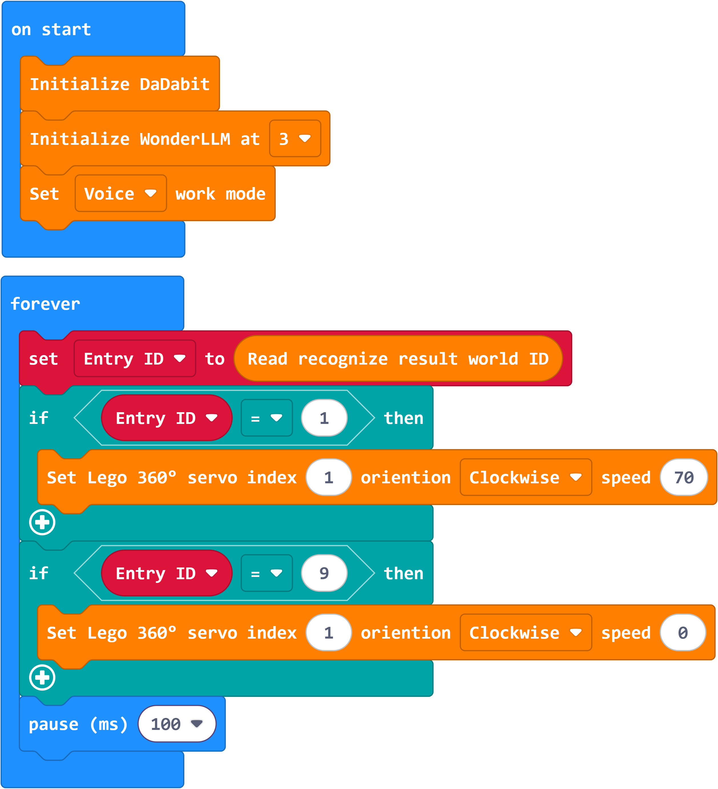

Program link: https://makecode.microbit.org/_XccaX73m2MWx. Click **Edit Code** in the upper-right corner of the page to download the complete program.

### 3.15.7 Downloading the Program

### 3.15.8 Project Extensions

Add a voice-controlled backward mode: allow steering forward, backward, and stopping. Show **GO** on the dot matrix display when moving forward, **BACK** when moving backward, and clear the screen when stopped.

### 3.15.9 Technical Support and Discussion

Join the forum for sharing questions, ideas, or suggestions, and answers will be provided promptly. Click the hyperlink [Hiwonder Forum](http://forum.hiwonder.com) or enter the URL in a browser: http://forum.hiwonder.com

## 3.16 Rhythm Drummer

### 3.16.1 Introduction
This is a smart rhythm drummer capable of drumming on command. Upon powering on, it enters a standby state. The WonderLLM large model supports controlling the drumming action through any voice commands while playing random music. Voice commands control the drummer to strike the drum surface alongside the playing and stopping of music, acting as a passionate rock drummer who uses voice to conduct rhythmic drum beats.

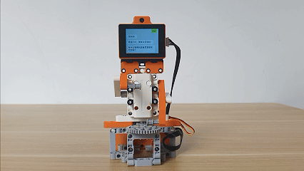

### 3.16.2 Learning Objectives

1. Understand the 360° block motor and the WonderLLM Online LLM module, mastering multi-module coordinated control using the micro:bit expansion board.
2. Comprehend the coordination logic of voice command analysis, motor control, and music playback, learning to coordinate drumming with audio.

### 3.16.3 Assembly Guide
### 3.16.4 Mode Switching

This model requires the Online LLM. If the Online LLM mode has been entered, skip this step and proceed directly to the wiring guide. Otherwise, refer to [4.5.10 Mode Switching](./4.Software%20&%20Hardware%20Guide.md#anther4.5.10) to re-flash the corresponding firmware.

### 3.16.4 Device Wiring

- Insert the WonderLLM module cable into port 6 of the micro:bit expansion board.
- Insert the 360° block servo cable into port S1 of the micro:bit expansion board, ensuring the yellow wire of the servo is inserted into the white pin of S1.

​	As shown below:

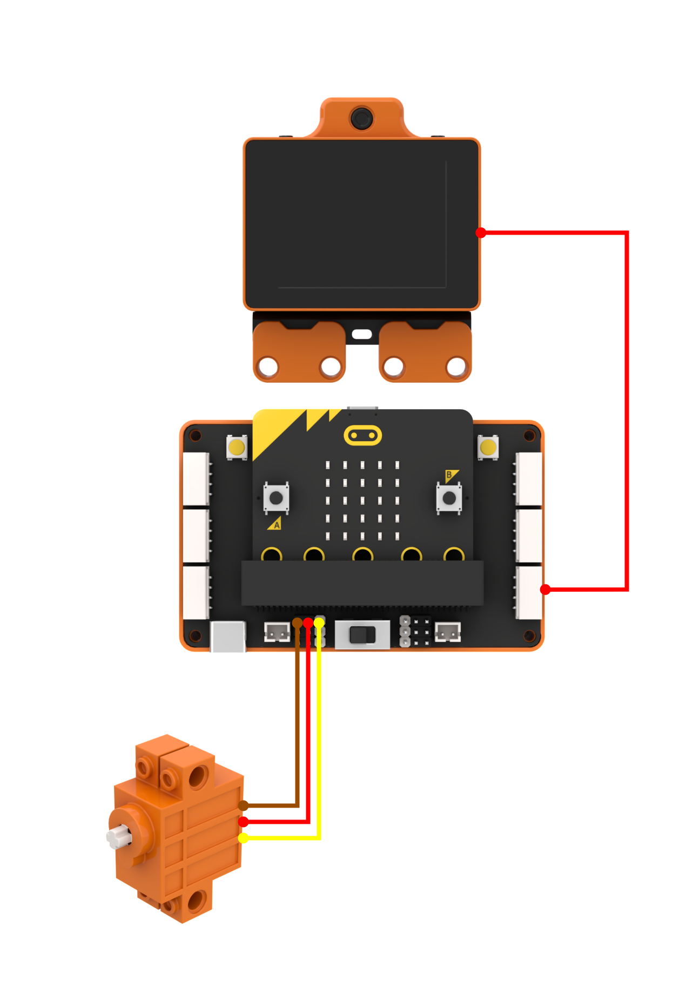

### 3.16.6 Programming

#### (1) Program Flowchart

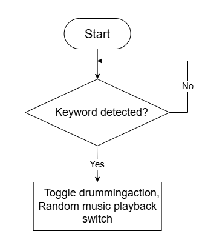

#### (3) Core Blocks Analysis

| Instruction Block | Category | Function Description |
| :---: | :---: | :---: |
|  |  | Compare whether two values are equal and return a boolean result |
|  |  | Define or get a variable used to store data |
|  |  | Assign a value to a custom variable |
|  |  | Initialize the DaDabit module to prepare for subsequent use |
|  |  | Initialize the WonderLLM interface to establish module communication |
| 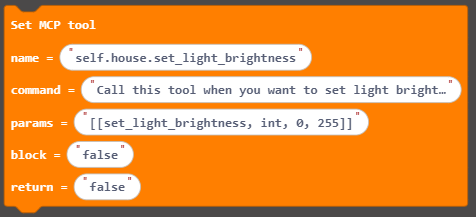 |  | Configure custom tool parameters that can be called by the ai module |
|  |  | Synchronize mcp tool configuration information with the ai module |
|  |  | Read the running data sent back after the ai module calls the tool |
|  |  | Extract the corresponding numeric value from the target dictionary based on the specified key and return it |
|  |  | Inform the ai module that a single tool call process has ended |
|  |  | Control the running direction and speed of the 360° block servo on the specified port |
|  |  | Determine whether the target text contains the specified character |

#### MCP Parameter Configuration

* Tool Name: `self.robot.setMusic`

1. Tool Description: You can control the start and stop of the drumming. The parameters are as follows: 1 is returned when starting the drumming, and 0 is returned when stopping.

2. AI Module Return Parameters: `[["music", "int", "0", "0", "1"]]`

> [!NOTE]
> 
> **The field name is `music`, integer type, the first 0 is the default value, the second 0 is the minimum value, and 1 is the maximum value.**

3. Block until call is completed: `true`

4. Return data to AI Module: `false`

5. Function: This MCP configuration defines the switch control tool of the Rhythm Drummer for the AI module. It allows the AI to send a command of 0 or 1 to control the start and stop of the drumming action, where starting returns 1 and stopping returns 0. The program will wait for the operation to complete during the call, and there is no need to send extra running data back to the AI.

#### (4) Complete Program

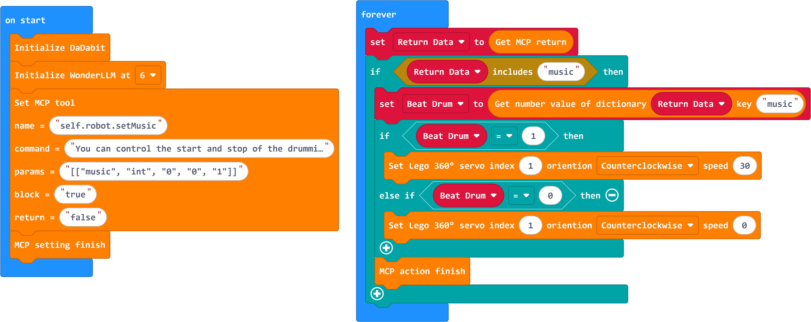

Program link: https://makecode.microbit.org/_45E4piR9P3p7. Click **Edit Code** in the upper-right corner of the page to download the complete program.

### 3.16.7 Downloading the Program

### 3.16.8 Project Extensions

Configure rhythmic drumming, such as drumming for 2s, pausing for 3s, drumming for 5s, and pausing for 1s. Simultaneously, flash the red and white RGB LEDs alternately while drumming, and display a heart shape on the dot matrix display.

### 3.16.9 Technical Support and Discussion

Join the forum for sharing questions, ideas, or suggestions, and answers will be provided promptly. Click the hyperlink [Hiwonder Forum](http://forum.hiwonder.com) or enter the URL in a browser: http://forum.hiwonder.com

